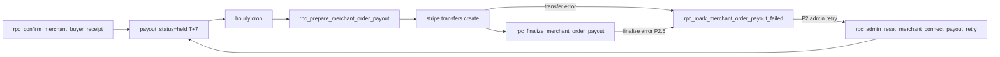
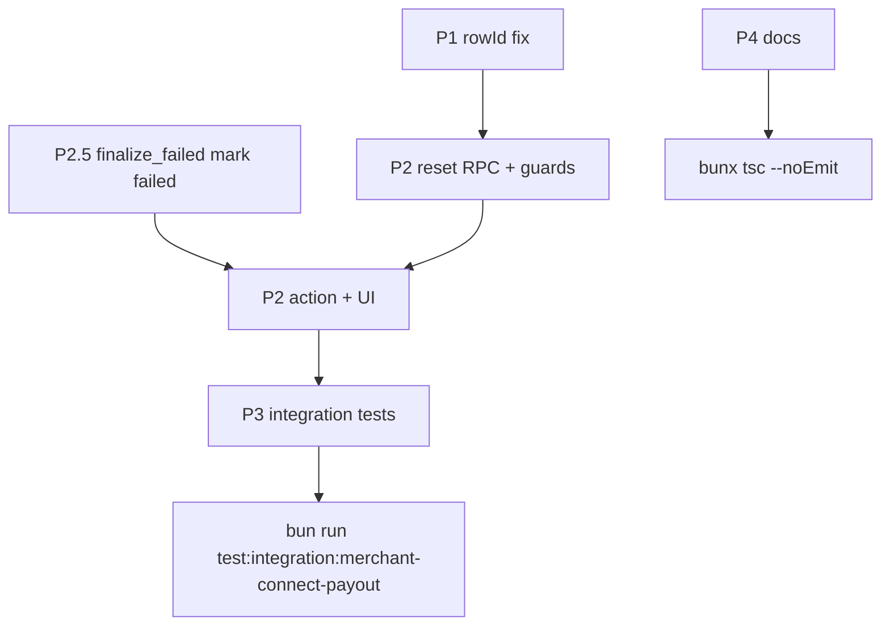

# Merchant Stripe Tab P1–P4 優化計劃

## 背景

[`MerchantConnectLedgerTab.tsx`](app/admin/payouts/components/MerchantConnectLedgerTab.tsx) 為唯讀對賬 ledger；實際撥款由 T+7 hourly cron [`/api/cron/merchant-connect-payout-ready`](app/api/cron/merchant-connect-payout-ready/route.ts) + [`executeMerchantConnectPayout`](lib/merchant-order/execute-connect-payout.ts) 執行。



---

## P1 — 修復 row key / 選取 / 導出（High）

**問題：** `held` / `pending` 列的 `stripeTransferId` 顯示為 `"—"`（[`admin-payouts.ts` L298](app/actions/admin-payouts.ts)），但 React `key`、checkbox、`selectedIds`、export filter 全用 `row.stripeTransferId` → 重複 key、全選/導出選取失效。

**修法（單一 SSOT）：** 引入 `getMerchantTransferRowId(row) => row.orderId`（[`MerchantTransferRow`](lib/admin-payouts/types.ts) 已有 `orderId`），替換以下 6 處：

| 位置 | 現狀 | 改為 |
|------|------|------|
| `toggleSelectAll` / `toggleSelectRow` | `stripeTransferId` | `orderId` |
| `exportSelectedOnly` filter | `stripeTransferId` | `orderId` |
| `TableRow key` | `stripeTransferId` | `orderId` |
| checkbox `onChange` | `stripeTransferId` | `orderId` |

**保留：** Stripe 流水號欄位仍顯示 `row.stripeTransferId`（`tr_` 連結邏輯不變）；CSV 第一欄仍輸出 transfer id（held 為 `"—"`）。

**驗證：** `bunx tsc --noEmit`；unit test 可選（helper 一行，非必須）。

---

## P2 — Admin 手動重試 failed 撥款（Medium）

**用戶決策：** 僅 Admin UI 按鈕；**不**擴展 cron 掃 `failed`。

**根因：** [`rpc_prepare_merchant_order_payout`](supabase/migrations/20260916120000_platform_financial_commission_config.sql) 僅接受 `payout_status = 'held'`（L399）；`failed` 列無法再進 prepare。

### 2a. Migration（新檔 `supabase/migrations/20260924120000_admin_merchant_connect_payout_retry.sql`）

新增 `rpc_admin_reset_merchant_connect_payout_retry(p_order_id UUID, p_admin_id UUID)`：

- `SECURITY DEFINER` + `service_role` only（與 [`rpc_mark_merchant_order_payout_failed`](supabase/migrations/20260729180000_merchant_connect_payout.sql) 一致）
- **必須**驗證 `p_admin_id` 對應 `profiles` admin（與 FPS `rpc_admin_set_fps_payout_request_status` 同級 audit 模式）
- **允許條件（與 cron candidate + prepare 對齊，不可只寫「複用 guard」）：**
  - `payout_status = 'failed'`
  - `stripe_transfer_id IS NULL`
  - `payout_status <> 'frozen'`
  - `buyer_confirmed_at IS NOT NULL`
  - `payout_hold_until IS NOT NULL AND payout_hold_until <= now()`
  - `public.fn_merchant_order_is_open(escrow_status)`
  - `refund_status` 為 NULL / 空 / `none`（與 [`rpc_list_merchant_connect_payout_candidates`](supabase/migrations/20260910180000_moderation_order_refund_saga.sql) L1425–1434 一致）
  - **排除** `refund_status = 'failed'` 且仍在 `payout_hold_until` 窗口內（I-H12 場景）
  - `stripe_payment_intent_id` 非空、`merchant_payout_amount > 0`（與 candidate 一致）
- 動作：`UPDATE ... SET payout_status = 'held', payout_error = NULL`；可選寫入 `admin_audit` / `payout_error` 旁註記 `retried_by_admin`
- 失敗時 `RAISE EXCEPTION` 附可讀訊息（供 UI toast）

> **備選（不採用）：** 擴展 `rpc_prepare` 直接接受 `failed` 並 atomic reset——可少一次 RPC，但 audit 邊界較難拆清；本計劃維持 reset + execute 兩步。

執行後 `bunx supabase gen types` 更新 [`types/supabase.ts`](types/supabase.ts)。

### 2b. Server action

在 [`app/actions/admin-payouts.ts`](app/actions/admin-payouts.ts) 新增：

```ts
retryAdminMerchantConnectPayout(orderId: string)
```

流程：

1. `requireAdmin()` → 取得 `guard.adminId`
2. `createAdminClient().rpc('rpc_admin_reset_merchant_connect_payout_retry', { p_order_id, p_admin_id })`
3. `executeMerchantConnectPayout(orderId)`（既有 Stripe transfer + finalize）
4. `revalidatePath("/admin/payouts")`（與 FPS actions 一致）
5. 回傳 `{ success, data: { transferId? } }` 或 `{ success: false, error }`

**Stripe 未設定：** `executeMerchantConnectPayout` 在 prepare 前檢查 Stripe client；若缺失則 reset 後訂單維持 `held`（不進 `processing`）。

### 2c. UI（加法原則）

[`MerchantConnectLedgerTab.tsx`](app/admin/payouts/components/MerchantConnectLedgerTab.tsx) 操作欄：

- 當 `row.payoutStatus === 'failed'` 時，在「查看訂單」旁新增 unstyled `<button type="button">重試撥款</button>`
- `useTransition` + loading/disabled；成功後 `fetchPage` refresh
- RPC 拒絕時 toast 顯示後端訊息（hold 未到期、moderation 窗口等）
- **不**改現有 Tailwind class

### 2d. Docs

更新 [`docs/dev/follow-up/admin-payouts/backend.md`](docs/dev/follow-up/admin-payouts/backend.md) + [`frontend.md`](docs/dev/follow-up/admin-payouts/frontend.md) 記錄 action 合約與 acceptance。

---

## P2.5 — `finalize_failed` 自癒（Medium，與 P2 同 PR）

**問題：** [`executeMerchantConnectPayout`](lib/merchant-order/execute-connect-payout.ts) 在 `stripe.transfers.create` 成功但 `rpc_finalize_merchant_order_payout` 失敗時，只回傳 `finalize_failed`，**不** call `rpc_mark_merchant_order_payout_failed` → 訂單卡在 `processing`，Admin「重試撥款」按鈕（僅 `failed`）無法觸及。

**修法（擇一，推薦 A）：**

| 方案 | 行為 |
|------|------|
| **A（推薦）** | `finalizeError` 分支 call `rpc_mark_merchant_order_payout_failed(p_order_id, 'finalize_failed: ...')` → 回到 `failed`，Admin 可 P2 重試 |
| B | 新增 `rpc_admin_resume_merchant_connect_payout_finalize`（有 transfer_id 時只 finalize）——範圍較大，延後 |

**注意：** Stripe idempotency key `merchant-order-payout:{orderId}` 可防重複 transfer；P2 重試在 A 方案下安全。

**測試：** P3 M3 覆蓋 simulate finalize 失敗 → mark failed → reset → prepare。

---

## P3 — Connect payout 整合測試（Medium）

**目標：** 補 cron candidate + P2 retry 缺口；**不重複** [`commission-rate.integration.test.ts`](tests/integration/merchant/commission-rate.integration.test.ts) 已覆蓋的 confirm / prepare snapshot（M1/M2 刪除）。

新建 [`tests/integration/platform/merchant-connect-payout-pipeline.integration.test.ts`](tests/integration/platform/merchant-connect-payout-pipeline.integration.test.ts)：

| Case | 步驟 | 斷言 |
|------|------|------|
| **M1** candidates | seed → confirm → backdate hold → `rpc_list_merchant_connect_payout_candidates` | 含 `order_id` |
| **M2** reset retry | `rpc_mark_merchant_order_payout_failed` → `rpc_admin_reset_...` → `rpc_prepare_...` | `failed`→`held`→`processing`；`payout_error` cleared |
| **M3** negative | frozen / hold 未到期 / 有 `stripe_transfer_id` / I-H12 refund 窗口 | reset RPC `RAISE` |

**不測：** `executeMerchantConnectPayout` 真 Stripe transfer（CI 無 key）；commission snapshot 回歸留 commission-rate 檔。

**Fixture：** 抽出 `seedMerchantOrderReadyForBuyerConfirm` 至 [`tests/integration/merchant/helpers/merchant-order-fixture.ts`](tests/integration/merchant/helpers/merchant-order-fixture.ts)（commission-rate 改 import）。

**package.json：** 新增 `test:integration:merchant-connect-payout`；先獨立 script，不接入 FPS gate。

---

## P4 — 文件與已知限制（Low）

不做大規模 perf refactor（7 次 parallel head-count 對 admin 規模可接受）。

| 項目 | 動作 |
|------|------|
| [`docs/dev/follow-up/admin-payouts/plan.md`](docs/dev/follow-up/admin-payouts/plan.md) L26 | 改為「T+7 cron 自動 `transfers.create`；admin tab 為對賬/監控」 |
| [`docs/dev/follow-up/admin-payouts/backend.md`](docs/dev/follow-up/admin-payouts/backend.md) | `statusCounts` 更正為 7 種；export cap 2000、name sort cap 5000；P2/P2.5 action 合約 |
| [`docs/dev/follow-up/admin-payouts/frontend.md`](docs/dev/follow-up/admin-payouts/frontend.md) | P1 選取用 `orderId`；P2 重試按鈕驗收 |
| [`docs/dev/follow-up/merchant-checkout/backend.md`](docs/dev/follow-up/merchant-checkout/backend.md) | 補 reset RPC + P2.5 finalize 失敗恢復說明 |

**刻意不做：** 合併 status count 為單一 SQL RPC、提高 sort cap、Cron 自動重試 failed、`processing` 卡住方案 B（resume finalize）。

---

## 實作順序與驗證



1. P1 → tsc
2. P2 migration `db push` → gen types
3. P2.5 `execute-connect-payout.ts`（與 P2 同 PR）
4. P2 action + UI
5. P3 測試
6. P4 文件
7. `bun run lint`（僅改動檔案）

---

## 風險與邊界

- **Stripe 真 transfer：** Admin 重試在 staging 需 Connect 測試帳戶；整合測試只驗 RPC 層。
- **processing 卡住：** P2.5 方案 A 後應收斂至 `failed`；若 transfer 已寫入 Stripe 但 DB 無 `stripe_transfer_id`，依賴 idempotency key 防雙轉。
- **Admin bypass moderation：** reset RPC 必須 mirror candidate guards（見 2a），不可僅依賴 prepare。
- **Frozen：** 重試按鈕不顯示；RPC 拒絕。
- **Race：** reset 與 cron 同時搶單時，prepare `FOR UPDATE` 保證單一 winner。
