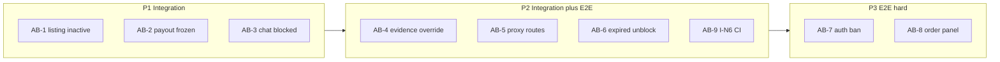

# Moderation Automation Backlog (AB-1～AB-9)

> **Status:** ⬜ 待實作（plan 已修訂）  
> **Overview:** 補齊舉報機制 Automation backlog AB-1～AB-9：以 integration matrix 為主覆蓋制裁副作用與 evidence override，Playwright 補 proxy／ban／訂單 UI，CI 確保 I-N6 唔再 skip。

---

## 現狀

- 主檔：[`tests/integration/moderation/moderation-matrix.integration.test.ts`](../../tests/integration/moderation/moderation-matrix.integration.test.ts)（26 cases；`I-L1b` 已驗 suspend sanction DB；`I-G2` 已驗 expired suspend 歷史）
- 缺口定義：[`docs/dev/follow-up/admin-moderation/PARTNER_QA_SIGNOFF.md`](../../docs/dev/follow-up/admin-moderation/PARTNER_QA_SIGNOFF.md) §Automation backlog
- 制裁副作用實作：[`supabase/migrations/20260809120000_admin_moderation_phase_e.sql`](../../supabase/migrations/20260809120000_admin_moderation_phase_e.sql) `_moderation_apply_sanction_side_effects` + `rpc_send_chat_message` 禁言檢查
- **I-N6 已存在**（L1031）但 `skipIf(!hasSellerIntegrationCreds())` — AB-9 係 CI/env 問題，唔係缺 test



---

## Plan 修訂摘要（2026-08-10）

| # | 原 plan 問題 | 修訂 |
|---|-------------|------|
| AB-1 | 用 `E2E_LISTING_ID` 會 inactive 共用 fixture | 改用 **MATRIX 專用 test listing**（service role insert）；`afterEach` 刪除或還原 `active` |
| AB-2 | seed order 預設 `seller_payout_status = none`，freeze 唔 hit | **硬性步驟**：seed 後必須 update → `ready`（或 `held`）再 assert |
| AB-3 | 需要 seller session，但 AB-9 話本地可 skip | 與 AB-9 統一：`hasFullModerationIntegrationEnv()` 為 matrix 頂層 gate |
| AB-4 | `profile` + `harassment` 會被 `submitUserReport` 擋（chat required） | 改用 **service role seed** insufficient-evidence case |
| AB-5b | 只 login admin 測試好弱 | 改測 **admin 帳被 suspend 仍可進 `/admin`**（proxy admin 豁免） |
| AB-6 | 與 I-G2 分工不清 | 註明 I-G2 = history UI；I-E5 = `getAccountAccessRestriction` RPC |
| AB-8 | 與現有 E2E L172 重疊 | 明確 delta：訂單編號、timeline、link href |
| Cleanup | 未涵蓋 listing/order 還原 | 擴充 `cleanup.ts` 刪 test order + test listing |

---

## 共用基建（先做）

在 [`tests/integration/moderation/helpers/`](../../tests/integration/moderation/helpers/) 新增／擴充：

| 檔案 | 內容 |
|------|------|
| `sanction-fixtures.ts` | `seedMatrixMemberListingForSeller(sellerId)` — **service role insert** 最小 `listings` row（`seller_persona = member`，`MATRIX_PREFIX` 標記）；**唔用** `E2E_LISTING_ID`。`seedMemberOrderWithPayoutReady(sellerId, buyerId, listingId)` — 重用 [`rpc_e2e_seed_member_auth_pending_payment_order`](../../supabase/migrations/20260910120000_e2e_seed_member_auth_pending_payment_order.sql) + **必須** update `seller_payout_status` → `ready`。`seedInsufficientEvidenceCase(subjectId, category)` — service role 建立 `harassment` 或 `offline_trade` case（profile source、**無** chat context）。`expireSanctionForCase(caseId, type)` — 沿用 I-G2 pattern |
| `db-assert.ts` 擴充 | `getListingStatus(listingId)`；`getMemberOrderPayoutStatus(orderId)`；`getAccountAccessRestriction(userId)`（wrap `moderation_get_account_access_restriction`）；`getResolveAuditPayload(caseId)` 查 `evidenceOverrideReason` |
| `cleanup.ts` 擴充 | `deleteMatrixTestListingsForSeller(sellerId)`；`deleteMatrixTestOrdersForPair(buyerId, sellerId)`；`wipeModerationMatrixPair` 後呼叫上述 helpers |
| `env.ts` 擴充 | `hasFullModerationIntegrationEnv()` = `hasModerationIntegrationEnv()` + `E2E_SELLER_EMAIL` + `E2E_SELLER_PASSWORD` |

**Seller creds 政策（AB-3 + AB-9 統一）：**

- Matrix 頂層改為 `describe.skipIf(!hasFullModerationIntegrationEnv())`（或等價：`beforeAll` 強制 `warmSession('seller')` 且缺 creds 即 fail）
- `test:moderation:gate` / CI：**必須**有 seller creds；本地缺 creds 可 `skip` 整個 matrix 並打印 warning（唔 partial-run 導致 AB-3 pass、I-N6 skip 嘅假象）

---

## AB-1 — 限制 Member 上架 → listings inactive（P1 · Integration）

**Test ID：** `I-E1`

1. `seedMatrixMemberListingForSeller` → assert `status = active`，`seller_persona = member`
2. `runAsBuyer` → profile/chat report → `runAsAdmin` → `resolveAdminModerationCase` with `mapResolutionOptionToInput("restrict_member_listing", "member")`
3. Assert：test listing `inactive`；`getActiveAccountSanctionsForUser` 含 `restrict_listing` + `member_persona`
4. `afterEach`：`deleteMatrixTestListingsForSeller`（或還原 `active`）

> **禁止**對 `E2E_LISTING_ID` 做 restrict_listing — `wipeModerationMatrixPair` 唔會還原 listing status，會污染後續 E2E。

---

## AB-2 — 凍結出款 → payout_status frozen（P1 · Integration）

**Test ID：** `I-E2`

1. `seedMemberOrderWithPayoutReady`（buyer = `getBuyerUserId()`, seller = `getSellerId()`）
2. **Assert pre-condition：** `seller_payout_status === 'ready'`（或 `held`）— seed RPC 預設 `none`，唔 update 就唔會被 freeze
3. Resolve `freeze_payout`
4. Assert `member_orders.seller_payout_status === 'frozen'`
5. `afterEach`：`deleteMatrixTestOrdersForPair`

> Merchant `merchant_orders` 路徑可 Phase 2 加（若 fixture 易 seed）。

---

## AB-3 — 制裁後禁發 chat（P1 · Integration）

**Test ID：** `I-E3`

1. Chat report + `suspend_7d` resolve（覆蓋 E7 文檔路徑；`restrict_chat` 無 UI resolution option）
2. `runAsSeller` → [`sendMessage`](../../app/actions/chat.ts) 到 `buyerSellerChatRoomId`
3. Assert `success: false` 且 error 含 `帳戶已被限制發送訊息`

**依賴：** `hasFullModerationIntegrationEnv()` + `warmSession('seller')`（見 §共用基建）。

---

## AB-4 — 證據不足 + 強制裁定 upheld（P2 · Integration）

**Test ID：** `I-E4`

> **唔用** `profile` + `harassment` report — `submitUserReport` 會擋（同 `I-R3` offline_trade）；chat report 會令 evidence sufficient。

**流程：**

1. `seedInsufficientEvidenceCase(sellerId, 'harassment')` — service role 建立 case（`primary_category = harassment`，無 `chat_room` context）
2. **Negative：** `runAsAdmin` → `resolveAdminModerationCase` upheld **無** `evidenceOverrideReason` → expect RPC `證據不足` 類錯誤
3. **Positive：** 新 case 或 reset case status → resolve with `evidenceOverrideReason: "I-E4 matrix override"` + `suspend_7d` → success；audit log payload 含 `evidenceOverrideReason`；case `upheld`

**E2E：** 唔必做（integration only）。

---

## AB-5 — suspend → `/marketplace` redirect；admin 豁免（P2 · Playwright）

**檔案：** [`e2e/admin-moderation.spec.ts`](../../e2e/admin-moderation.spec.ts)

沿用 `insertAccountSanctionForE2e` + `deleteAccountSanctionsForUser`（L295 附近；現有 test 用 `/profile/user`）：

| Test | 行為 |
|------|------|
| `E2E-AB5a` | buyer project：suspend sanction on buyer → `page.goto("/marketplace")` → URL `/auth/suspended` |
| `E2E-AB5b` | guest project：`loginAsAdmin` → **對 admin userId insert suspend sanction** → `page.goto("/admin/disputes")` → **唔** redirect suspended（驗 `proxy.ts` `profileRole !== "admin"` 豁免）→ `finally` 清 sanction |

---

## AB-6 — suspend 過期 → proxy 解封（P2 · Integration + Playwright）

**Integration `I-E5`：**

1. Resolve `suspend_7d`
2. `expireSanctionForCase`
3. `getAccountAccessRestriction(sellerId)` → `blocked: false`

> **分工：** `I-G2` 驗 expired sanction 出現喺 subject history UI；`I-E5` 驗 enforcement RPC 解封。

**E2E `E2E-AB6`：**

1. insert suspend → goto `/profile/user` → suspended
2. service role 改 `ends_at` 過去（或 `expireAccountSanctionForE2e` helper）
3. reload `/profile/user` → **唔** redirect suspended

可抽 [`e2e/fixtures/supabase-admin.ts`](../../e2e/fixtures/supabase-admin.ts)：`expireAccountSanctionForE2e(userId)`。

---

## AB-7 — 永久封禁 → 登入失敗（P3 · Playwright）

**風險：** `ban_permanent` 會 Auth ban **E2E seller 帳**；Auth ban 喺 [`resolveAdminModerationCase`](../../app/actions/admin-moderation.ts) server action（`applySupabaseAuthBan`），唔係 migration。

**Test ID：** `E2E-AB7`（guest project）

1. Seed open case（`seed:moderation-e2e` 或 inline report）
2. Admin UI resolve「永久封禁」
3. 新 context / 清 storage → seller `login` → expect 失敗
4. `finally`：`deleteAccountSanctionsForUser` + `unbanUserForE2e`（`ban_duration: 'none'` + global signOut）in supabase-admin fixtures

若缺 service role → `test.skip`（與現有 admin moderation 一致）。

---

## AB-8 — 關聯訂單卡連結 / timeline（P3 · Playwright）

**現有覆蓋：** [`e2e/admin-moderation.spec.ts`](../../e2e/admin-moderation.spec.ts) L172 已驗 `關聯訂單` heading（fraud/offline_trade case）。

**AB-8 delta（`E2E-AB8`）：**

1. Integration helper：seed order + chat report `fraud` category（buyer-seller pair）
2. E2E：admin 開 case → expect 訂單編號文字 + timeline 區塊 + `在新分頁開啟` link `href` 匹配 `/profile/user/orderDetail/`（或 merchant 路徑）

若 DB 無關聯訂單 → `test.skip`（與現有 orders panel test 同 pattern）。

---

## AB-9 — I-N6 常駐、唔 skip（P2 · CI / env）

**唔寫新 test** — 強化現有 I-N6 + matrix gate：

1. [`tests/integration/moderation/helpers/env.ts`](../../tests/integration/moderation/helpers/env.ts)：`hasFullModerationIntegrationEnv()`（見 §共用基建）
2. Matrix 頂層 / I-N6 改為 require full env（與 AB-3 一致）
3. **CI：** 新增 [`.github/workflows/moderation-integration.yml`](../../.github/workflows/moderation-integration.yml)（optional on PR / manual dispatch）：
   - secrets: `E2E_*`, `SUPABASE_SERVICE_ROLE_KEY`
   - run: `bun run test:integration:moderation` only
4. 文檔：[`docs/dev/e2e.md`](../../docs/dev/e2e.md) + [`.env.example`](../../.env.example) 標明 `E2E_SELLER_EMAIL/PASSWORD` 為 **full moderation gate 必需**

---

## 文檔與 gate 同步

| 檔案 | 更新 |
|------|------|
| [`PARTNER_QA_SIGNOFF.md`](../../docs/dev/follow-up/admin-moderation/PARTNER_QA_SIGNOFF.md) | AB 完成後改狀態 ✅ + 連 test id |
| [`6phase-test-plan.md`](../../docs/dev/follow-up/admin-moderation/6phase-test-plan.md) | §5 matrix 加 I-E1～I-E5、E2E-AB* |
| [`scripts/moderation-release-gate.sh`](../../scripts/moderation-release-gate.sh) | 無需改（integration 已包含） |

---

## 驗證

每 phase 完成後：

```bash
bunx vitest run --config vitest.config.mts tests/integration/moderation
MODERATION_GATE=1 bun run test:e2e e2e/admin-moderation.spec.ts --project=setup --project=guest --project=buyer
bun run test:moderation:gate   # 全量回歸
```

---

## 實施順序

| Phase | 內容 | Todos |
|-------|------|-------|
| 0 | 共用 fixtures + db-assert + cleanup + env | `fixtures-assert` |
| P1 | AB-1～AB-3（I-E1～I-E3） | `p1-integration` |
| P2 | AB-4 + AB-5/6 E2E + AB-9 CI/docs | `p2-ab4-e2e`, `p2-ab9-ci` |
| P3 | AB-7 ban/unban + AB-8 order panel delta | `p3-e2e-hard` |
| 收尾 | PARTNER_QA + 6phase-test-plan 對照 | `doc-sync` |

預估：**P1+P2 ≈ 1–2 PR**；P3 可獨立 PR（AB-7 需格外小心 test 帳回收）。
