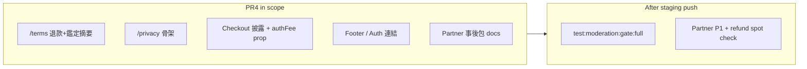

# PR4 — 對外條款 + Partner 事後簽收包

**SSOT:** [refund-policy.md](../../docs/dev/refund-policy.md) · [refund-policy-rollout-plan.md](../../docs/dev/follow-up/refund-policy-rollout-plan.md) §PR4

**前提:** PR1–PR3 已 commit（`2d7d033` / `eb1417f` / `e3703aa`）。PR4 **純文案 + 輕量路由**，唔改 saga / migration。

**用戶決策:** Spot check **暫不執行**；staging push 後與現有 Partner P1 **一次過簽**。

**計劃修訂（2026-08-11）:** 納入 plan review 五點修正（見 §0）。

---

## 0. Plan review 修正（必做）

| # | 修正 | 執行 |
|---|------|------|
| 1 | **Auth 兩個 dead link** — [`AuthForm.tsx`](../../app/auth/AuthForm.tsx) 已連 `/terms` **及** `/privacy`，兩頁都必須新建 | §1.1 + §1.2 |
| 2 | **Footer escrow 死鏈** — `/marketplace?info=escrow` 無 handler | §1.3 **必做**改 `/terms#escrow` |
| 3 | **Checkout `authFee` prop** — `MerchantDirectReview` 要接 `pricing.authFee` | §3 |
| 4 | **Admin settings mock 條款** — 與 `/terms` 可能矛盾 | §1.4 |
| 5 | **`/terms` 草案 banner** — 同 `/privacy` 對稱，待法務審閱 | §1.1 |

---

## 範圍總覽



| 項目 | PR4 | Push 後 Partner |
|------|-----|-----------------|
| `/terms` + `/privacy`（修復 Auth dead links） | ✅ | 人手核對文案 |
| Footer 鑑定託管 → `/terms#escrow` | ✅ **必做** | UX 抽查 |
| Checkout 鑑定費披露 + 動態 `authFee` | ✅ | UX 抽查 |
| `PARTNER_QA_SIGNOFF` 加 spot check 步驟 | ❌ 僅草稿 handoff | ✅ 一次過簽 |
| 實際跑 4 條 spot check | ❌ skip | ✅ |

---

## 1. 對外條款頁

### 1.1 `/terms` — 服務條款（含退款摘要）

**現況:** [AuthForm.tsx](../../app/auth/AuthForm.tsx) 已連 `/terms` 與 `/privacy`，**兩個 route 都不存在**；[Footer.tsx](../../app/components/navigation/Footer.tsx) 條款仍 `href="#"`。

**新增:** `app/terms/page.tsx` — Server Component，靜態內容，無 Supabase。

**頂部 banner（修正 #5）:** `草案 — 待法務／產品審閱`（與 `/privacy` 對稱）。

**內容**（摘 [refund-policy.md](../../docs/dev/refund-policy.md) 用戶向段落）:

- 訂單類型（**P2P 無平台退款**）
- 階段 S0–S4 簡表
- **鑑定費**（入庫後服務開始；pass 後售後預設不退 D；seller fault fail 全退）
- **售後窗口：Member 3 日 / Merchant 7 日**
- 售後爭議發生在 **收貨後**（物流損毀等），唔係重新鑑定 fail
- Stripe processing fee 一句話
- 佣金／鑑定費寫 **「按平台當時公布費率」**，唔寫死 5%/8%/HK$150

**Anchor `id="escrow"`（修正 #2）:** 鑑定託管流程一節，供 Footer 連結。

### 1.2 `/privacy` — 私隱政策骨架

**新增:** `app/privacy/page.tsx`

- 章節 placeholder：收集資料、用途、第三方（Stripe）、保留期、聯絡
- 頂部 banner：`草案 — 待法務審閱`

### 1.3 Footer / Auth 連結（修正 #1、#2）

| 檔案 | 改動 |
|------|------|
| [Footer.tsx](../../app/components/navigation/Footer.tsx) | `服務條款` → `/terms`；`私隱政策` → `/privacy`；**`鑑定託管流程` → `/terms#escrow`**（取代死鏈 `?info=escrow`） |
| [AuthForm.tsx](../../app/auth/AuthForm.tsx) | 無需加 checkbox（已有）；確認兩 link 生效即可 |

**唔另開** `app/help/` — Help 內容併入 `/terms#escrow`（收斂 full scope）。

### 1.4 Admin settings mock 條款（修正 #4）

[app/admin/settings/page.tsx](../../app/admin/settings/page.tsx) 內「平台聲明與交易條款編輯器」仍 **toast-only mock**（含 5% 佣金等），**唔係**用戶面向 SSOT。

**PR4 最小改動:** 在該 section 加一行說明 —「此處為營運草稿編輯器，尚未接庫；**用戶正式條款以 `/terms` 為準**。」

唔接 `platform_settings` upsert（out of scope）。

---

## 2. Checkout 披露（修正 #3）

**檔案（addition-only，唔改現有 Tailwind class）：**

| 檔案 | 改動 |
|------|------|
| [AuthEscrowReview.tsx](../../app/checkout/[id]/components/steps/AuthEscrowReview.tsx) | 1–2 行披露：鑑定服務開始後鑑定費一般不退；售後窗口與規則見[服務條款](/terms) |
| [MerchantDirectReview.tsx](../../app/checkout/[id]/components/steps/MerchantDirectReview.tsx) | **新增 `authFee: number` prop**（由 [CheckoutClient.tsx](../../app/checkout/[id]/CheckoutClient.tsx) 傳 `pricing.authFee`）；`authServiceEnabled` 區塊用動態金額 + 同類披露 |
| [CheckoutClient.tsx](../../app/checkout/[id]/CheckoutClient.tsx) | 傳 `authFee={pricing.authFee}` 入 `MerchantDirectReview` |

**唔寫** S1 buyer fault（主線極少 trigger）。

---

## 3. Partner 事後簽收包（docs only，PR4 不執行）

**新增:** [docs/dev/follow-up/refund-policy/PARTNER_REFUND_SPOTCHECK.md](../../docs/dev/follow-up/refund-policy/PARTNER_REFUND_SPOTCHECK.md)

1. Seller fault 鑑定 fail → 買家全額（含 D）— cross-ref [admin-grading PARTNER_HANDOFF](../admin-grading/PARTNER_HANDOFF.md)
2. Buyer fault 鑑定 fail → A+B+C，D 留平台（**註：主線極少**）
3. Pass 後 3 日 seller fault 售後 → A+C，唔退 D
4. P2P 舉報 → 無退款選項
5. （可選）carrier 售後 / preview panel 肉眼確認

**更新:**

| 檔案 | 改動 |
|------|------|
| [PARTNER_QA_PENDING.md](../../docs/dev/PARTNER_QA_PENDING.md) | Migration → **`20260915120000`**；§4 指向 spot check handoff；**push 後與 P1 一次過** |
| [PARTNER_QA_SIGNOFF.md](../../docs/dev/follow-up/admin-moderation/PARTNER_QA_SIGNOFF.md) | Dev 前提 migration 字串 → `20260915120000`；**唔**把 spot check 塞入 P1 必做 |
| [refund-policy-rollout-plan.md](../../docs/dev/follow-up/refund-policy-rollout-plan.md) | PR4 驗收勾選；spot check 標 post-push |

---

## 4. 驗收（PR4 merge 前 — dev only）

```bash
bun run build:ci
bunx tsc --noEmit
bun run lint    # 改動檔
```

**唔納入 PR4 gate:** `test:moderation:gate:full`、Partner spot check。

---

## 5. Push 後 checklist（非 PR4 code）

1. Staging `db push` 至 `20260915120000`
2. `bun run test:moderation:gate:full`
3. Partner：`PARTNER_QA_SIGNOFF` P1 + `PARTNER_REFUND_SPOTCHECK.md`
4. 法務 sign-off `/terms` + `/privacy`

---

## 6. Out of scope

- Variable commission / `platform_settings` wiring
- Grading UI 隱藏 buyer fault
- PR4 內執行 spot check
- Admin settings 條款 editor 接 DB

---

## 7. 建議 commit

單一 PR4 commit 或拆兩個：

1. `app/terms` + `app/privacy` + Footer/Auth + admin settings disclaimer
2. Checkout disclosure (`authFee` prop) + partner handoff docs
