# v2.1 Pre-Launch：C3 實作 + Launch 範圍測試計劃（修訂版）

## 目標與邊界

### 上線定義（本 plan 的 North star）

> **v2.1 signoff 全綠** = `PRODUCTION_GATE` 附錄 A 所有 **InScope P0/P1** 項達 `Covered`（見下方殘留表例外）+ Partner **M1** 每次 deploy + **首次 prod cutover 前** 可選 **M3.1** 一條肉眼 + Stripe Live ops。

**唔等於**「repo 內每一個功能、每一個 e2e spec 都入 production gate」。

| 層級 | v2.1 完成後 |
|------|-------------|
| **v2 交易核心**（鑑定、退款、capture、券、售後、舉報、FPS、Connect、webhook） | 自動化簽收 |
| **附錄 A 殘留**（C6/C7/S0-05、部分 Partial） | 明確標記，不阻 v2.1 |
| **OutOfScope 產品**（Auction、申訴 portal 等） | 不測、不 launch |
| **非 gate E2E**（P2P 全鏈、chat realtime、collection 等 ~20 specs） | Phase 5 / v2.2，唔阻 v2.1 |

**起點：** r8 `test:production:gate:signoff` 已全綠（2026-08-15）。

### Post-plan 進度（2026-08-16）

| 項目 | 狀態 |
|------|------|
| Phase 5 tier 文檔 | ✅ `e2e-tiering.md` + SSOT §8 |
| L1 nightly:p2（TC-E01–E03） | ✅ dev + soak 1/3 |
| L6 member-trading 6 specs | ◐ 5/6 綠（escrow 待再驗）— SSOT §9b |
| Matrix soak | ◐ 1/3 |
| C3 / C4 / C5 grading | ☐ 未開 |

**明確不納入（維持 OutOfScope）：** Auction mock、申訴 portal、Listing 頁舉報、Moderation Phase F cron、全站 Email/Push、P2P 面交**平台 order refund**（舉報制裁用 integration 覆蓋，見 Phase 3 PG-S3-11）。

```mermaid
flowchart LR
  subgraph phase1 [Phase1_C3_GCAN]
    RPC[rpc_cancel_merchant_auth_order]
    Action[cancelMerchantAuthOrder]
    Tests[G-CAN1M_2M_3M]
  end
  subgraph phase2 [Phase2_C4_C5]
    C5[G-BF10_11_platform_inconclusive]
    C4[G-BF5M_fail_race]
  end
  subgraph phase3 [Phase3_E2E_Env]
    PhaseH[PhaseH_merchant_no_skip]
    Matrix[M-A1_soak_then_include]
    Partial[Partial_E2E_gaps]
  end
  subgraph phase4 [Phase4_Gate_Docs]
    Gate[signoff_v2.1]
    Audit[appendix_residual_table]
  end
  subgraph phase5 [Phase5_v2.2_optional]
    Nightly[non_gate_e2e_tier]
  end
  phase1 --> phase2 --> phase3 --> phase4
  phase4 -.-> phase5
```

---

## Phase 1 — C3：Merchant pre-intake cancel（P0，intent 已確認）

> **注意：** C3 = **G-CAN*M**（商戶入庫前取消訂單）。**C4 = G-BF5M**（grading fail finalize race）— 兩者無關，勿混淆。

### 商業規則（對稱 Member G-CAN1–3，但 state machine 不同）

Member 用 `member_escrow_status`（`custody` → `grading`）；Merchant 用 `escrow_state`（`payment_held` → `authenticating`）。

| Test ID | Merchant 狀態 setup | 預期 |
|---------|---------------------|------|
| **G-CAN1M** | `requires_authentication=true`，`payment_capture_status=authorized`，`platform_received_at IS NULL`，`escrow_status=payment_held`（**可**已填 inbound tracking，**未** admin intake） | 商戶可取消 → `escrow_status=refunded`，`payment_capture_status=voided`，listing `active`，`fn_restore_merchant_order_coupon_on_void` |
| **G-CAN2M** | 經 `finalizeMerchantAuthOrderIntake` → `escrow_status=authenticating`，`platform_received_at` 已設 | RPC 拒絕（「鑑定期間不可取消」） |
| **G-CAN3M** | 同 G-CAN2M（merchant intake 後 `platform_received_at` 與 `authenticating` 通常同時出現） | 同 G-CAN2M — **若實作上兩 case 等價，可合併為一個 reject test + 文檔註明** |

**與 Member 差異（測試設計）：** 勿用 `promoteMemberAuthOrderToGrading` 語意；Merchant G-CAN2M/3M 必須經 [finalizeMerchantAuthOrderIntake](tests/integration/grading/helpers/grading-merchant-fixture.ts) 或等價 admin intake RPC。

操作者：`merchant_id` = 登入商戶 user id（`E2E_SELLER_ID`）。

### 實作要點

1. **Migration** — `supabase/migrations/20260928120000_merchant_auth_pre_intake_cancel.sql`
   - `rpc_cancel_merchant_auth_order(p_order_id UUID, p_merchant_id UUID)`
   - 鏡像 [rpc_cancel_member_order](supabase/migrations/20260910110000_member_auth_checkout_coupon.sql)（L1310–1397），改查 `merchant_orders`：
     - **允許：** `payment_held` + `authorized` + `platform_received_at IS NULL` + `requires_authentication`
     - **拒絕：** `platform_received_at IS NOT NULL` OR `escrow_status IN ('authenticating','authenticated','shipped',...)` OR `auth_fee_captured` / `fully_captured`
     - **成功：** `escrow_status='refunded'`，`payment_capture_status='voided'`，coupon restore，listing `active`
   - Stripe void 順序：與 member 一致 — action 層先 `PI.cancel`，再 RPC（見 [cancelMemberOrder](app/actions/orders.ts) L2182–2218）

2. **App** — [app/actions/orders.ts](app/actions/orders.ts)：`cancelMerchantAuthOrder`；[lib/merchant-order/merchant-order-rpc.ts](lib/merchant-order/merchant-order-rpc.ts) 封裝

3. **Flags** — [merchant-seller-actions.ts](app/lib/merchant-order/merchant-seller-actions.ts)：`canCancelAuthOrder`

4. **UI（加法 only）** — [MerchantOrderDetailView.tsx](app/components/merchant/MerchantOrderDetailView.tsx) unstyled「取消訂單」

5. **Integration** — `tests/integration/grading/auth-grading-merchant-cancel.integration.test.ts`；含 coupon variant（G-CAN1M+coupon）

6. **Wire-up** — [package.json](package.json) `test:integration:grading`；`db push` + types

7. **（可選 PR-D）** — merchant order detail E2E smoke：見到取消掣（logic 已由 integration cover）

---

## Phase 2 — C5 + C4（Grading 缺口）

### C5 — Platform / Inconclusive @ S1（以測試 + 小 UI 為主）

**現況：** RPC/UI 已支援；缺 integration 證明 + S3 對齊的 platform reason。

| Test ID | 檔案 | Assert |
|---------|------|--------|
| G-BF10 | 新或擴充 `auth-grading-fail-platform.integration.test.ts` | member `platform` → `voided`，無 `seller_receivables` |
| G-BF11 | 同上 | member `inconclusive` → 全退，無 receivable |
| G-BF10M / G-BF11M | [auth-grading-merchant-fail.integration.test.ts](tests/integration/grading/auth-grading-merchant-fail.integration.test.ts) | 無 `merchant_ledgers` recovery |

**必做（非 optional）：** [admin-grading.ts](app/actions/admin-grading.ts) — `faultParty === 'platform'` 時 `reason` 必填（對齊 S3 `platformFaultReason`）。

### C4 — G-BF5M（grading fail finalize race，唔係 C3 cancel）

鏡像 member [G-BF5](tests/integration/grading/auth-grading-fail-single.integration.test.ts)（L189–241）於 merchant：`prepare` → void capture → `finalize` 仍成功。

---

## Phase 3 — Env / E2E 穩定化

### Phase H merchant（消滅 skip → env 必須齊）

- [phase-h-refund.integration.test.ts](tests/integration/moderation/phase-h-refund.integration.test.ts)：固定 `E2E_SELLER_ID` + [findMerchantListingForSellerIntegration](tests/integration/grading/helpers/grading-merchant-fixture.ts)
- **移除** `skipIf(!phaseHMerchantId)` — env 唔齊則 **fail**（同 `verify:merchant-grading-e2e`）
- **前置：** CI/staging secrets 與 `verify:merchant-grading-e2e` 對齊後再 merge
- 更新 [PRODUCTION_GATE.md](docs/dev/PRODUCTION_GATE.md) 附錄 C：刪 Phase H merchant skip 白名單

### M-A1 Rewards matrix（PG-CPN-08）

1. 修 [platform-rewards-matrix.spec.ts](e2e/platform-rewards-matrix.spec.ts)（HK TZ、bootstrap 競態）
2. **Soak 門檻：** 連續 **2–3 次** `PRODUCTION_GATE_INCLUDE_MATRIX=1 bun run test:production:gate:signoff` 全綠後，先改 [production-gate.sh](scripts/production-gate.sh) signoff **預設 include matrix**
3. soak 未過前：matrix 仍用 opt-in flag，唔 block v2.1 其餘 PR

### Partial E2E（壓 Partner M2–M7）

| PG-ID | 動作 | Partner |
|-------|------|---------|
| PG-RPT-06 | E2E-R6 第二報 **純 UI**（唔靠 RPC） | M2 縮短 |
| PG-CPN-09 / C8 | 無券 merchant_auth checkout → authorize E2E | R4 skip |
| PG-S3-11 | Integration：P2P dispute finalize `refund_status` 不變 | M3.4 skip |
| M5 | `e2e/home-p0-smoke.spec.ts` | M5 skip |
| M4 | `e2e/legal-pages-smoke.spec.ts` | M4 skip |
| PG-WH-01 | 擴充 webhook-route 多 1–2 events | — |
| C3 UI（可選） | merchant cancel button smoke | — |

**Partial 項預期：** 完成後標 **Covered** 或 **Partial（收窄）** — 唔承諾全部變 Perfect Covered（見殘留表 PG-S0-06、PG-S1-21、PG-S2-02）。

---

## Phase 4 — Gate、文檔、Partner

1. **Sign-off：** 新 specs 在 `test:integration:grading` / moderation / rewards E2E 路徑內；`bun run test:production:gate:signoff` 全綠（matrix 依 soak 結果）
2. **附錄 A 更新：** PG-S0-04、PG-S1-08/10/11、PG-S3-02、PG-CPN-08、PG-S3-11（integration 後）→ `Covered`
3. **[v2.1-deferred.md](docs/dev/v2.1-deferred.md)：** C3/C4/C5/Phase H/M-A1 Done
4. **[PARTNER_QA.md](docs/dev/PARTNER_QA.md)：** 新增「Post v2.1 最小簽收」
5. **[admin-grading/backend.md](docs/dev/follow-up/admin-grading/backend.md)** + [INTEGRATION_QUEUE.md](docs/dev/INTEGRATION_QUEUE.md)

### 附錄 A 殘留（v2.1 完成後仍接受）

| PG-ID / ID | 狀態 | 處理 |
|------------|------|------|
| PG-S0-05 | Missing | 低優先；merchant 未付款過期 cron — v2.2 |
| PG-S0-06 | Partial | webhook 擴充後仍可能 Partial |
| PG-S1-21 | Partial | fail webhook unit；C1 route 已 cover HTTP |
| PG-S2-01 | OutOfScope | 政策 |
| PG-S2-02 | Partial | 無專項 outbound dispute — 接受 |
| PG-S3-10 / C7 | Missing | async refund replay — v2.2 |
| PG-WH-03 | Missing | staging live webhook replay — ops |
| C6 | Deferred | legacy capture(0) 政策待拍板 |
| C8 | Partial→較完整 | baseline checkout E2E 收窄範圍 |

### Partner QA（修訂）

| 場景 | 做咩 |
|------|------|
| **每次 staging deploy** | **M1 only**（~15 min，4 頁唔白屏） |
| **首次 prod cutover 前** | M1 + **可選 M3.1** 一條退款肉眼 |
| **M2–M7** | Gate v2.1 已覆蓋 → 日常 **skip** |

---

## Phase 5 — v2.2 可選（唔阻 v2.1）

**目的：** 若要做到更接近「整系統功能」自動化，將 **唔入** production gate 的現有 E2E 分層納入 **nightly / PR optional**，唔一次塞入 signoff。

| 優先 | Spec 範例 | 說明 |
|------|-----------|------|
| P2 | `member-trading-p2p.spec.ts`、`member-offer-negotiation.spec.ts` | C2C 主流程 |
| P2 | `global-chat-realtime.spec.ts` | Chat |
| P3 | `merchant-product-detail.spec.ts`、`marketplace-search-offer.spec.ts` | 瀏覽/下單入口 |
| P3 | `admin-announcements.spec.ts`、`member-dashboard.spec.ts` | Admin/用戶周邊 |

產出：在 `PRODUCTION_GATE.md` 或新 `docs/dev/e2e-tiering.md` 記錄 **Gate / Nightly / Manual** 三層，避免再誤稱「全 repo 已 cover」。

---

## C6（政策 — 不阻 v2.1）

Legacy 非 seller fault `capture(0)` — 需 [refund-policy.md](docs/dev/refund-policy.md) §7.3 拍板後加 integration。可與 Phase 5 並行。

---

## PR 拆分

| PR | 內容 | 估時 |
|----|------|------|
| **PR-A** | C3 migration + action + UI + G-CAN*M integration | 2–3 天 |
| **PR-B** | C5 tests + platform reason 必做 + G-BF5M | 1–2 天 |
| **PR-C** | Phase H no-skip + M-A1 修復 + matrix soak | 2–3 天 |
| **PR-D** | Partial E2E + webhook + 可選 merchant cancel smoke | 2 天 |
| **PR-E** | Gate/docs/PARTNER_QA + 殘留表 + v2.2 tier 文檔 | 0.5–1 天 |

---

## 驗收標準（修訂 — 精確表述）

1. `bun run test:production:gate:signoff` 全綠（matrix：soak 通過後預設 include，否則 `INCLUDE_MATRIX=1` 額外門檻全綠）
2. 附錄 A **v2.1 InScope 項** 無未解釋的 `Missing` / `Flaky`（殘留表內例外除外）
3. C3 intent 已實作 + G-CAN*M integration 綠
4. Partner 文檔改為 Post v2.1 最小簽收（M1 日常 + 首次 prod 可選 M3.1）
5. **不宣稱**「整個 repo 所有 e2e spec 已入 gate」— Phase 5 文檔化 non-gate tier

---

## Partner QA 對照（完成後）

| 原 Must-do | v2.1 後 |
|------------|---------|
| M1 煙霧 | **每次 deploy 保留** |
| M2 舉報 | skip（gate E2E + integration） |
| M3 退款 | **首次 prod 前** 可選 1 條；日常 skip |
| M4 條款 | skip（legal E2E） |
| M5 首頁 | skip（home E2E） |
| M6 FPS | M1 開到 grading 頁即可 |
| M7 Connect | M1 開到 payouts 頁即可 |
