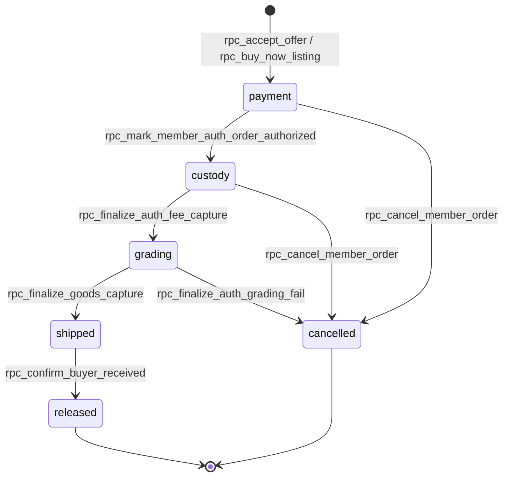
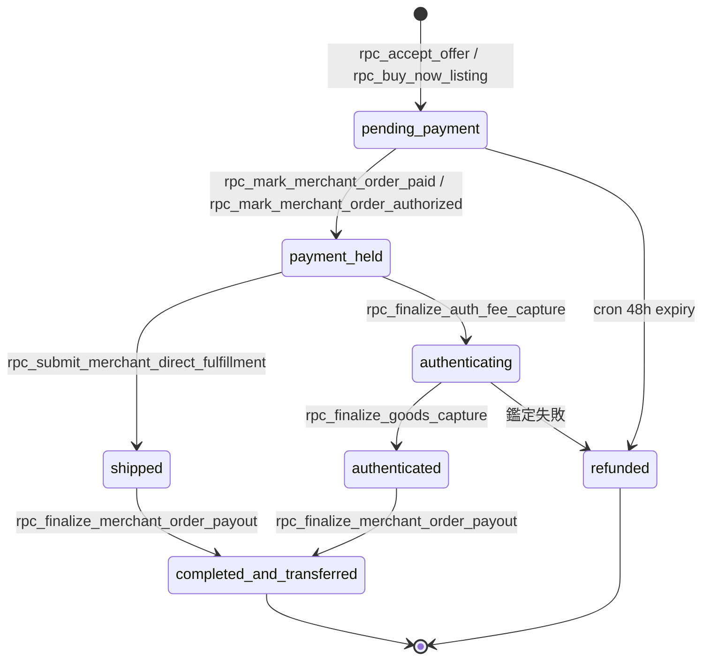
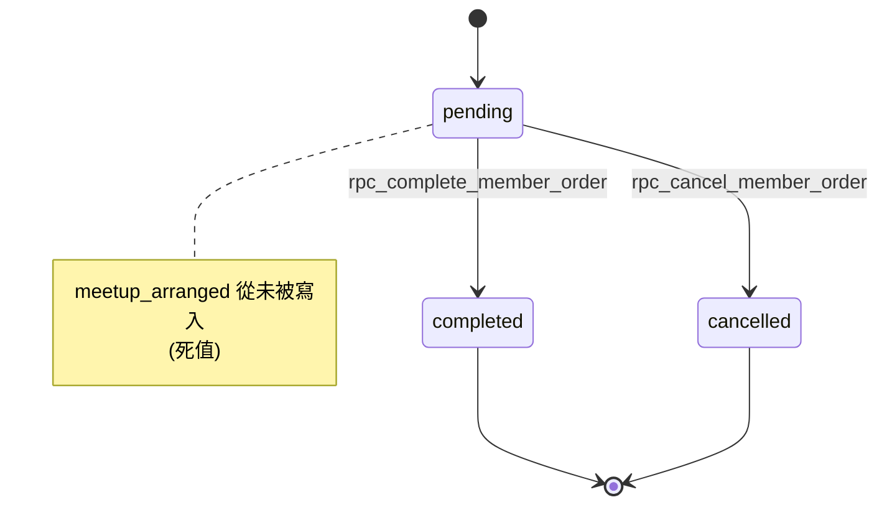
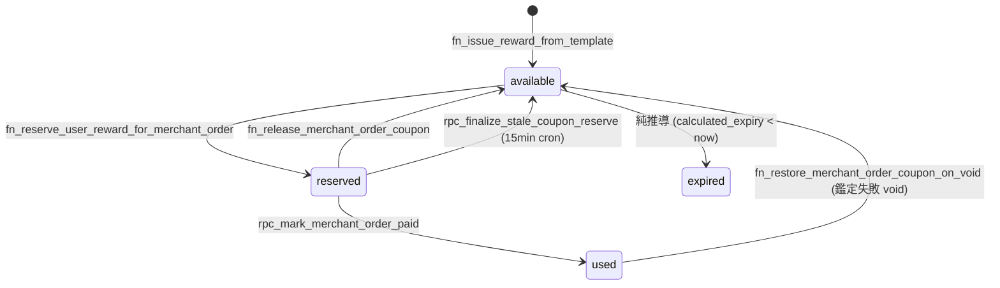
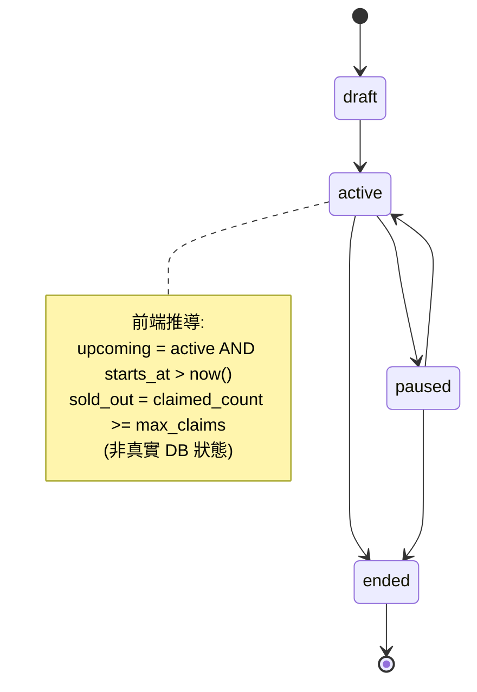

# HKCardVault 六層測試架構白皮書 (6-Tier Testing Architecture)

> **文件版本**：v1.0
> **產出日期**：2026-08-08
> **審計範圍**：180 個 Supabase migrations、41 個 Server Actions、16 個 Route Handlers、34 個 Playwright spec、5 個 Vitest integration、20 個 bun:test unit
> **免責聲明**：本文不含任何憑證、API Key 或密碼明文。所有敏感項目僅以風險描述形式呈現。

---

## 第 0 章：執行摘要

### 0.1 六層總覽表

| 層級 | 定義一句話 | 工具 | 觸發時機 | 現況覆蓋 | 目標覆蓋 | CI Gate 位置 | 落地 Phase |
|---|---|---|---|---|---|---|---|
| L1 FSM 狀態機測試 | 驗證業務狀態轉移的合法性與非法轉移拒絕 | Vitest + Supabase RPC | 每次改 escrow/coupon/campaign 狀態邏輯 | 1 檔(coupon-fsm) | 6 套狀態機全覆蓋 | PR(純邏輯) + Merge(連DB) | Phase 1 |
| L2 AI Threat Modeling | 模擬攻擊者越權/篡改/繞過支付 | Vitest + PostgREST 直打 + 靜態掃描 | 每次 migration / 改 GRANT / 改 RLS | 1 檔(coupon-security) | 20 條攻擊向量 | Merge + Release 門禁 | Phase 1 |
| L3 Vitest 單元/整合 | 純函數與 Server Action 級測試 | Vitest 4.1.10 | 每次新增/重構 helper 或 Server Action | 5 integration + 20 孤兒 unit | 核心 lib 80% | PR | Phase 2 |
| L4 Property-Based Testing | 隨機生成極端輸入驗證不變性 | fast-check 4.9.0 | 每次改金額/日期/庫存計算 | 1 檔(coupon-pbt) | 30+ 不變式 | Merge | Phase 2 |
| L5 Mutation Testing | 注入變異驗證測試套件真實品質 | Stryker（**依賴斷鏈**） | 大版本前 / 改 Billing & Escrow | 0（無法執行） | 核心金流模組 ≥85 | Nightly | Phase 3 |
| L6 E2E 端到端 | 真實瀏覽器全流程驗收 | Playwright 1.61.1 | 重大 PR 合併前 / Release | 34 spec | +6 cron +webhook +persona | Nightly + Release | Phase 3 |

### 0.2 三大核心結論

① **5 個 P0 資安漏洞令測試失去意義** —— 現存 CRITICAL 級提權與財務漏洞屬設計層/DB 層破防，任何單元測試或 E2E 都攔唔住。喺呢啲修完之前投入測試建設，等同喺無地基嘅樓上鋪地板。

② **真實狀態機遠比想像複雜** —— 專案冇單一 `order_status` 欄位，而係 **2 套獨立 escrow enum（`member_escrow_status` 6 值 / `escrow_state` 7 值）× 6 個平行子狀態機**。FSM 測試必須按乘積狀態空間設計，而非線性流程。

③ **測試基建三重斷鏈** —— Stryker 依賴被 merge commit `6952c23` 誤刪令 `bun run test:rewards:mutation` 100% 失敗；20 個 `bun:test` unit test 冇 runner script 且被 `tsconfig.json` exclude 導致零 type-check；`.github/workflows/ci.yml` 只 trigger on push to main/Production，**PR 完全零 gate**。

### 0.3 P0 熔斷清單

| 編號 | 漏洞 | 位置 | 後果 | 覆核狀態 |
|---|---|---|---|---|
| T-01 | `handle_new_user()` 直接信任 `NEW.raw_user_meta_data->>'role'` 寫入 `profiles.role`，無白名單 | `supabase/migrations/20260820120000_reward_trigger_events_expansion.sql:1057-1094`（5 次 CREATE OR REPLACE 中最後一次，無後續修復） | 任何人打 Supabase Auth `/auth/v1/signup` 帶 `data:{role:"admin"}` 即自建管理員帳號，整站權限模型形同虛設 | ✅ sa-reviewer 獨立覆核確認 |
| T-02 | `GRANT UPDATE ON public.profiles TO authenticated`（全表無 column list）+ policy 僅 `USING/WITH CHECK (auth.uid()=id)` | `20260703120000_profiles_settings_columns.sql:12-21` | 任何已登入 member 可 `.update({role:'admin', is_banned:false, kyc_status:'approved'})` 自我提權、自我解封、偽造 KYC | ✅ 全庫無 `GRANT UPDATE (` 欄位限定，無 profiles BEFORE UPDATE trigger |
| T-03 | `fn_restore_merchant_order_coupon_on_void(UUID)` SECURITY DEFINER + GRANT authenticated + 零身分檢查 | 定義 `20260816120000:138-176`，body 重建 `20260830120000:715-747` | 任意用戶傳任意 order_id 把已核銷券還原成未使用，同時清零訂單 `platform_subsidy_amount` → 券無限重用 + 破壞撥款對帳 | ✅ `20260831120000` 無 REVOKE |
| T-04 | `fn_claim_mission_points(UUID, INT, TEXT)` GRANT authenticated，只檢查 `p_points > 0`，`p_mission_id` 只做 NULL 檢查未 JOIN 任何 mission 表，無 dedup | `20260706170000_points_mission_redemption_rpcs.sql:6-44` | 無限印積分 | ✅ 全庫僅此一次定義，無後續收緊 |
| T-05 | `fn_enforce_member_order_transitions` 喺 6 個 migration 被 `CREATE OR REPLACE`，但 grep `EXECUTE FUNCTION public.fn_enforce_member_order_transitions` **零結果**，且 `supabase/` 無 declarative schema snapshot | 見第 2 章 | **呢條防線從未真正掛載到 `member_orders` 表。DB 層完全裸奔** | ✅ 比原報告描述更嚴重 |

### 0.4 六層落地 Phase 總覽

- **Phase 0（緊急止血，1-2 日）**：修 T-01~T-05 + 修基建三重斷鏈
- **Phase 1（2 週）**：L2 AI Threat Modeling + L1 FSM。理由：L2 成本最低 ROI 最高（已證 5 個 CRITICAL 零測試覆蓋）；L1 係唯一能同時驗證「trigger 有無綁定」+「fall-through 漏洞」的方法
- **Phase 2（1 個月）**：L3 Vitest + L4 PBT
- **Phase 3（季度）**：L6 E2E 補完 + L5 Mutation。理由：L5 必須最後 —— 先修依賴 → 先有紮實 L3/L4 → 先跑 Stryker 才有意義，否則只係燒 CI 分鐘數

---

## 第 1 章：現況基線盤點

### 1.1 Runtime 與工具鏈表

Bun **1.3.14**（`package.json:5` `packageManager`，`bun.lock` lockfileVersion 1，無 pnpm/npm/yarn lock）、Next.js **16.2.9**（pin 死無 `^`）、React/React-DOM **19.2.4**（pin 死）、TypeScript `^5`、`strict: true`、alias `@/* → ./*`、`@supabase/supabase-js ^2.49.8`、`@supabase/ssr ^0.6.1`、`stripe ^22.3.2`、Stripe API version `2023-10-16`（`lib/stripe.ts:12`）、`zustand ^5.0.14`、`framer-motion ^12.40.0`、`tailwindcss ^4`

### 1.2 已裝 vs 未裝矩陣

| 套件 | package.json 宣告 | node_modules | 判定 |
|---|:--:|:--:|---|
| `vitest ^4.1.10` | ✅ | ✅ | 正常 |
| `@playwright/test ^1.61.1` | ✅ | ✅ | 正常 |
| `fast-check ^4.9.0` | ✅ | ✅ | 正常 |
| `@stryker-mutator/*` | ❌ | ❌ | 🔴 **斷鏈**（config + script 存在，依賴被 merge commit `6952c23` 誤刪） |
| `msw` | ❌ | ✅ | ⚠️ 只係 `shadcn@4.10.0` transitive dep，源碼零引用 |
| `jest` / `@jest/*` | ❌ | ❌ | 完全冇 |
| `@testing-library/*` | ❌ | ❌ | 🔴 **零 component 測試能力** |
| `jsdom` / `happy-dom` | ❌ | ❌ | 🔴 同上 |
| `@vitest/coverage-v8` | ❌ | ❌ | 🔴 **零 coverage** |

### 1.3 Config 檔盤點

| 檔案 | 狀態 | 關鍵設定 |
|---|---|---|
| `vitest.config.mts` | ✅ 真正在用 | `setupFiles:["tests/integration/shared/vitest.setup.ts"]`、`include:["tests/integration/**/*.integration.test.ts"]`、`environment:"node"`、`fileParallelism:false`、`testTimeout/hookTimeout: 120_000` |
| `vitest.config.ts` | 🔴 **毒藥孤兒** | `include:["tests/**/*.test.ts"]` 會誤中 integration test 但**無 setupFiles** → 裸跑 `bunx vitest` 必炸（`server-only`/`next/cache`/`next/headers` mock 全缺）。全庫零引用 |
| `vitest.mutation.config.mts` | 存在 | `include` 只有 `coupon-pbt.integration.test.ts`，`env:{COUPON_PBT_NUM_RUNS:"25"}` |
| `playwright.config.ts` | 存在 | `testDir:"./e2e"`、`fullyParallel:false`、`workers:1`、`reporter:"list"`、`retries: CI?2:0`、`trace:"on-first-retry"`、自寫 `loadEnvFile()`、`webServer:{command:"bun run dev", timeout:120s}` |
| `stryker.config.json` | 存在但斷鏈 | `mutate` 只 2 檔（`lib/rewards/checkout-subsidy-math.ts` + `lib/rewards/coupon-expiry.ts`）、`testRunner:"vitest"`、`thresholds:{high:85, low:70, break:85}` |
| `jest.config.js` / `tsconfig.test.json` | ❌ 不存在 | 但有孤兒 `tsconfig.test.tsbuildinfo` |

### 1.4 測試資產統計

- 34 個 Playwright spec（Admin 7 / Marketplace 2 / Member交易託管 11 / Member收藏儀表板 4 / Rewards 6 / Merchant 1 / 社交舉報 3）
- 5 個 Vitest integration：`rewards/coupon-fsm` / `rewards/coupon-pbt`（唯一 fast-check）/ `rewards/coupon-security` / `rewards/rewards-matrix` / `moderation/moderation-matrix`
- 20 個 `bun:test` unit（co-located，孤兒）
- `__tests__/` 目錄零個；`tests/rewards/` 空目錄
- Playwright 6 project：`setup`(產 storageState,60s) / `guest` / `buyer`(`e2e/.auth/buyer.json`) / `seller` / `chat-realtime`(雙瀏覽器,180s) / `member-trading`(300s)
- E2E 支援檔：`e2e/fixtures/supabase-admin.ts`(42.5K)、`e2e/helpers/platform-rewards.ts`(36K)、`member-trading.ts`(25K)、`stripe-reconcile.ts`(14K)
- E2E fixture RPC 4 個：`rpc_e2e_reset_listing_trading_fixture`(`20260709200000`) / `rpc_e2e_backdate_merchant_payout_hold`(`20260829120000`) / `rpc_e2e_backdate_coupon_reserve`(`20260830120000`) / `rpc_e2e_seed_merchant_pending_payment_order`(`20260830120000`)

### 1.5 覆蓋熱區 vs 冷區矩陣

| 領域 | Unit | Integration | E2E | Mutation |
|---|:--:|:--:|:--:|:--:|
| rewards/coupon | 1 | 4 | 6 | 2檔(斷鏈) |
| moderation | 0 | 1 | 2 | 0 |
| merchant-order | 4 | 0 | 1 | 0 |
| member-order/escrow | 1 | 0 | 6 | 0 |
| marketplace/search | 3 | 0 | 2 | 0 |
| admin | 0 | 0 | 7 | 0 |
| dashboard | 3 | 0 | 1 | 0 |
| auth/persona | 2 | 0 | 2 | 0 |
| listings/collection | 2 | 0 | 3 | 0 |
| chat | 2 | 0 | 1 | 0 |
| profile | 1 | 0 | 2 | 0 |
| **checkout/payments/stripe** | **0** | **0** | 2 | 0 |
| **api/cron (6 routes)** | **0** | **0** | **0** | 0 |
| **api/stripe/webhook** | **0** | **0** | **0** | 0 |
| **components/ui (32)** | **0** | **0** | 間接 | 0 |
| **app/store (7 Zustand)** | **0** | **0** | 間接 | 0 |

最大真空係 `lib/checkout/`、`lib/payments/`、`lib/stripe/`、`app/api/cron/*`、`app/api/stripe/webhook`、7 個 Zustand store、32 個 UI primitive —— 全部零直接測試，而呢啲正正係金流關鍵路徑。

### 1.6 CI/CD 現況與缺口

`.github/workflows/ci.yml`（26 行）：`on: push: branches: [main, Production]` —— **PR 完全零 gate**。3 個 Gate：`bunx tsc --noEmit` / `bun run lint` / `bun run build`。

缺口清單：
① 零測試 job
② PR 無 trigger
③ `bun ci` 疑似無效指令（Bun 應為 `bun install --frozen-lockfile`）
④ 零 artifact upload（Playwright trace 唔會保留）
⑤ 無 `workflow_dispatch`
⑥ 無 nightly schedule
⑦ `build:ci` script 寫咗但 CI 冇用
⑧ 零 pre-commit hook（無 husky/lint-staged，`.git/hooks/` 完全空）

`vercel.json` 只有 `crons`（6 條，全部零測試覆蓋），無 build/env/region 設定；無 Netlify。

### 1.7 三大結構性缺口

1. `tsconfig.json:34` `"exclude": ["node_modules","public/sw.js","**/*.test.ts"]` → **25 個測試檔（20 bun + 5 vitest）完全零 type-check**，CI Gate 1 形同虛設。修復成本近零（一行改動 + 新增 `tsconfig.test.json`），立即見效
2. **20 個 `bun:test` unit test 三重孤兒**：`package.json` 冇 `test` script、兩個 vitest config 都撈唔到（`.mts` 只收 `tests/integration/**`，`.ts` 只收 `tests/**`）、tsconfig exclude。呢批測試資產從未被任何 CI 或本地流程執行過
3. `vitest.config.ts` 孤兒死配置，容易誤導開發者或令未來 CI 指向錯誤 config，應刪除或改為 unit 專用

20 個孤兒測試檔清單：

| # | 檔案路徑 |
|---|---|
| 1 | `app/lib/chat/filter-rooms-for-viewer-persona.test.ts` |
| 2 | `app/lib/chat/partnerRoomKey.test.ts` |
| 3 | `app/lib/marketplace/searchParsers.test.ts` |
| 4 | `lib/auth/member-persona-features.test.ts` |
| 5 | `lib/auth/profile-routes.test.ts` |
| 6 | `lib/dashboard/map-merchant-performance.test.ts` |
| 7 | `lib/dashboard/map-merchant-product-analytics.test.ts` |
| 8 | `lib/dashboard/member-trading-stats.test.ts` |
| 9 | `lib/listings/active-listing-persona.test.ts` |
| 10 | `lib/listings/images.test.ts` |
| 11 | `lib/marketplace/load-seller-profile.test.ts` |
| 12 | `lib/marketplace/portfolio-pricing.test.ts` |
| 13 | `lib/member-order/resolve-order-id.test.ts` |
| 14 | `lib/merchant-order/display-status.test.ts` |
| 15 | `lib/merchant-order/merchant-order-rpc.test.ts` |
| 16 | `lib/merchant-order/order-timeline-steps.test.ts` |
| 17 | `lib/merchant-order/resolve-order-id.test.ts` |
| 18 | `lib/profile/avatar.test.ts` |
| 19 | `lib/rewards/check-in-streak.test.ts` |
| 20 | `lib/search/card-identifier.test.ts` |

## 2. 第一層：Finite State Machine 測試 (FSM)

### 2.1 定義與哲學

**定義**：將具有嚴格狀態轉移特性的業務（訂單生命週期、優惠券狀態、搶券檔期）建模為有限狀態機（Finite State Machine），並驗證：

1. **非法轉移是否被拒絕** —— 不存在於白名單內的 `from → to` 組合必須在寫入層被擋下。
2. **合法轉移是否 100% 準確** —— 每一個合法轉移必須有明確嘅觸發條件（RPC / trigger / cron），唔容許「隱性」轉移。
3. **終態不可回退** —— `released`、`completed_and_transferred`、`cancelled` 等終態一旦到達，任何路徑都唔應該再變返去之前嘅狀態。

**哲學段落**：

FSM 測試唔係測「功能有冇做到」，而係測「**唔應該發生嘅事有冇被擋住**」。傳統功能測試回答嘅係「用戶撳咗『確認收貨』之後，訂單會唔會變成『已完成』？」；FSM 測試回答嘅係「一個已經被取消嘅訂單，會唔會被某個 webhook、某個 race condition、某個舊版本 RPC 重新推進去『已完成』？」。

金融級系統嘅災難通常唔係「按鈕撳唔到」，而係「已完成訂單被打回未付款」「已取消訂單被重新出貨」「已退款嘅訂單狀態被覆寫成已放款」。呢類 bug 喺日常 QA 幾乎不可能人手發現 —— 因為佢哋需要「特定時序 + 特定角色 + 特定舊資料狀態」先會觸發，而呢正正係 FSM 測試存在嘅原因：用窮舉同白名單矩陣，將「隱性可達性」變成「顯性可驗證性」。

---

### 2.2 HKCardVault 真實狀態機全圖

> ★ **本專案冇單一 `order_status` 欄位**。真實情況係 2 套獨立 escrow enum（Member C2C / Merchant B2C）+ 多個平行子狀態機（capture、refund、payout、grading fault、auth result）共同組成訂單嘅「真實狀態」。任何以 `pending → custody → grading → shipped → completed` 單線流程為假設嘅測試設計都係錯的 —— 因為 Member 側同 Merchant 側嘅狀態值、轉移順序、甚至「鑑定」跟「非鑑定」分支都完全唔同。

#### 2.2.1 Member C2C 鑑定託管（`member_orders.escrow_status`）

- **欄位**：`member_orders.escrow_status`
- **型別**：enum `member_escrow_status`，**nullable**（P2P 面交單為 `NULL`）
- **值**：`payment` / `custody` / `grading` / `shipped` / `released` / `cancelled`
- **定義位置**：`types/supabase.ts:3835-3840`
- **SQL 位置**：`supabase/migrations/20260708100000_member_auth_escrow_status.sql:11-16`



#### 2.2.2 Merchant B2C（`merchant_orders.escrow_status`）

- **欄位**：`merchant_orders.escrow_status`
- **型別**：enum `escrow_state`
- **值**：`pending_payment` / `payment_held` / `shipped` / `authenticating` / `authenticated` / `completed_and_transferred` / `refunded`
- **定義位置**：`types/supabase.ts:3817-3823`



> ⚠️ **`refunded` 語義超載**：同一個 enum 值代表 **3 種完全不同嘅終態**：
> 1. 鑑定失敗（`rpc_finalize_auth_grading_fail`，`20260816120000:846`）
> 2. 48h 未付款逾時（`rpc_finalize_merchant_pending_payment_expiry`，`20260815120000:660`）
> 3. Legacy refund（`rpc_finalize_auth_refund`，`20260729190000:703`）
>
> 三者無法從 `escrow_status` 單獨區分，需要交叉查詢 `auth_result` / `paid_at` / `refund_status` 先可以判斷實際發生咗邊一種情況。**FSM 測試必須明確覆蓋呢三條路徑**，唔可以只測「到咗 `refunded` 就當成功」。

#### 2.2.3 `member_order_state`（`member_orders.status`，與 escrow 平行雙寫）

- **欄位**：`member_orders.status`
- **值**：`pending` / `meetup_arranged`（🪦 死值，全 codebase 從未寫入，只有讀取端過濾） / `completed` / `cancelled`



#### 2.2.4 優惠券狀態（★ 無獨立 coupon 表、無 status enum，由 5 個欄位推導）

優惠券冇獨立嘅 `status` 欄位，「狀態」係由 `user_rewards` 表入面 5 個欄位（`is_used`、`used_at`、`reserved_merchant_order_id`、`reserved_at`、`calculated_expiry`）**組合推導**出嚟：

| 邏輯狀態 | 真實推導條件 | 寫入函數 | 位置 |
|---|---|---|---|
| `available` / `redeemable` | `is_used=false AND reserved_merchant_order_id IS NULL AND (calculated_expiry IS NULL OR >= now())` | `fn_issue_reward_from_template` | `20260705183000:43` |
| `reserved`（鎖券） | `reserved_merchant_order_id = <order>` AND `reserved_at` set | `fn_reserve_user_reward_for_merchant_order`（`FOR UPDATE` + CAS） | `20260830120000:17-81` |
| `used`（核銷） | `is_used=true, used_at=now(), reserved_*=NULL` | `rpc_mark_merchant_order_paid`（**service_role only**） | `20260830120000:237-246` |
| `released`（還券） | `reserved_*=NULL` | 3 路徑（見下） | — |
| `expired` | `calculated_expiry < now()` | 純推導，**無定時 job 寫回** | — |

**還券 3 條路徑**：

| 函數 | 位置 | 場景 |
|---|---|---|
| `fn_release_merchant_order_coupon` | `20260830120000:88-130` | 換券 / 取消選券 |
| `rpc_finalize_stale_coupon_reserve` | `20260830120000:534-601` | cron `*/15` 分鐘掃描陳舊預留 |
| `fn_restore_merchant_order_coupon_on_void` | `20260830120000:715-750` | 鑑定失敗 void，**會將 `is_used=false, used_at=NULL`**（唯一可令已核銷券「復活」嘅路徑） |

**還券觸發場景**：

| 場景 | 位置 |
|---|---|
| 換券 | `20260830120000:392,440` |
| Stripe PI canceled | `app/api/stripe/webhook/route.ts:452-465` |
| 48h 逾時 | `20260815120000:690` |
| 15 分鐘 stale reserve | cron |
| 鑑定失敗 void | `20260816120000:953` |



> ⚠️ Stale reserve cron 每 15 分鐘跑一次，閾值係 `reserved_at < now() - 15 min`，即係話一張券**最壞情況下會被鎖足 30 分鐘**先被釋放（跌入下一次 cron 執行窗口）。

#### 2.2.5 搶券檔期 `reward_campaigns`

- **定義位置**：`20260817120000_reward_flash_campaigns.sql:10-47`
- **真實 enum** `reward_campaign_status` = **`draft` / `active` / `paused` / `ended`**

> ⚠️ **無 `upcoming`、無 `sold_out`** —— 呢兩個係**前端推導狀態**，唔存在於 DB：
> - `upcoming` = `status='active' AND starts_at > now()`
> - `sold_out` = `claimed_count >= max_claims`

**真實欄位**：`max_claims`（**注意唔係** `total_quota`）/ `claimed_count` / `max_claims_per_user`。`remaining_claims` 係 RPC 計算輸出，等於 `GREATEST(max_claims - claimed_count, 0)`，並非儲存欄位。

**約束**：
- CHECK：`claimed_count >= 0 AND claimed_count <= max_claims`（`:27`）
- CHECK：`ends_at > starts_at`

**去重機制**：`UNIQUE (campaign_id, user_id, claim_day)`（`:43`，`claim_day` 由 `_hk_today()` 以 HKT 計算，`:56-63`）+ `user_rewards.grant_dedup_key = 'flash:<campaign_id>:<YYYY-MM-DD>'`

**扣庫存實作**：`SELECT ... FOR UPDATE` 鎖 campaign row（`:439-442`）→ guarded `UPDATE ... SET claimed_count = claimed_count + 1 WHERE id=? AND claimed_count < max_claims RETURNING *`（`:485-495`）→ ✅ **無超賣風險**。

> ⚠️ **`max_claims_per_user > 1` 實際無法生效** —— 因為被 `UNIQUE (campaign_id, user_id, claim_day)` 卡死（每人每日只能中一次）。Admin UI 容許填入 >1（`RewardActivityForm.tsx:790-806`），但用戶第 2 次領取時會即刻收到 duplicate key 錯誤。屬於 **UI 與 DB 契約不一致**。



#### 2.2.6 平行子狀態機（6 個）

| 子狀態機 | 欄位 | 值 | 位置 | 備註 |
|---|---|---|---|---|
| Capture | `payment_capture_status`（member+merchant 共用） | `none`/`authorized`/`auth_fee_captured`/`fully_captured`/`voided`/`refunded`/`partially_refunded` | `20260730100000:16-24` | NOT NULL DEFAULT `'none'` |
| Refund | `refund_status`（TEXT+CHECK） | `none`/`processing`/`refunded`/`failed` | `20260729190000:22-24, 48-50` | 非 enum，僅 CHECK 約束 |
| Merchant Payout | `merchant_orders.payout_status`（TEXT+CHECK） | `pending`/`held`/`processing`/`paid`/`failed`/`frozen` | `20260804120000:9-11` | 非 enum |
| Member FPS Payout | `member_seller_payout_status` | `none`/`held`/`ready`/`processing`/`paid`/`frozen`/`failed` | `20260801120000:15` | 🔴 `processing`/`paid`/`failed` **從未被任何程式碼寫入 → 狀態機斷鏈**，`ready` 係死路 |
| Payout Request | `payout_request_status` | `pending`/`ready`/`processing`/`completed`/`failed` | `20260801120000:34` | |
| Grading Fault | `grading_fault_party` | `buyer`/`seller`/`platform`/`carrier`/`inconclusive` | `20260731100000:15-21` | |
| Auth Result | `auth_result`（TEXT） | 實際只寫 `'passed'`/`'failed'` | `20260708100000:28` | 🔴 **完全無 CHECK constraint，任意字串可寫入**，而放款閘門靠 `auth_result='passed'` 判定 |

---

### 2.3 乘積狀態空間問題

因為訂單嘅「真實狀態」係由多個獨立欄位組成，理論上嘅狀態空間係呢啲欄位嘅**笛卡兒積**，遠遠大於單一 enum 嘅值域。

**Member 側**：`escrow_status`(6) × `member_order_state`(4) × `payment_capture_status`(7) × `refund_status`(4) × `member_seller_payout_status`(7) = **4,704 個理論組合**

**Merchant 側**：`escrow_status`(7) × `payment_capture_status`(7) × `refund_status`(4) × `payout_status`(6) = **1,176 個組合**

實際合法組合遠少於此數字 —— 例如 `escrow_status='released'` 而 `payment_capture_status='none'` 明顯係不可達組合。**FSM 測試的核心價值就係窮舉呢個乘積空間，並證明絕大多數組合不可達（unreachable），只有白名單內嘅組合先可以喺生產環境出現**。

**建議策略**：

| 策略 | 說明 |
|---|---|
| ① 定義合法組合白名單 | 為每個訂單類型（Member 鑑定 / Merchant 鑑定 / Merchant 非鑑定）列出所有「應該存在」嘅欄位組合 |
| ② PBT 隨機生成組合驗證 | 用 property-based testing 隨機生成欄位組合，白名單外嘅組合必須觸發拒絕或者根本冇任何 RPC 可以產生 |
| ③ 每個 RPC 建立 from-state 前置條件矩陣 | 每個寫入 escrow 相關欄位嘅 RPC，必須明確列出容許嘅 from-state，並喺測試中逐一驗證非法 from-state 會被拒 |

---

### 2.4 何時必須觸發（Trigger Conditions）

| 情境 | 必須跑的 FSM 測試 | 執行層 |
|---|---|---|
| 新增/修改任何 `rpc_*` 涉及 `escrow_status` 寫入 | 該 RPC 的完整 from-state 矩陣 | PR |
| 新增/修改 enum 值（`ALTER TYPE ... ADD VALUE`） | 全狀態機回歸 | PR |
| 修改 `fn_enforce_member_order_transitions` | Trigger 掛載驗證 + 白名單矩陣 | PR + Merge |
| 修改任何 cron 的時間驅動轉移 | 逾時路徑測試 | Merge |
| 修改優惠券鎖券/還券邏輯 | 券狀態機 5 態全覆蓋 | PR |
| 修改搶券扣庫存邏輯 | 併發 + 庫存不變性 | Merge |
| 每次 migration 合併前 | 全狀態機 smoke | Merge |
| Release 門禁 | 全狀態機 + 非法轉移拒絕矩陣 | Release |

---

### 2.5 測試案例設計模板

#### 2.5.1 合法轉移矩陣（Member C2C）

| From | To | 觸發 RPC | 位置 | 授權角色 | from-state guard |
|---|---|---|---|---|---|
| — | `payment`/`pending` | `rpc_accept_offer` | `20260729110000:35`（member 分支 `:152-181`） | seller | ✅ |
| — | `payment`/`pending` | `rpc_buy_now_listing` | `20260729140000:4`（`:193-217`） | buyer | ✅ |
| `payment` | `custody` | `rpc_mark_member_auth_order_authorized` | `20260730100000:41`（UPDATE `:101`） | webhook/service_role | ✅ |
| `payment` | `custody` | 🔴 `rpc_mock_pay_member_auth_order` | `20260708100000:236`（UPDATE `:253`） | **GRANT authenticated**，有 `auth.uid()=p_buyer_id` 檢查 | ⚠️ 買家本人可繞過 Node 層 `NODE_ENV` guard（`app/actions/orders.ts:2865-2870`） |
| `custody` | `custody`（寫 inbound tracking） | `rpc_submit_inbound_tracking` | `20260803120400:152` | seller | ✅ |
| `custody` | `grading` | 🔴 `rpc_finalize_auth_fee_capture` | `20260730100000:351`（UPDATE `:410`） | **GRANT authenticated，函數內無 admin 檢查** | 🔴 授權缺失 |
| `grading` | `shipped` | 🔴 `rpc_finalize_goods_capture` | `20260816120000:682`（UPDATE `:747`） | **GRANT authenticated，無 admin 檢查，`p_admin_id` 呼叫端任意提供** | 🔴 審計可偽造 |
| `shipped` | `shipped`（寫 outbound） | `rpc_admin_submit_grading_outbound` | `20260729190000:383`（UPDATE `:418`） | admin | ✅ |
| `shipped`/`pending` | `released`/`completed` | 🟠 `rpc_confirm_buyer_received` | `20260802120000:9`（UPDATE `:44`） | buyer | 🟠 **`fully_captured` guard 被回歸移除**（`20260731100000:775` 曾有） |
| `grading` | `cancelled` | `rpc_finalize_auth_grading_fail` | `20260816120000:846` | authenticated，無 admin 檢查 | 🟠 |
| `payment`/`custody` | `cancelled` | `rpc_cancel_member_order` | `20260730100000:584` | seller | ✅ 有鑑定鎖 |
| **任意** | `cancelled` | 🟠 `rpc_finalize_auth_refund` | `20260729190000:605`（UPDATE `:657`） | service_role | ❌ **完全無 escrow from-state guard** |

#### 2.5.2 合法轉移矩陣（Merchant B2C）

| From | To | RPC | 位置 |
|---|---|---|---|
| — | `pending_payment` | `rpc_accept_offer` / `rpc_buy_now_listing` | `20260729110000:110-131` / `20260729140000:143-167` |
| `pending_payment` | `payment_held` | `rpc_mark_merchant_order_paid`（非鑑定）/ `rpc_mark_merchant_order_authorized`（鑑定） | `20260830120000:133` / `20260730100000:125` |
| `payment_held` | `shipped` | `rpc_submit_merchant_direct_fulfillment` | `20260803120700:6` |
| `payment_held` | `authenticating` | `rpc_finalize_auth_fee_capture` | `20260730100000:456` |
| `authenticating` | `authenticated` | `rpc_finalize_goods_capture` | `20260816120000:800` |
| `*` | `completed_and_transferred` | `rpc_finalize_merchant_order_payout`（service_role only） | `20260803120300:3` |
| `pending_payment`(>48h) | `refunded` | `rpc_finalize_merchant_pending_payment_expiry`（cron） | `20260815120000:660` |
| `payment_held`/`authenticating`/`authenticated` | `completed_and_transferred` | ⚠️ `rpc_complete_merchant_order`（**遺留後門**，無 payout/capture/auth_result 檢查，只 REVOKE FROM authenticated 但函數未 DROP） | `20260718110000:3` |

#### 2.5.3 非法轉移拒絕矩陣（測試必須斷言 RAISE / 4xx）

| 測試 ID | 攻擊/誤操作情境 | 預期結果 | 目前實況 |
|---|---|---|---|
| FSM-N01 | Member `cancelled → shipped` | 必須拒絕 | 待驗證（依賴 F-01，見 2.6） |
| FSM-N02 | Member `released → pending` | 必須拒絕 | 待驗證 |
| FSM-N03 | Merchant `completed_and_transferred → payment_held` | 必須拒絕 | 待驗證 |
| FSM-N04 | Member `grading → released`（跳過 `shipped`） | 必須拒絕 | 待驗證 |
| FSM-N05 | Member `payment → shipped`（跳過 `custody`/`grading`） | 必須拒絕 | 待驗證 |
| FSM-N06 | 組合 `escrow='released'` 但 `payment_capture_status='none'` | 組合必須不可達 | ❌ 目前可達（見 F-06） |
| FSM-N07 | 券 `used → available`（除鑑定失敗 void 路徑外） | 必須拒絕 | ⚠️ void 路徑會令 `used` 復活，需明確排除 |
| FSM-N08 | 券 `reserved` 被第二張訂單再 reserve | 必須拒絕（CAS 鎖） | ✅ 目前有 `FOR UPDATE` 保護 |
| FSM-N09 | 檔期 `ended → active` | 必須拒絕 | 待驗證（enum 冇 trigger 保護） |
| FSM-N10 | 檔期 `claimed_count > max_claims` | 必須被 CHECK 攔截 | ✅ CHECK 已存在 |
| FSM-N11 | 非 buyer 呼叫 `rpc_confirm_buyer_received` | 必須拒絕 | 待驗證 |
| FSM-N12 | 非 admin 呼叫 `rpc_finalize_goods_capture` | 必須拒絕 | ❌ **目前會通過 → 測試預期失敗，屬已知缺口**（F-02） |
| FSM-N13 | 非 admin 呼叫 `rpc_finalize_auth_fee_capture` | 必須拒絕 | ❌ 目前會通過（F-02） |
| FSM-N14 | Merchant `pending_payment → completed_and_transferred`（跳過所有中間態） | 必須拒絕 | ⚠️ `rpc_complete_merchant_order` 後門可繞過（F-07） |
| FSM-N15 | `payout_requests.status` `pending → completed`（跳過 `ready`） | 必須拒絕 | ❌ 目前可達（F-08） |
| FSM-N16 | `payout_requests.status` `failed → completed` | 必須拒絕 | ❌ 目前可達（F-08） |
| FSM-N17 | Member 鑑定單（`use_authentication=true`）呼叫 `rpc_complete_member_order` | 必須拒絕（應走鑑定流程） | ❌ 目前無檢查（F-09） |
| FSM-N18 | `auth_result` 寫入任意非 `passed`/`failed` 字串 | 必須被 CHECK 攔截 | ❌ 無 CHECK constraint（F-03） |
| FSM-N19 | Refund webhook 對 `released` 訂單觸發 `rpc_finalize_auth_refund` | 必須拒絕 | ❌ 目前無 escrow from-state guard（F-05） |
| FSM-N20 | 舊 3-arg `rpc_submit_inbound_tracking` overload 呼叫（無 `courier_name`） | 必須拒絕或已下架 | ❌ 舊 overload 未 DROP（F-12） |

---

### 2.6 已知 FSM 缺口清單（依風險排序）

| 編號 | 缺口 | 位置 | 風險 |
|---|---|---|---|
| F-01 🔴 | `fn_enforce_member_order_transitions` 喺 6 個 migration 被 `CREATE OR REPLACE`（`20260704210000`/`20260707130000`/`20260709210000`/`20260729160000`/`20260729170000`/`20260811120000`），但 grep `EXECUTE FUNCTION public.fn_enforce_member_order_transitions` **零結果**，`supabase/` 目錄只有 `config.toml` + `migrations/`，**無 declarative schema snapshot** | — | **呢條防線從未真正掛載。`member_orders` 喺 DB 層完全裸奔，全靠應用層 RPC 內部檢查** |
| F-02 🔴 | 同一函數 `:124-141` 有「第三方 fall-through 放行區」：任何非 buyer/seller/admin 的登入者可推進 `custody→grading`、`grading→shipped` | `20260811120000:124-141` | 目前係**死代碼定時炸彈** —— 一旦補 `CREATE TRIGGER` 就立即引入漏洞 |
| F-03 🔴 | `auth_result` TEXT 欄位完全無 CHECK constraint，而 `rpc_confirm_buyer_received` / `rpc_prepare_merchant_order_payout` 都以 `auth_result='passed'` 為放款條件 | `20260708100000:28` | 放款閘門可被任意字串控制 |
| F-04 🟠 | `member_seller_payout_status` 的 `ready` 係死路：Admin 銷帳只更新 `payout_requests.status='completed'`，**冇同步 `member_orders.seller_payout_status`** | `app/actions/admin-payouts.ts:1167-1181` | 已出款訂單永遠停留 `ready`，且 moderation 仍會誤 freeze（`20260809120000:184-187`） |
| F-05 🟠 | `rpc_finalize_auth_refund` 完全無 escrow from-state guard（只檢查 `refund_status IN ('processing','refunded')`） | `20260729190000:605-743`（member `:667-668`，merchant `:712-713`） | 已 `released`/`completed_and_transferred` 訂單可被 webhook `refund.created` 強制打回 `cancelled`，listing 由 `sold` 打回 `active` |
| F-06 🟠 | `rpc_confirm_buyer_received` 的 `payment_capture_status='fully_captured'` guard 被回歸移除 | `20260802120000:9-65`（`20260731100000:775` 曾有） | 訂單可在未全額 capture 下進入 `released`，且不可逆副作用已發生（listing sold / 歸檔 collection / 觸發評價獎勵 trigger） |
| F-07 🟠 | `rpc_complete_merchant_order` 遺留後門，函數未 DROP，`service_role` 仍可執行 | `20260718110000:3-84`，REVOKE 於 `20260729180000:444` | 可繞過 payout/capture/auth_result 直接結案 |
| F-08 🟠 | `payout_requests` 狀態更新繞過 RPC，直接 table UPDATE，唯一 guard 係 `.in("status", FPS_INCOMPLETE_STATUSES)`，**無 from→to 合法性矩陣** | `app/actions/admin-payouts.ts:1149-1234` | 允許 `pending → completed`（跳過 `ready`）、`failed → completed` |
| F-09 🟠 | `rpc_complete_member_order` 完全冇檢查 `use_authentication = false` | `20260715180000:140-203`；Server Action `app/actions/orders.ts:2760-2772` 同樣冇檢查 | 鑑定單（可能仍在 `payment` 未付款）亦符合條件會被標記 completed + listing sold。目前唯一攔截係 trigger —— 但 F-01 令呢個攔截根本不存在 |
| F-10 🟡 | `refunded` 語義超載（3 種終態共用一值） | 見 2.2.2 | 無法單獨區分，需交叉欄位 |
| F-11 🟡 | `meetup_arranged` 死值，全 codebase 從未寫入 | `types/supabase.ts:3843` | 狀態機定義與實作脫節 |
| F-12 🟡 | `rpc_submit_inbound_tracking` 舊 3-arg overload 未 DROP，可繞過 `courier_name` 必填 | 舊 `20260708100000:274`，新 `20260803120400:152` | 對比 `rpc_submit_merchant_direct_fulfillment` 有明確 DROP（`20260803120700:4`），此處遺漏 |
| F-13 🟡 | Trigger `service_role` 全放行（`20260811120000:8-10`）→ 所有 cron/webhook/e2e fixture 零狀態機驗證 | 同左 | E2E fixture `e2e/fixtures/supabase-admin.ts:1117-1129` 直接 `.update({escrow_status:"custody"})` 就係實例 |
| F-14 🟡 | Merchant 側**完全冇 DB trigger 防禦線**，`merchant_orders` 只有 2 個 AFTER UPDATE 統計 trigger | `20260704260000:82`、`20260705150000:258` | 防禦完全依賴「RPC 是唯一寫入路徑」假設，無 defense-in-depth |
| F-15 🟡 | 前端狀態常數與 DB 不一致：`app/lib/types/trading.ts:3-9` 的 `STATUS_STEP_INDEX` 將 `shipped` 排喺 `grading` 之前（`payment:0, custody:1, shipped:2, grading:3, released:4`），與真實 DB 流程 `grading→shipped` **相反**；`app/lib/types/rbac.ts:58-64` 的 `ListingStatus` 含 DB 不存在的 `"draft"`/`"pending"` | 同左 | UI 進度條顯示錯誤 |

#### 2.6.1 缺失的時間驅動轉移

現有 Vercel Cron（`vercel.json`）：

| Path | Schedule | 轉移 |
|---|---|---|
| `/api/cron/expire-merchant-pending-payment` | `0 * * * *` | `pending_payment → refunded`(48h) + listing `inactive→active` + 釋放券 |
| `/api/cron/member-fps-payout-ready` | `0 * * * *` | `seller_payout_status held → ready` + insert `payout_requests` |
| `/api/cron/merchant-connect-payout-ready` | `0 * * * *` | `payout_status held→processing→paid` + escrow `*→completed_and_transferred` |
| `/api/cron/release-stale-coupon-reserves` | `*/15 * * * *` | 釋放 15 分鐘陳舊券預留 |
| `/api/cron/ingest-platform-trades` | `30 18 * * *` | 價格聚合（非金流） |
| `/api/cron/aggregate-prices` | `0 19 * * *` | 價格聚合（非金流） |

（全部使用 `createAdminClient()` service role → **完全繞過 trigger**，呼應 F-13。）

❌ **明確缺失的轉移**（policy 有要求但未實作）：

- Member 鑑定單**無任何逾時取消 cron**（`expires_at` 預設 `now()+14 days`，但全 codebase 冇任何 cron 讀取此欄位）
- `docs/dev/escrow-payment-policy.md:91` 要求「7 個曆日內未入庫 → `payment_expired`, void PI」—— **`payment_expired` 呢個狀態值根本不存在於任何 enum**
- 無 authorize 過期 re-auth job（policy `:94`）
- 無入庫後 24h 內必須 capture auth_fee 的 SLA job（policy `:92`）
- 無鑑定 10 工作天超時告警（policy `:93`）
- 無 chargeback / dispute 自動化（policy §12）

## 3. 第二層：AI Threat Modeling 資安測試

### 3.1 定義與 STRIDE 對應

**定義**：模擬惡意攻擊者透過 Server Actions、REST/RPC 參數注入、RLS 漏洞或權限繞過，嘗試越權存取數據、篡改金額或繞過支付。與傳統滲透測試（黑箱、憑經驗猜測）不同，AI Threat Modeling 係**基於原始碼與 schema 系統性推導攻擊路徑**——逐一走查每個 `SECURITY DEFINER` 函數、每條 RLS policy、每個 GRANT/REVOKE 語句，推導出攻擊者理論上可以做到的事，再轉化為可自動化重複執行的斷言，納入 CI 回歸。

呢種手法嘅核心價值在於：傳統滲透測試依賴人手嘗試，覆蓋率受限於測試員嘅想像力同時間；AI Threat Modeling 則對 codebase 做窮舉式結構分析（例如：列出所有 `GRANT ... TO authenticated` 嘅函數，逐一檢查函數體有冇身分驗證），理論上可以達到接近 100% 嘅攻擊面覆蓋。

STRIDE 對應表：

| STRIDE | 定義 | HKCardVault 具體場景 | 對應攻擊向量 |
|---|---|---|---|
| **S**poofing 身分偽造 | 冒充他人身分 | `p_admin_id` 由呼叫端任意提供並寫入 `grading_audit_logs.admin_id` | T-08 |
| **T**ampering 篡改 | 修改資料 | 買家篡改 `buyer_total_amount`；PI metadata 覆寫金額 | T-19 |
| **R**epudiation 否認 | 無法追溯 | 審計日誌 `admin_id` 可偽造 | T-08 |
| **I**nformation Disclosure 資訊洩漏 | 讀取不該讀的資料 | `profiles_public_read USING (true)` 可撈全平台 email；`kyc_records_select_public USING (true)` 洩 PII | T-10, T-11 |
| **D**enial of Service | 阻斷服務 | 鎖他人優惠券 15 分鐘；商戶運費設定錯誤令該商戶所有結帳 RAISE | T-09 |
| **E**levation of Privilege 提權 | 取得更高權限 | signup 注入 `role:"admin"`；member 自我 UPDATE `profiles.role` | T-01, T-02 |

---

### 3.2 攻擊面地圖（4 象限）

#### 象限一：金融與金流邊界

- **Stripe 架構事實**：本平台採用 **Separate Charges & Transfers** 模式（唔用 `application_fee_amount`、唔用 `transfer_data.destination`），100% 款項先收入平台帳戶託管，事後由後台 `stripe.transfers.create()` 手動撥款至商戶 Connect 帳戶。
- ✅ **正面事實**：全 codebase **無任何入口接受 client 傳入金額**——PaymentIntent 嘅 `amount` 100% 來自 DB RPC 回傳值（`app/actions/merchant-checkout.ts:642` `Math.round(prepared.buyer_total_amount * 100)`）。Client 端 `resolveCheckoutDisplayPricing`（`lib/checkout/compute-pricing.ts:45`）輸出嘅計價結果從未回傳去 server，純粹係 UI 顯示用途。
- 🔴 **真正攻擊面**：Webhook PI metadata 係 `merchant_orders` 金額嘅寫入來源，而且**冇對賬機制**（詳見 T-19）。
- 🔴 全 codebase **冇 Zod / valibot / yup** 呢類 schema validation library，所有輸入解析全部裸用 `Number()`，並無 `isFinite()` 或 `NaN` 檢查。

#### 象限二：優惠券雙重支付（Double Spending）

- ✅ **已有原子保護**：`fn_reserve_user_reward_for_merchant_order` 用 `SELECT FOR UPDATE` + guarded CAS（`20260830120000:35-80`）；搶券扣庫存用 guarded atomic UPDATE（`20260817120000:485-495`）→ 理論上無法超賣。
- 🔴 **真正攻擊面**：`fn_restore_merchant_order_coupon_on_void` 零身分檢查（詳見 T-03）——唔需要製造併發，直接一次呼叫就可以把已核銷嘅優惠券還原返可用狀態。

#### 象限三：權限越權（B2C / C2C / Admin）

- ✅ 12/12 Admin Server Actions 都有雙層檢查（app 層 `requireAdmin()` + DB 層 `_grading_require_admin()`）。
- 🔴 **真正攻擊面**全部喺 DB function 嘅 GRANT 層（詳見 T-03 / T-04 / T-06 / T-08 / T-09）——app 層檢查完全，但如果攻擊者繞過 app 層、直打 PostgREST `/rest/v1/rpc/*` endpoint，就完全冇第二重防線。
- ⚠️ `app/actions/admin-member-orders.ts:23-25, 84-86, 137-139` 用 `NODE_ENV === 'production'` 字串比對代替 `requireAdmin()`（詳見 T-12）。

#### 象限四：RLS & SECURITY DEFINER

- 🔴 `USING (true)` 形同虛設嘅 policy：`kyc_records_select_public`、`profiles_public_read`。
- 🔴 12 個 SECURITY DEFINER trigger 函數缺 `SET search_path`（詳見 T-17）。
- 🔴 3 張表全 migrations 零記錄，RLS 狀態不可稽核（詳見 T-13）。

---

### 3.3 20 條真實攻擊向量測試案例

> 以下全部由 sa-reviewer 獨立開檔覆核。格式：`編號 | 風險等級 | 攻擊者身分 | 攻擊入口 | 攻擊手法 | 預期防禦 | 測試斷言 | 目前實況`

#### P0 熔斷級

**T-01** ｜ CRITICAL ｜ 匿名訪客
攻擊入口：`supabase/migrations/20260820120000_reward_trigger_events_expansion.sql:1057-1094`
攻擊手法：直打 Supabase Auth REST API `POST /auth/v1/signup`，body 帶 `{"data":{"role":"admin"}}`，繞過 `app/actions/auth.ts:154-160`（該處把 role 寫死 `"member"`，但只保護本站表單路徑）。`handle_new_user()` 執行 `requested_role := COALESCE((NEW.raw_user_meta_data->>'role')::user_role, 'member')` 直接寫入 `profiles.role`。
預期防禦：應強制忽略 client 提供嘅 role，一律 `'member'`。
測試斷言：註冊後查 `profiles.role` 必須 = `'member'`。
目前實況：🔴 未防禦。全庫 5 次 `CREATE OR REPLACE`，此為最後一次，無後續修復。

**T-02** ｜ CRITICAL ｜ 已登入 member
攻擊入口：`20260703120000_profiles_settings_columns.sql:12-21`
攻擊手法：supabase-js `.from('profiles').update({role:'admin', is_banned:false, kyc_status:'approved'}).eq('id', myUid)`。`GRANT UPDATE ON public.profiles TO authenticated` 無 column list，policy 僅 `USING/WITH CHECK (auth.uid()=id)`。
預期防禦：應改為欄位級 `GRANT UPDATE (display_name, bio, avatar_seed, username, ...)` 白名單（仿 `20260831120000` 對 `user_rewards` 嘅修法）。
測試斷言：UPDATE `role` 必須被拒（42501 或 RLS 違規）。
目前實況：🔴 未防禦。全庫無 `GRANT UPDATE (` 欄位限定，無 profiles BEFORE UPDATE trigger。

**T-03** ｜ CRITICAL ｜ 任意已登入用戶
攻擊入口：定義 `20260816120000:138-176`，body 重建 `20260830120000:715-747`，GRANT `20260816120000:174-176`
攻擊手法：直打 `POST /rest/v1/rpc/fn_restore_merchant_order_coupon_on_void` 傳任意 `p_order_id`。SECURITY DEFINER + GRANT authenticated + 函數體零 `auth.uid()` 檢查 → 把已核銷券 `is_used=false, used_at=NULL`，同時 `platform_subsidy_amount=0, buyer_total_amount=total_amount, coupon_user_reward_id=NULL`。
預期防禦：應 REVOKE FROM authenticated，收窄 service_role only。
測試斷言：非 service_role 呼叫必須 RAISE。
目前實況：🔴 未防禦。`20260831120000_rewards_security_hardening.sql` 只 revoke 咗 `fn_release_merchant_order_coupon`，漏咗呢個。

**T-04** ｜ CRITICAL ｜ 任意已登入用戶
攻擊入口：`20260706170000_points_mission_redemption_rpcs.sql:6-44`，GRANT `:91`
攻擊手法：直打 `fn_claim_mission_points(any_uuid, 999999999, 'x')`。只檢查 `p_points > 0`，`p_mission_id` 只做 NULL 檢查未 JOIN 任何 mission 表驗證合法性/獎勵上限，底層 `fn_apply_point_transaction`（`20260705181000:48-104`）無 dedup。
預期防禦：應改為 server-side 查任務表決定 points，禁止呼叫端指定。
測試斷言：任意 `p_points` 必須被拒。
目前實況：🔴 未防禦。全庫僅此一次定義。

**T-05** ｜ CRITICAL ｜ —
攻擊入口：見第 2 章 F-01
攻擊手法：`fn_enforce_member_order_transitions` 從未 `CREATE TRIGGER` 掛載。
預期防禦：trigger 必須存在並生效。
測試斷言：用 `pg_trigger` 查詢驗證 trigger 存在；並實測一次非法轉移必被拒。
目前實況：🔴 防線從未存在。

#### P1 高危

**T-06** ｜ HIGH ｜ 任意已登入用戶
攻擊入口：`20260822120000_check_in_program.sql:238-244`，REVOKE 清單 `:855-859` 只列 5 個函數
攻擊手法：`fn_sync_check_in_program_template(check_in_program)` SECURITY DEFINER 未 REVOKE FROM PUBLIC → 構造 composite row 直接覆寫 `reward_templates` 模板 `b1000001-0001-4001-8001-000000000020`（改 type/reward_value/valid_duration_days）→ 任意面額券。
預期防禦：應 REVOKE FROM PUBLIC。
測試斷言：非 admin 呼叫必須被拒。
目前實況：🔴 未防禦。

**T-07** ｜ CRITICAL ｜ 訂單真實買家
攻擊入口：`20260708100000_member_auth_escrow_status.sql:236-269`，GRANT `:495-496`
攻擊手法：直打 `POST /rest/v1/rpc/rpc_mock_pay_member_auth_order`，繞過 Node 層 `NODE_ENV === "production"` guard（`app/actions/orders.ts:2865-2870`）→ 未付款訂單變 `custody` + 寫 `payment_confirmed_at`，誘導賣家寄卡入平台。
預期防禦：應 REVOKE FROM authenticated。
測試斷言：非 service_role 呼叫必須被拒。
目前實況：⚠️ 有 `auth.uid()=p_buyer_id` 檢查（只有真買家可觸發），但金流繞過風險仍屬 CRITICAL。

**T-08** ｜ HIGH ｜ 任意已登入用戶
攻擊入口：`20260730100000:351-496`（GRANT `:499-500`）/ `20260816120000:682-838`
攻擊手法：`rpc_finalize_auth_fee_capture` / `rpc_finalize_goods_capture` GRANT authenticated 且函數內**無 admin 檢查**；`p_admin_id` 由呼叫端任意提供直接寫入 `member_orders.auth_graded_by` 及 `grading_audit_logs.admin_id`（**審計可偽造**）；`p_payment_intent_id` **從未與 DB 比對**（只檢查非空字串）。唯一實質保護係 `p_captured_amount_cents` 必須等於金額×100——而該金額對訂單參與者可讀（`GRANT SELECT ON member_orders TO authenticated`，`20260703180000:3`）。
預期防禦：應加 `_grading_require_admin()` + `p_admin_id := auth.uid()` + PI 比對。
測試斷言：非 admin 必被拒；`p_admin_id` 與 `auth.uid()` 不符必被拒。
目前實況：🔴 未防禦。配合 T-05，第三方可將訂單由 `custody` 推到 `shipped` + `auth_result='passed'` + `fully_captured`，完全繞過真實 Stripe capture 與平台鑑定。

**T-09** ｜ HIGH ｜ 任意已登入用戶
攻擊入口：`20260830120000:17-85`
攻擊手法：`fn_reserve_user_reward_for_merchant_order` 的 `p_buyer_id` 未比對 `auth.uid()` → 把他人的券鎖到任意 order_id → 15 分鐘 DoS（要等 cron 釋放，最壞 30 分鐘）。
預期防禦：應 `p_buyer_id := auth.uid()`。
測試斷言：傳入他人 uid 必被拒。
目前實況：🔴 未防禦。

**T-10** ｜ HIGH ｜ 匿名訪客 / 任意用戶
攻擊入口：`20260728130000_kyc_records_grants_and_merchant_init.sql:11-15`
攻擊手法：`kyc_records_select_public USING (true)` → `GET /rest/v1/kyc_records?select=*` 讀取全部商戶 KYC 紀錄（可能含實名/文件路徑等 PII）。
預期防禦：應改 `auth.uid() = user_id OR is_admin()`。
測試斷言：非本人非 admin 查詢必須回空。
目前實況：🔴 未防禦。

**T-11** ｜ HIGH ｜ 匿名訪客
攻擊入口：`20260702120000_marketplace_search_rpc.sql:21-25`
攻擊手法：`profiles_public_read USING (true)` → `GET /rest/v1/profiles?select=*` 取得全平台用戶 email。欄位級保護只靠應用層 `.select()` 白名單，直打 REST API 可繞過。
預期防禦：應改為 column-level grant 或建立 public view。
測試斷言：匿名查詢不得回傳 email/敏感欄位。
目前實況：🔴 未防禦。

**T-12** ｜ MEDIUM-HIGH ｜ 已登入 member（環境變數配置錯誤時）
攻擊入口：`app/actions/admin-member-orders.ts:23-25, 84-86, 137-139`
攻擊手法：用 `NODE_ENV === 'production'` 字串比對擋開發用 Admin RPC（`rpc_confirm_platform_received` / `rpc_complete_member_auth_grading` / `rpc_fail_member_auth_order` / `rpc_submit_outbound_tracking`）→ preview branch 或 staging 未設 `NODE_ENV=production` 時任何登入用戶可偽造他人訂單的鑑定與物流狀態。
預期防禦：應改用與其餘 admin action 一致嘅 `requireAdmin()` 顯式角色檢查。
測試斷言：非 admin 必被拒（不論 NODE_ENV）。
目前實況：🔴 未防禦。

**T-13** ｜ HIGH ｜ 未知
攻擊入口：—
攻擊手法：`listing_bookmarks` / `merchant_ledgers` / `product_price_snapshots` 三表**全 migrations 零記錄**，只存在於 `types/supabase.ts` → 代表係 Dashboard 手動建立，RLS 狀態完全不可從程式碼稽核。`merchant_ledgers` 涉及金流帳本，若 RLS 未啟用則任何 authenticated 角色可直讀寫商戶帳本。
預期防禦：應納入 migration 版控並明確 ENABLE RLS。
測試斷言：需人工登入 Supabase Studio 執行 `\d+` 核實。
目前實況：⚠️ **治理盲區，最優先人工核實**。

**T-14** ｜ MEDIUM ｜ —
攻擊入口：`.github/copilot-instructions.md` 約 L160-168
攻擊手法：Markdown 表格含 `Email` 與 `Passworld` 欄位，3 組測試帳號密碼以**明文**列出並已 commit 入 git。
預期防禦：應改為指向 `.env` 變數名（如 `E2E_ADMIN_EMAIL` / `E2E_ADMIN_PASSWORD`），並輪換已洩漏憑證。
測試斷言：靜態掃描：文檔內不得出現密碼欄位。
目前實況：🔴 存在明文密碼欄位（本文依規範不複製內容）。

**T-15** ｜ HIGH ｜ Stripe webhook（或能觸發 refund 的路徑）
攻擊入口：`20260729190000:605-743`（member `:667-668`，merchant `:712-713`）
攻擊手法：`rpc_finalize_auth_refund` UPDATE 的 WHERE 只有 `refund_status IN ('processing','refunded')`，**完全無 `escrow_status` from-state 條件** → 已 `released`/`completed_and_transferred` 訂單被強制改為 `cancelled`/`refunded`，listing 由 `sold` 打回 `active`（`:723-726`）。
預期防禦：應加 escrow from-state guard。
測試斷言：終態訂單的 refund finalize 必被拒。
目前實況：🔴 未防禦。

**T-16** ｜ MEDIUM ｜ service_role（或未來重新 GRANT）
攻擊入口：`20260718110000:3-84`，REVOKE 於 `20260729180000:444`
攻擊手法：`rpc_complete_merchant_order` 遺留後門：由 `payment_held`/`authenticating`/`authenticated` 直接跳 `completed_and_transferred` + `listings='sold'`，**無 payout、無 capture、無 auth_result、無 transfer_id 檢查**。REVOKE 只針對 `authenticated`，函數**未 DROP**。
預期防禦：應 `DROP FUNCTION`。
測試斷言：函數不應存在。
目前實況：🔴 未移除。`types/supabase.ts:3112` 仍導出型別。

**T-17** ｜ MEDIUM ｜ 具 public schema CREATE 權限者
攻擊入口：各 migration
攻擊手法：12 個 SECURITY DEFINER trigger 函數缺 `SET search_path`：`fn_trigger_member_order_complete`、`fn_recalculate_reputation_tags`、`fn_enforce_member_order_transitions`、`fn_handle_kyc_verified`、`fn_aggregate_user_reputation_stats`、`fn_trigger_merchant_order_complete`、`fn_recalculate_merchant_reputation_tags`、`fn_recalculate_member_reputation_tags` 等 → search_path hijack（CVE-2018-1058 類型）。
預期防禦：全部補 `SET search_path = public`。
測試斷言：靜態掃描：所有 SECURITY DEFINER 必須有 `SET search_path`。
目前實況：🔴 未防禦。實際可利用性取決於 `public` schema 嘅 CREATE 權限是否已對 PUBLIC 收回（需 `\dn+ public` 核實）。

**T-18** ｜ MEDIUM-HIGH ｜ 能重放 webhook 者
攻擊入口：`app/api/stripe/webhook/route.ts:565-708`
攻擊手法：**無 `stripe_webhook_events` 去重表**（全 codebase grep `webhook_event|event_id` 零命中），replay 防護只靠 DB 狀態機 `already_applied` + UNIQUE INDEX（屬「事後失敗」而非「事前拒絕」）。任何未來新增、缺少狀態機守衛的 handler 將直接暴露。
預期防禦：應建立 event-id 去重表。
測試斷言：同一 `event.id` 第二次必須 early-return。
目前實況：⚠️ ✅ 有 `constructEventAsync` 簽名驗證（`:575-597`）。

**T-19** ｜ HIGH ｜ 能寫入 PI metadata 者（Stripe Dashboard 存取權 / Key 洩漏 / 未來 metadata 注入點）
攻擊入口：`app/api/stripe/webhook/route.ts:113-127` → `20260830120000:212-235`
攻擊手法：`rpc_mark_merchant_order_paid` 直接用 PI metadata 覆寫 `item_subtotal`/`total_amount`/`buyer_total_amount`/`platform_subsidy_amount`，**①不檢查 `buyer_total_amount*100 == amount_received` ②不檢查 `total == subtotal+shipping+auth` ③不檢查 `buyer_total == total - subsidy`**。唯一守衛係 `escrow_status='pending_payment'`。
預期防禦：應在 RPC 內重新呼叫 `fn_compute_platform_subsidy` 重算，或至少斷言三條不變式。
測試斷言：webhook 路徑的 INV-1/INV-2 必須成立。
目前實況：🔴 未防禦。緩解：下游 `rpc_confirm_merchant_buyer_receipt`（`:164-171`）與 `rpc_prepare_merchant_order_payout`（`:1084-1091`）會延遲檢出並攔截撥款，但 `merchant_ledgers` 已被污染。

**T-20** ｜ LOW-MEDIUM ｜ —
攻擊入口：`app/lib/types/rbac.ts:1`
攻擊手法：前端 `UserRole = "USER" | "MERCHANT" | "ADMIN" | "PENDING_MERCHANT"`（全大寫），真實 DB enum `user_role` 係小寫 `member`/`merchant`/`admin`。`docs/dev/database.md:34` 亦係全大寫（過時文件）。
預期防禦：統一為 DB 小寫值。
測試斷言：型別測試：TS 常數必須與 `types/supabase.ts` 的 enum 值完全一致。
目前實況：🔴 大小寫完全不匹配，若有地方把 TS 常數直接傳入 RPC 比較會靜默失敗。

---

### 3.4 已正確做到的防禦（正面對照清單）

| 防禦措施 | 位置 |
|---|---|
| PaymentIntent `amount` 100% 來自 DB RPC，不接受 client 金額 | `app/actions/merchant-checkout.ts:601-645` |
| Webhook 簽名驗證 `constructEventAsync` | `app/api/stripe/webhook/route.ts:575-597` |
| Stripe outbound idempotency key（5 處） | `lib/merchant-order/execute-connect-payout.ts:127`、`lib/payments/auth-capture-saga.ts:96`、`goods-capture-saga.ts:110`、`auth-grading-fail-void-saga.ts:124`、`app/actions/orders.ts:2454` |
| `merchant_orders` 對 authenticated 只 GRANT SELECT | `20260717180000:3` |
| Payout RPC REVOKE FROM authenticated + 函數內二次守衛 | `20260815120000:1152-1155,955`、`20260803120300:188-191,26` |
| 撥款前三重金額一致性檢查 + 快照鎖定 | `20260815120000:1084-1108` |
| Transfer 金額 vs DB 快照對賬 | `20260803120300:60-64` |
| `FOR UPDATE` 行鎖遍佈所有金流 RPC | 全庫金流函數 |
| 優惠券原子預留 CAS | `20260830120000:56-77` |
| UNIQUE INDEX 防重複（`stripe_transfer_id`、`(order_id, transaction_type)`、`payout_requests.order_id`） | `20260729180000:24,28,32`、`20260801120000:146` |
| Fail-closed KYC：商戶未通過 Connect 驗證前不可收款 | `app/actions/merchant-checkout.ts:594-599` |
| Cron Bearer token 驗證 | `lib/cron/request.ts:3-11` |
| `rpc_buy_now_listing` 價格取自 `listings.price`（server 權威），非 client | `20260729140000:44,108` |
| 12/12 Admin Server Actions 雙層權限檢查（app 層 `requireAdmin()` + DB 層 `_grading_require_admin()`） | 全部 admin actions |
| `20260831120000_rewards_security_hardening.sql` 已修 3 個歷史漏洞：R-01 `user_rewards` UPDATE 收窄至 `acknowledged_at` 欄位級、R-02 `get_reward_coupon_center` IDOR 防護、R-03 `fn_release_merchant_order_coupon` 收窄 service_role | `20260831120000:6-7,10-29,109-111` |

呢份正面清單嘅存在意義係——團隊已經有相當成熟嘅安全意識同工程實踐，問題唔係「唔識做」，而係**缺乏系統性回歸機制**去防止新 migration 意外開回舊洞。`20260831120000` 修咗 3 個歷史漏洞正正證明「先寬鬆後補洞」呢個疊代模式係常態——所以 L2 測試層嘅核心價值就係把每一個補完嘅洞變成永久回歸斷言，防止未來嘅 migration 因為複製貼上舊 pattern 而重新引入相同漏洞。

---

### 3.5 何時必須觸發

| 情境 | 必須跑 | 執行層 |
|---|---|---|
| 每次新增/修改 migration | 靜態掃描（GRANT/REVOKE/SECURITY DEFINER 三件套 + `SET search_path` 檢查） | PR |
| 每次新增 SECURITY DEFINER 函數 | 該函數的權限矩陣測試 | PR |
| 每次修改 `GRANT` / `REVOKE` | 全 RPC 授權矩陣回歸 | PR + Merge |
| 每次修改 RLS policy | 該表的 4 種角色（anon/member/merchant/admin）× 4 種操作（SELECT/INSERT/UPDATE/DELETE）矩陣 | Merge |
| 每次修改 webhook handler | 簽名驗證 + replay + 金額對賬 | Merge |
| 每次修改 Admin Server Action | 非 admin 呼叫必被拒 | PR |
| Release 門禁 | 全部 20 條攻擊向量 | Release |
| Nightly | 全量 + 新表 RLS 覆蓋率掃描 | Nightly |

---

### 3.6 自動化實作建議

分三種手法，互相補足，覆蓋唔同層次嘅風險：

**(a) PostgREST 直打測試（最貼近真實攻擊）**

用 anon key 建立 supabase client（`@supabase/supabase-js`），登入專屬測試帳號，直接 `.rpc()` / `.from().update()`，斷言必須收到 4xx 或 `PostgrestError`。呢種手法直接模擬「攻擊者繞過 app 層、直打 REST API」嘅真實場景，係最有效驗證 RLS / GRANT 有冇實際生效嘅方法。

範例斷言模式（pseudo-code，僅示意結構，唔作為可直接執行嘅檔案）：

```
// T-02 回歸測試骨架（示意）
const { error } = await memberClient
  .from('profiles')
  .update({ role: 'admin' })
  .eq('id', memberUid);

expect(error).not.toBeNull();
expect(error.code).toMatch(/42501|PGRST/);
```

```
// T-03 回歸測試骨架（示意）
const { error } = await memberClient.rpc(
  'fn_restore_merchant_order_coupon_on_void',
  { p_order_id: someOtherUsersOrderId }
);

expect(error).not.toBeNull();
```

**(b) 靜態掃描腳本（防止未來 migration 開回舊洞）**

掃描 `supabase/migrations/**/*.sql`，規則清單：

1. 每個 `CREATE FUNCTION ... SECURITY DEFINER` 必須有 `SET search_path`。
2. 每個 SECURITY DEFINER 函數若 `GRANT ... TO authenticated`，必須在函數體內出現 `auth.uid()` 或 `is_admin()` 或 `_grading_require_admin()`。
3. 每個新 `CREATE TABLE` 必須在同一 migration 有 `ENABLE ROW LEVEL SECURITY`。
4. 禁止 `USING (true)` 出現在含 PII 欄位的表（維護白名單）。
5. `rpc_mock_*` / `rpc_e2e_*` / `rpc_dev_*` 必須只 GRANT service_role。

呢類掃描應該作為 PR CI 嘅必經關卡，一旦 match 到違規 pattern 即 fail build，強制 reviewer 人手覆核。

**(c) DB 內省測試（驗證 schema 真實狀態）**

查詢 `pg_trigger` / `pg_policies` / `information_schema.role_routine_grants`，斷言：

- `fn_enforce_member_order_transitions` 必須有對應 trigger（對應 T-05）。
- 所有 `public` schema 的表 `relrowsecurity = true`。
- 無任何 SECURITY DEFINER 函數同時 `proconfig IS NULL` 且被 GRANT 給 authenticated。

呢類測試嘅價值在於——靜態掃描只能檢查 migration 檔案本身，但實際 schema 狀態可能因為 Dashboard 手動操作（如 T-13 提及嘅三張表）而同 migration 記錄唔一致。DB 內省測試直接對「真實運行環境」做斷言，係最後一道防線。

---

### 3.7 ⚠️ 資安鐵律（測試執行紀律）

> 🚨 **本章節所有測試執行必須嚴格遵守以下鐵律，無任何例外情況。**

- 🚫 **嚴禁**任何測試腳本或 Agent 透過 Supabase Admin Service Role Key、curl、Node 腳本或 SQL 去修改現有管理員或真實用戶密碼。
- 🚫 **嚴禁**篡改 `.env` 內任何正式 Key 或憑證。
- ✅ 測試必須使用專屬沙盒測試帳號（env 變數名：`E2E_ADMIN_EMAIL`/`E2E_ADMIN_PASSWORD`、`E2E_BUYER_EMAIL`/`E2E_BUYER_PASSWORD`、`E2E_SELLER_EMAIL`/`E2E_SELLER_PASSWORD`、`E2E_MERCHANT_CHECKOUT_PASSWORD`）。
- ✅ 或使用 Playwright storageState 預存 Session，無密碼注入（`e2e/fixtures/auth.setup.ts` → `e2e/.auth/buyer.json`、`e2e/.auth/seller.json`，已 gitignore）。
- ✅ Integration test 用 `tests/integration/shared/vitest.setup.ts` 的 `vi.mock` seam 注入 auth context，唔需要真實密碼。
- 📌 **待辦**：清理 `.github/copilot-instructions.md` 內的明文憑證表格，改為指向 env 變數名，並輪換已洩漏憑證。
- 📌 **待辦**：統一規範命名——同一條鐵律喺三處有三個名（「E2E 測試資安防線」/「QA 測試資安防線」/「測試資安防線」），令 Agent 靠字串定位會撲空，建議統一命名為單一標準術語並全庫替換引用。

## 4. 第三層：Vitest 單元與邏輯整合測試

### 4.1 定義與分層

定義：快如閃電的極速單元與函數級整合測試，專注測試無純 UI 依賴的純函數、計算邏輯、Server Actions 解析器與 Mappers。

| 子層 | 對象 | 是否需要 DB | Config | 執行速度 |
|---|---|---|---|---|
| L3a 純函數 unit | `lib/**` 無 side effect 的 helper | ❌ | 需新建 unit config | 毫秒級 |
| L3b Parser/Mapper unit | `parse*` / `map*` / `format*` | ❌ | 同上 | 毫秒級 |
| L3c Server Action integration | `app/actions/**` | ✅ 真實 Supabase | `vitest.config.mts` | 秒-分鐘級 |
| L3d RPC integration | Postgres RPC 直呼 | ✅ | 同上 | 秒級 |

### 4.2 打擊目標清單

**Group A — 核心金額純函數（最高優先，已是 Stryker mutate target）**

| 函數 | 路徑:行 | 簽名 | Pure |
|---|---|---|---|
| `computeSubsidy` | `lib/rewards/checkout-subsidy-math.ts:3` | `({kind:"discount_coupon"\|"free_shipping", itemSubtotal, shippingFee, amountHkd, maxSubsidyHkd}) => number` | ✅ |
| `computeBuyerTotal` | `lib/rewards/checkout-subsidy-math.ts:23` | `({itemSubtotal, shippingFee, authFee, subsidy}) => {total, buyerTotal}` | ✅ |
| `isCouponExpiredSqlStyle` | `lib/rewards/coupon-expiry.ts:9` | `(calculatedExpiry: string\|null\|undefined, now: Date) => boolean` | ✅ |
| `classifyCouponTab` | `lib/rewards/coupon-expiry.ts:25` | `(row, now) => "redeemable"\|"redeemed"\|"expired"` | ✅ |

**Group B — Checkout 定價**

| 函數 | 路徑:行 | 備註 |
|---|---|---|
| `computeCourierShippingFee` | `lib/merchant-checkout/pricing.ts:27` | Client + Server 共用 |
| `resolveShippingFee` | `lib/merchant-checkout/pricing.ts:41` | ⚠️ 無呼叫者 |
| `computeMerchantCheckoutAmounts` | `lib/merchant-checkout/pricing.ts:60` | ⚠️ **死代碼** |
| `toStripeCents` | `lib/merchant-checkout/pricing.ts:84` | ⚠️ **死代碼** |
| const `AUTHENTICATION_FEE = 150` | `lib/merchant-checkout/pricing.ts:13` | |
| `computeMerchantDirectPricing` | `lib/checkout/compute-pricing.ts:11` | 🔴 **CLIENT ONLY，純顯示** |
| `resolveCheckoutDisplayPricing` | `lib/checkout/compute-pricing.ts:45` | 🔴 **CLIENT ONLY**（`app/checkout/[id]/CheckoutClient.tsx:118`） |
| `calculateMemberAuthPaymentTotal` | `lib/payments/member-auth-payment.ts:12` | `cardPrice + 150` |
| `parseShippingFeeInput` | `lib/merchant/shipping-fee.ts:11` | |
| `validateShopBaseCourierShippingFee` | `lib/merchant/shipping-fee.ts:30` | 0-500 |
| `validateListingExtraShippingFee` | `lib/merchant/shipping-fee.ts:42` | 0-200 |
| `validateCourierShippingFeeTotal` | `lib/merchant/shipping-fee.ts:52` | ⚠️ **死代碼**，≤999 |
| ⭐ `parseMerchantPayoutPreparation` | `lib/merchant-order/parse-merchant-payout-preparation.ts:33` | **全 codebase 唯一完整金額 guard**（`:65-78` 用 `Number.isFinite` + `>0`/`>=0` 四重檢查）→ **應作為所有其他 parser 的模板** |

**Group C — 簽到 / Streak（時區敏感）**

| 函數 | 路徑:行 |
|---|---|
| `toHongKongDateString` | `lib/rewards/check-in-streak.ts:3` |
| `isCheckedInTodayHk` | `lib/rewards/check-in-streak.ts:7` |
| `wasCheckedInYesterdayHk` | `lib/rewards/check-in-streak.ts:16` |
| `isCheckInStreakBroken` | `lib/rewards/check-in-streak.ts:27` |
| `resolveEffectiveCheckInStreak` | `lib/rewards/check-in-streak.ts:37` |
| `getCheckInPointsForCycleDay` | `lib/constants/rewards.ts:102` |
| `getCheckInCycleDayFromStreak` | `lib/constants/rewards.ts:107` |
| `getRewardTemplateRemainingStock` | `lib/constants/rewards.ts:92` |

⚠️ 警示：`lib/rewards/check-in-streak.test.ts` 用 `bun:test`，vitest 撈唔到 → **CI 完全跑唔到**。`wasCheckedInYesterdayHk` 用 `setDate(-1)` 喺**本機時區**做減法再轉 HK 日期 → 有 DST / 月尾 bug 風險，係 PBT 首要目標。

⚠️ 澄清：**`parseLocalDate` 唔存在於本專案**，日期解析真身係上表 5 個函數。

**Group D — Parser / Mapper（防 crash）**

- `lib/rewards/mapUserRewardCoupon.ts`：`parseUserRewardCouponRows:61` / `mapUserRewardRowToCoupon:135` / `groupUserRewardCoupons:169` / `mapLockedTemplateRowToView:210` / `parseRewardCouponCenter:249`
- `lib/constants/rewards.ts`：`parseRewardGrantRows:135` / `formatRewardGrantSummary:167`
- `lib/admin-rewards/parse-admin-reward-template.ts:54, 114`
- `lib/admin-rewards/parse-admin-reward-campaign.ts:18, 52`
- `lib/admin-rewards/parse-admin-reward-activity.ts:19, 62`
- `lib/admin-check-in-program/parse-check-in-program.ts`：`parseCheckInProgramRow:34` / `parseCheckInProgramMemberView:65` / `programRowToForm:112` / `buildDefaultCheckInProgramForm:125` / `completionRewardValueForType:138` / `upsertInputToRpcPayload:144` / `parseCompletionGranted:159`

**Group E — Admin 表單 / 顯示邏輯**

- `lib/admin-rewards/template-form.ts`：`buildDefaultFlashSchedule:24`（⚠️ 用 `toISOString().slice(0,16)` 餵 `datetime-local` → **UTC↔local 錯位 bug**）/ `formatActivityIdShort:72` / `formatTriggerConditionLabel:80` / `formatRewardActivityValue:110` / `formatActivityValidityPeriod:135` / `activityMatchesSearch:151` / `activityRowToForm:203` / `rowToForm:245` / `formatActivityStock:264` / `formatStock:273` / `rewardValueForType:280`
- `app/admin/campaigns/campaign-tabs.ts`：`resolveCampaignTab:3` / `campaignTabToQuery:14`

**Group F — 未匯出、目前無法單測（重構待辦）**

| 函數 | 位置 | 問題 |
|---|---|---|
| `localDateTimeToIso` | `app/actions/admin-reward-activities.ts:75` **及** `app/admin/campaigns/RewardActivityForm.tsx:49` | **重複實作 2 份**，兩處都非 export |
| `buildActivityPayload` | `app/actions/admin-reward-activities.ts:86` | 含 `2147483647` magic quota（`:130`） |
| `validateFlashSchedule` | `RewardActivityForm.tsx:60` | 非 export |
| `validateAutoGrantSchedule` | `RewardActivityForm.tsx:85` | 非 export |
| `buildUpsertPayload` | `app/actions/admin-rewards.ts:77` | 非 export |
| `parseFlashCampaigns` | `app/actions/reward-flash.ts:21` | 非 export，PBT 高價值 |
| `parseEligibleCoupons` | `app/actions/checkout-coupons.ts:32` | 非 export |
| `buildCouponCode` | `lib/rewards/mapUserRewardCoupon.ts:121` | 非 export |

建議：全部抽出至 `lib/**` 並 export，符合 DRY 原則（`localDateTimeToIso` 尤其應合併為單一實作）。

### 4.3 Server Action 可測性 seam 剖析

`tests/integration/shared/vitest.setup.ts`（32 行）用 `vi.mock` 攔截 6 個模組：

| Mock 目標 | 用途 |
|---|---|
| `server-only` | 令 Server Action 可喺純 Node 載入 |
| `next/cache` | `revalidatePath` / `revalidateTag` 變 `vi.fn()` |
| `next/headers` | `cookies()` 回傳 stub |
| `@/lib/auth/session` | `getOptionalAuthUser()` → `authState.user` |
| `@/lib/supabase/server` | `createClient()` → `authState.supabase` |
| `@/lib/auth/guard-member-persona-server` | 強制 `allowed: true` |

配合 `tests/integration/shared/auth-state.ts` 注入身分。並設定 `process.env.TZ = "Asia/Hong_Kong"`。

**呢個係全專案 Server Action 可測性嘅唯一 seam，任何新增 integration test 都必須沿用。**

必要 env（`tests/integration/shared/env.ts` 的 `hasBaseIntegrationEnv()` 需 7 個齊備，缺一即拋 `Missing integration test env vars`）：

`NEXT_PUBLIC_SUPABASE_URL` / `NEXT_PUBLIC_SUPABASE_ANON_KEY` / `SUPABASE_SERVICE_ROLE_KEY` / `E2E_ADMIN_EMAIL` / `E2E_ADMIN_PASSWORD` / `E2E_BUYER_EMAIL` / `E2E_BUYER_PASSWORD`

### 4.4 三重孤兒問題與統一 runner 方案

問題重述：20 個 `bun:test` unit test：
①`package.json` 冇 `test` script
②兩個 vitest config 都撈唔到（`.mts` 只收 `tests/integration/**/*.integration.test.ts`；`.ts` 只收 `tests/**/*.test.ts`，而 unit test 係 co-located 喺 `lib/**` 同 `app/lib/**`）
③`tsconfig.json:34` exclude `**/*.test.ts` → 零 type-check

方案對比表：

| 方案 | 做法 | 優點 | 缺點 | 建議 |
|---|---|---|---|---|
| A. 保留雙 runner | 加 `"test:unit": "bun test"` script，vitest 只管 integration | 改動最小、bun test 極快 | 兩套 API（`bun:test` vs `vitest`）、fast-check 整合不一致、coverage 難統一 | 短期止血 |
| B. 全面遷移 vitest | 20 個檔的 import 由 `bun:test` 改 `vitest`，新建 `vitest.unit.config.mts`（include `["lib/**/*.test.ts","app/lib/**/*.test.ts"]`，無 setupFiles） | 單一 API、coverage 統一、Stryker 可直接 mutate、與 PBT 無縫 | 需改 20 個檔 import 行 | ⭐ **推薦最終方案** |
| C. 混合 | 先 A 止血，Phase 2 執行 B | 風險最低 | 過渡期雙軌 | ⭐ **推薦執行路徑** |

另建議：刪除 `vitest.config.ts` 毒藥孤兒，改為 `vitest.unit.config.mts`；新建 `tsconfig.test.json`（`extends: "./tsconfig.json"`，`include` 加回 `**/*.test.ts`），CI 加 `bunx tsc -p tsconfig.test.json --noEmit`。

### 4.5 TS 鏡像 vs SQL 真身的盲點警示

> ★★★ **極重要警示** ★★★
>
> `computeSubsidy` / `computeBuyerTotal`（`lib/rewards/checkout-subsidy-math.ts`）**唔係生產金流路徑**，只係 Postgres `fn_compute_platform_subsidy`（`supabase/migrations/20260816120000_merchant_auth_checkout_coupon.sql:5-135`）嘅 TS 鏡像，唯一使用者係 `tests/integration/rewards/coupon-pbt.integration.test.ts`。
>
> 👉 **Stryker 打佢哋 = 只驗證鏡像正確性，唔驗證真實 SQL。呢個係目前測試策略嘅最大盲點。**

TS 鏡像缺少 SQL 有嘅 3 個 gate：

| Gate | SQL 位置 | TS 鏡像 |
|---|---|---|
| `min_spend_hkd` 門檻（`item_subtotal >= min_spend_hkd`） | `20260816120000` 內 | ❌ 缺 |
| `shipping_methods ? 'sf'` 且 `p_shipping_method='sf'` | 同上 | ❌ 缺 |
| `restrictions.requires_authentication` 適用範圍 | 同上 | ❌ 缺 |

另有語義不一致：SQL `rpc_prepare_merchant_order_payment`（`20260830120000:446-448`）要求 `buyer_total_amount > 0`（**嚴格大於**，等於 0 直接 RAISE），但 TS 鏡像 `computeBuyerTotal` 只驗 `>= 0`。

解方見 5.4 Differential Testing。

### 4.6 何時必須觸發

| 觸發情境 | 時機 |
|---|---|
| 新增/重構任何 `lib/**` helper | PR |
| 新增/重構 Server Action | PR（unit）+ Merge（integration） |
| 修改金額計算 | PR + 必須同步跑 L4 PBT |
| 修改日期/時區邏輯 | PR + PBT |
| 修改 parser 契約（RPC 回傳 shape 改變） | PR |
| 每次 `bun run supabase:types` 後 | 全 parser 回歸 |

### 4.7 覆蓋率門檻建議（分模組差異化）

| 模組 | Statements | Branches | 理由 |
|---|---|---|---|
| `lib/rewards/**`、`lib/merchant-checkout/**`、`lib/checkout/**`、`lib/payments/**`、`lib/merchant-order/**` | ≥ 90% | ≥ 85% | 金流關鍵路徑 |
| `lib/**`（其餘） | ≥ 75% | ≥ 65% | |
| `app/actions/**` | ≥ 60% | ≥ 50% | 有 DB 依賴，integration 為主 |
| `app/components/**`、`components/**` | 不設門檻 | — | 零 component 測試能力（無 `@testing-library`/`jsdom`），交由 L6 E2E |

需先安裝 `@vitest/coverage-v8`（目前零 coverage）。

---

## 5. 第四層：Property-Based Testing (fast-check)

### 5.1 定義與 Invariant 思維

定義：唔使用固定寫死的測資，而係透過生成器產生數千組極端、隨機的輸入（負數、巨大數值、浮點、特殊字串、極端日期），驗證系統的「不變性 (Invariants)」。

哲學：Example-based test 答「呢個 input 出咩 output」；PBT 答「**無論咩 input，呢條數學關係式永遠成立**」。金融系統嘅 bug 往往藏喺開發者諗唔到嘅組合入面。

現況：已裝 `fast-check ^4.9.0`，但**只有 1 個 PBT 檔**（`tests/integration/rewards/coupon-pbt.integration.test.ts`），`COUPON_PBT_NUM_RUNS` 可調（mutation run 時設 25 減迭代）。

### 5.2 HKCardVault 真實不變式清單

★ 以下全部由真實 SQL/TS 原始碼推導，非憑空設計。

**5.2.1 Checkout 階段**（`rpc_prepare_merchant_order_payment`）

| ID | 不變式 | 出處 | 現況 |
|---|---|---|---|
| INV-1 | `total_amount == item_subtotal + shipping_fee + auth_fee` | `20260830120000:443` | ✅ 下游二次校驗 |
| INV-2 | `buyer_total_amount == MAX(total_amount - platform_subsidy_amount, 0)` | `:444` | ✅ |
| INV-3 | `buyer_total_amount > 0`（**嚴格大於**，=0 直接 RAISE） | `:446-448` | ⚠️ TS 鏡像只驗 `>= 0` |
| INV-4 | `platform_subsidy_amount >= 0` | `COALESCE(v_subsidy,0)` | ✅ |
| INV-5 | 折扣券 `subsidy == LEAST(amount_hkd, item_subtotal)` ⟹ `subsidy <= item_subtotal` | `20260816120000:113` | ✅ |
| INV-6 | 免運券 `subsidy == LEAST(shipping_fee, max_subsidy_hkd)` ⟹ `subsidy <= shipping_fee` AND `subsidy <= max_subsidy_hkd` | `:133` | ✅ |
| INV-7 | `shipping_method != 'sf'` ⟹ `shipping_fee == 0` | `fn_merchant_checkout_shipping_fee:16-18` | ❌ 未測 |
| INV-8 | `use_auth == true` ⟹ `shipping_method == 'meetup'` | `20260830120000:324-325, 395-396` | ❌ |
| INV-9 | `use_auth == true` ⟹ `auth_fee == 150`；否則 `0` | `fn_merchant_checkout_auth_fee`（IMMUTABLE） | ❌ |
| INV-10 | `0 <= base_courier_shipping_fee <= 500` AND `0 <= extra_shipping_fee <= 200` AND `base+extra <= 999` | `fn_merchant_checkout_shipping_fee:38-50` | ❌ |
| INV-11 | 免運券 + `use_auth` ⟹ `shipping_fee` 被回填為 `v_quoted_sf_fee` | `20260830120000:430-432` | ❌ **關鍵未測** —— 唯一會令 subsidy > 實際運費的路徑 |
| INV-12 | `coupon_user_reward_id IS NULL` ⟺ `platform_subsidy_amount == 0` AND `coupon_type IS NULL` | `:458-460` | ❌ |

**5.2.2 Payment Held 階段**

| ID | 不變式 | 出處 | 現況 |
|---|---|---|---|
| INV-13 | `PaymentIntent.amount == ROUND(buyer_total_amount * 100)` | `app/actions/merchant-checkout.ts:642` | ✅ E2E |
| INV-14 | `PaymentIntent.currency == 'hkd'` | `:698` | ✅ E2E |
| INV-15 | `PaymentIntent.metadata.order_id == merchant_orders.id` | `:652` | ✅ E2E |
| INV-16 | `merchant_ledgers(order_id,'escrow_payment').amount == buyer_total_amount` | `20260830120000:235, 254-265` | ❌ |
| INV-17 | 每個 `(order_id, transaction_type)` 最多 1 筆 ledger | UNIQUE INDEX `20260729180000:28` | ❌ |
| INV-18 | `escrow_status != 'pending_payment'` ⟹ `rpc_mark_merchant_order_paid` 回 `already_applied: true` | `20260830120000:179-185` | ❌ |
| INV-19 | `stripe_payment_intent_id` 一旦設定，後續 mark_paid 必須同值否則 RAISE | `:175-177` | ❌ |
| INV-20 | 付款成功 ⟹ `user_rewards.is_used = true` AND `reserved_merchant_order_id = NULL` | `:237-246` | ✅ FSM |

**5.2.3 Payout 階段**

| ID | 不變式 | 出處 | 現況 |
|---|---|---|---|
| INV-21 | `commission_amount == ROUND(item_subtotal * 0.08, 2)` | `20260815120000:1093, 886` | ✅ E2E |
| INV-22 | `merchant_payout_amount == ROUND(item_subtotal - commission_amount + shipping_fee, 2)` | `:1094` | ✅ E2E（容差 0.02） |
| INV-23 | `merchant_payout_amount == ROUND(item_subtotal * 0.92 + shipping_fee, 2)`（由 21+22 推導） | 同上 | ❌ |
| INV-24 | **`merchant_payout_amount` 與 `auth_fee` 無關**（鑑定費 150 全歸平台） | `:1094` 公式不含 `v_auth_fee` | ❌ **未測，重要** |
| INV-25 | **`merchant_payout_amount` 與 `platform_subsidy_amount` 無關**（補貼由平台承擔，商戶收足額） | 同上 | ✅ E2E |
| INV-26 | `merchant_payout_amount > 0`（否則 RAISE） | `:1096-1098` | ❌ |
| INV-27 | **平台淨收 = `buyer_total - payout` = `commission + auth_fee - subsidy`** ⟹ 補貼夠大時**平台淨虧** | 由 INV-1/2/22 代數推導 | ❌ **最重要的財務不變式，零覆蓋** |
| INV-28 | `subsidy > 0` ⟹ `merchantPayoutInCents > expectedBuyerTotalInCents` ⟹ **不使用 `source_transaction`**（從平台餘額出款） | `lib/merchant-order/execute-connect-payout.ts:122-124` | ⚠️ 間接 |
| INV-29 | `PaymentIntent.amount_received >= ROUND(buyer_total_amount * 100)` 才准 transfer | `:101` | ❌ |
| INV-30 | `Transfer.amount == ROUND(merchant_payout_amount * 100)` | `:109`；finalize 校驗 `20260803120300:61` | ❌ |
| INV-31 | Transfer 冪等：`idempotencyKey = merchant-order-payout:{orderId}` ⟹ 一單一 transfer | `:127` + UNIQUE INDEX `20260729180000:24` | ❌ |
| INV-32 | `payout_hold_until == buyer_confirmed_at + 7 days` | `20260815120000:900` | ⚠️ E2E 靠 backdate RPC 繞過 |
| INV-33 | 撥款前置：`buyer_confirmed_at IS NOT NULL` AND `payout_status='held'` AND `payout_hold_until <= now()` AND `stripe_transfer_id IS NULL` | `:1021-1035` | ❌ |
| INV-34 | 快照鎖定：`commission_rate_applied` 一旦非 NULL，重算值必須完全相同否則 RAISE | `:1100-1108` | ❌ **關鍵防篡改，未測** |
| INV-35 | `merchant_ledgers('commission_deduction').amount == commission_amount` AND `('payout').amount == merchant_payout_amount` | `20260803120300:101-133` | ⚠️ 只有 UI 對賬警告（`app/actions/admin-payouts.ts:278`，容差 0.01） |

**5.2.4 Capture 階段（鑑定訂單分段扣款）**

| ID | 不變式 | 出處 | 現況 |
|---|---|---|---|
| INV-36 | `auth_fee_cents == ROUND(auth_fee*100)` 且 partial capture `final_capture: false` | `lib/payments/auth-capture-saga.ts:103-104` | ❌ |
| INV-37 | member：`goods_cents == ROUND(COALESCE(item_subtotal, final_price)*100)` | `rpc_prepare_goods_capture` member 分支 | ❌ |
| INV-38 | merchant：`goods_cents == ROUND((buyer_total_amount - auth_fee)*100)` | `20260816120000:566, 589` | ❌ |
| INV-39 | merchant finalize 守衛：`p_captured_amount_cents == ROUND(buyer_total_amount*100)` 否則 RAISE | `20260816120000:783-784` | ❌ **核心對賬，未測** |
| INV-40 | merchant finalize 守衛 2：`auth_fee + goods_amount == buyer_total_amount` 否則 RAISE | `:797-799` | ❌ |
| INV-41 | member finalize 守衛：`p_captured_amount_cents == ROUND((auth_fee + item_subtotal)*100)` | `:731-733` | ❌ |
| INV-42 | 鑑定失敗 ⟹ `amount_to_capture: 0` + `final_capture: true`（全額 void） | `lib/payments/auth-grading-fail-void-saga.ts:129` | ❌ |
| INV-43 | 鑑定失敗 ⟹ 券回復 `is_used=false, used_at=NULL` AND `platform_subsidy_amount=0` AND `buyer_total_amount = total_amount` | `20260816120000:156-170` | ❌ |

**5.2.5 FPS 提現階段**

| ID | 不變式 | 出處 | 現況 |
|---|---|---|---|
| INV-44 | **`payout_requests.amount == member_orders.final_price`**（**不扣任何佣金**） | `20260803120200:78` | ❌ |
| INV-45 | `payout_requests.amount >= 0` | DB CHECK `20260801120000:136` | ✅ DB 層 |
| INV-46 | 每個 `member_orders.id` 最多 1 筆 `payout_requests` | UNIQUE `20260801120000:146` + `ON CONFLICT DO NOTHING` | ❌ |
| INV-47 | 只有 `fps_id` AND `fps_name` 皆非空才進 `ready`，否則 `pending` + `PENDING_FPS` 佔位 | `20260803120200:60-64` | ❌ |
| INV-48 | 銷帳只准從 `FPS_INCOMPLETE_STATUSES` 遷移（CAS 防重複） | `app/actions/admin-payouts.ts:1179, 1224` | ❌ |
| INV-49 | 出款資格前置：`escrow_status='released'` AND `payment_capture_status='fully_captured'` AND `refund_status ∈ (NULL,'','none')` AND `payout_hold_until <= now()` | `20260803120200:33-50` | ❌ |

**5.2.6 優惠券 / 庫存 FSM**

| ID | 不變式 | 出處 | 現況 |
|---|---|---|---|
| INV-50 | 一張 `user_rewards` 同時最多被 1 張訂單預留 | `20260830120000:56-77`（`FOR UPDATE`+CAS） | ✅ |
| INV-51 | `reserved_merchant_order_id IS NOT NULL` ⟹ `reserved_at IS NOT NULL` | `:63-64` | ❌ |
| INV-52 | 15 分鐘未付款 ⟹ 陳舊預留自動釋放 | cron `*/15` + `:534` | ❌ |
| INV-53 | `calculated_expiry < now()` ⟹ 不可用（prepare 及 mark_paid 雙重檢查） | `20260816120000:57-59`；`20260830120000:201-204` | ✅ |
| INV-54 | **`remaining_claims = GREATEST(max_claims - claimed_count, 0)` 任何併發下均 >= 0** | CHECK `20260817120000:27` | ⚠️ DB CHECK 有，PBT 未測 |
| INV-55 | 同一 `(campaign_id, user_id, claim_day)` 最多 1 筆 claim | UNIQUE `20260817120000:43` | ✅ |
| INV-56 | `claimed_count <= max_claims` 恆成立 | CHECK `:27` | ⚠️ |
| INV-57 | `reward_templates.claimed_count <= max_claims` | CHECK `20260705183000:15` | ⚠️ |

### 5.3 Generator 設計

| Arbitrary | fast-check 建構 | 覆蓋的極端情境 |
|---|---|---|
| 金額 HKD | `fc.oneof(fc.constant(0), fc.constant(-1), fc.integer({min:1,max:999999}), fc.double({min:0, max:1e6, noNaN:false}), fc.constant(Number.MAX_SAFE_INTEGER), fc.constant(0.1+0.2))` | 零、負數、巨大值、浮點誤差、NaN/Infinity |
| 小數位金額 | `fc.double({min:0,max:10000}).map(x => Math.round(x*100)/100)` | 2 位小數邊界 |
| 日期 | `fc.date({min: new Date('2020-01-01'), max: new Date('2030-12-31')})` + 特別注入月尾（1/31, 3/31）、閏年（2/29）、HK 無 DST 但輸入可能來自其他時區 | 跨月/跨年/閏年 |
| 券種 | `fc.constantFrom('discount_coupon','free_shipping')` | |
| 運送方式 | `fc.constantFrom('sf','meetup')` | |
| 併發序列 | `fc.array(fc.constantFrom('reserve','release','use','expire'), {maxLength: 20})` | 券狀態機隨機操作序列 |
| 庫存併發 | `fc.array(fc.integer({min:1,max:5}), {minLength:1, maxLength:100})` | 搶券併發模擬 |

### 5.4 Differential Testing 方案（最高價值）

> ★★★ **Differential Testing —— 最高價值方案** ★★★
>
> 目標：證明 TS 鏡像 `computeSubsidy` 與 SQL `fn_compute_platform_subsidy` **語義完全等價**。
>
> 做法：同一組 fast-check 生成的隨機輸入，同時餵入 ①TS 純函數 ②真實 Postgres RPC（用 integration test 的 supabase client 直呼），斷言兩者輸出必須相等。
>
> 必須先補齊 TS 鏡像缺失的 3 個 gate（`min_spend_hkd` / `shipping_methods ? 'sf'` / `requires_authentication`）同修正 `> 0` vs `>= 0` 語義差。
>
> 價值：一旦建立，任何一方改動而另一方冇跟上，測試即刻 fail —— 呢個係唯一能防止「TS 顯示金額」同「SQL 實際扣款」長期漂移嘅機制。

### 5.5 何時必須觸發

| 觸發情境 | 時機 |
|---|---|
| 修改任何金額計算（TS 或 SQL 任一方） | PR + Merge |
| 修改日期/時區邏輯 | PR |
| 修改券/庫存併發邏輯 | Merge |
| `bun run supabase:types` 後 | 全 parser PBT |
| Nightly | 跑全量高迭代（`COUPON_PBT_NUM_RUNS` 調高至 1000+） |

## 6. 第五層：Mutation Testing (Stryker)

### 6.1 定義與 Mutation Score 意義

定義：喺源碼中主動注入微小錯誤（`>` → `>=`、`+` → `-`、`&&` → `||`、移除 return），再執行單元測試，觀察測試套件能否捕捉呢啲「變異 (Mutants)」。

Mutation Score = killed / (killed + survived)。

哲學：Coverage 答「測試有冇行過呢行碼」；Mutation Score 答「**測試有冇真正驗證呢行碼嘅正確性**」。100% coverage 但 0% mutation score 係完全可能嘅 —— 代表測試只係執行咗程式碼但冇做有意義斷言。

常見 Mutator 對金流邏輯的殺傷力表：

| Mutator | 範例 | HKCardVault 影響 |
|---|---|---|
| Conditional Boundary | `>` → `>=` | `buyer_total > 0` 變 `>= 0` → 允許 0 元訂單 |
| Arithmetic | `-` → `+` | `total - subsidy` 變 `total + subsidy` → 補貼變加價 |
| Math (LEAST/MIN) | `Math.min` → `Math.max` | 免運補貼由 `min(shipping, cap)` 變 `max` → 平台超額補貼 |
| Logical | `&&` → `\|\|` | 券資格檢查由 AND 變 OR → 過期券可用 |
| Block Removal | 移除 early return | 繞過 guard |

### 6.2 斷鏈修復方案

現況：`stryker.config.json` 存在、`package.json:27` 有 `"test:rewards:mutation": "stryker run"`，但 devDependencies **冇** `@stryker-mutator/core` / `@stryker-mutator/vitest-runner`，`node_modules/@stryker-mutator` 亦不存在 → 指令 100% 失敗。

根因（git 佐證）：commit `d7c090b` 曾有兩個 devDependency；merge commit `6952c23`（parents = `89364f6` + `d7c090b`）嘅 resolution 誤刪咗依賴，但保留咗 script 同 config。

修復指令：`bun add -d @stryker-mutator/core@^9.6.1 @stryker-mutator/vitest-runner@^9.6.1`

附註：`stryker.config.json` 的 `$schema` 指向 `./node_modules/@stryker-mutator/core/schema/stryker-schema.json`，目前亦係死鏈，安裝後自動修復。

⚠️ **呢個係 Phase 0 必修項** —— 一個「寫咗但永遠跑唔到」嘅測試指令比冇更危險，因為佢會令人誤以為有覆蓋。

### 6.3 mutate 範圍擴張路線圖

現況：`stryker.config.json` 的 `mutate` 只有 2 個檔（`lib/rewards/checkout-subsidy-math.ts`、`lib/rewards/coupon-expiry.ts`）

⚠️ 而且呢 2 個檔係 SQL 嘅 TS 鏡像、**唔係生產金流路徑**（詳見第 4 章 4.5）→ 現時嘅 mutation testing 只驗證鏡像正確性

擴張路線表：

| 階段 | 新增 mutate 目標 | 理由 | 前置條件 |
|---|---|---|---|
| 現況 | `lib/rewards/checkout-subsidy-math.ts`、`lib/rewards/coupon-expiry.ts` | — | — |
| Phase 3a | `lib/merchant-order/parse-merchant-payout-preparation.ts` | 全 codebase 唯一完整金額 guard（`:65-78` 四重 `Number.isFinite` 檢查），係其他 parser 嘅模板，必須確保佢本身無懈可擊 | 需先有對應 unit test |
| Phase 3b | `lib/merchant-checkout/pricing.ts`、`lib/checkout/compute-pricing.ts` | 定價計算 | 需先 L3 覆蓋 |
| Phase 3c | `lib/rewards/check-in-streak.ts` | 5 個時區敏感函數，`wasCheckedInYesterdayHk` 用 `setDate(-1)` 有 DST/月尾 bug 風險，Boundary mutator 最能揪出 | 需先把 `bun:test` 遷移至 vitest |
| Phase 3d | `lib/merchant/shipping-fee.ts` | 邊界驗證（0-500 / 0-200 / ≤999），Conditional Boundary mutator 直擊 | |
| Phase 3e | `lib/rewards/mapUserRewardCoupon.ts`、`lib/admin-rewards/**` parser | 防 crash 邏輯 | |

### 6.4 Threshold 策略與效能取捨

現況：`thresholds: {high: 85, low: 70, break: 85}`

差異化建議表：

| 模組群 | break | high | 理由 |
|---|---|---|---|
| 金流計算核心（`checkout-subsidy-math`、`pricing`、`compute-pricing`、`parse-merchant-payout-preparation`） | 90 | 95 | 一個 survived mutant = 一條潛在財務漏洞 |
| 時區/日期（`check-in-streak`） | 85 | 90 | |
| Parser / Mapper | 70 | 80 | 主要防 crash，非財務 |

效能取捨：`vitest.mutation.config.mts` 用 `env: {COUPON_PBT_NUM_RUNS: "25"}` 把 PBT 迭代由預設降至 25，避免 mutation run 時間爆炸（每個 mutant 都要跑一次完整測試套件）。擴張 mutate 範圍時必須同步調整，建議：

- Mutation run 專用 config 只 include 快速 unit test，排除需要真實 DB 的 integration test
- 用 `--incremental` 模式只 mutate 改動過的檔案（PR 用）
- 全量 mutation 只喺 nightly 跑

### 6.5 何時必須觸發

| 情境 | 範圍 | 執行層 |
|---|---|---|
| 修改核心清算/分賬邏輯（`merchant_payout_amount` 計算、Stripe Connect 手續費扣除） | 該檔案 incremental | PR |
| 大版本發布前（如平台獎勵 v2 上線） | 核心 Billing + Escrow 模組全量 | Release 門禁 |
| 新增測試後想驗證測試品質 | 對應模組 | 手動 |
| 定期品質體檢 | 全量 | Nightly / Weekly |

---

## 7. 第六層：E2E 端到端驗收 (Playwright)

### 7.1 定義與現況

定義：喺真實瀏覽器中模擬真實用戶點擊、切換 Tab、填寫表單、完成付款與導航的全流程驗收。

現況表：

| 項目 | 值 |
|---|---|
| 版本 | `@playwright/test ^1.61.1` |
| Spec 數 | 34 |
| `testDir` | `./e2e` |
| 並行 | `fullyParallel: false`、`workers: 1`（**完全序列**） |
| Reporter | `"list"`（無 HTML report、無 artifact 上傳） |
| Retries | `CI ? 2 : 0` |
| Trace | `"on-first-retry"`（且不保存） |
| webServer | `bun run dev`，`reuseExistingServer: !CI`，timeout 120s |
| Env 載入 | 自寫 `loadEnvFile()` 手動讀 `.env` + `.env.local`（無 dotenv 套件） |

6 個 project 表：

| Project | 機制 | storageState | timeout |
|---|---|---|---|
| `setup` | `e2e/fixtures/auth.setup.ts` | 產生 storageState | 60s |
| `guest` | 無登入 | — | default |
| `buyer` | deps=setup | `e2e/.auth/buyer.json` | default |
| `seller` | deps=setup | `e2e/.auth/seller.json` | default |
| `chat-realtime` | deps=setup，雙瀏覽器 | — | 180s |
| `member-trading` | deps=setup | — | 300s |

34 個 spec 分類表：Admin 7（`admin-catalog`/`admin-dispute-freeze`/`admin-moderation`/`admin-orders`/`admin-settings`/`admin-stripe-finance`/`admin-user-control`）、Marketplace 2、Member 交易託管 11、Member 收藏儀表板 4、Rewards 6、Merchant 1、社交舉報 3

支援檔：`e2e/fixtures/supabase-admin.ts`(**42.5K**，巨型 admin fixture)、`e2e/helpers/platform-rewards.ts`(36K)、`member-trading.ts`(25K)、`stripe-reconcile.ts`(14K)、`collection-asset.ts`、`rewards-checkout-coupon.ts`、`rewards-matrix-state.ts`

E2E fixture RPC 4 個：`rpc_e2e_reset_listing_trading_fixture`(`20260709200000`) / `rpc_e2e_backdate_merchant_payout_hold`(`20260829120000`) / `rpc_e2e_backdate_coupon_reserve`(`20260830120000`) / `rpc_e2e_seed_merchant_pending_payment_order`(`20260830120000`)

### 7.2 核心 E2E 旅程清單

| 旅程 | 關鍵步驟 | 現有覆蓋 |
|---|---|---|
| B2C Checkout 主流程 | 大盤商品 → 加購鑑定 → 挑選折價券 → Stripe 付款 → 訂單詳情 | `rewards-checkout-coupon.spec.ts`、`platform-rewards-stripe-reconcile.spec.ts` |
| Admin 精靈建獎勵 → 會員即時領取使用 | Admin 建活動 → 設檔期 → 會員搶券 → checkout 套用 | `platform-rewards-phase2/phase3/matrix.spec.ts` |
| Member 鑑定託管全鏈 | 出價 → 接受 → 付款(authorize) → 賣家寄件 → 平台入庫(capture auth fee) → 鑑定通過(capture goods) → 出庫 → 買家確認 → FPS 出款 | `member-auth-escrow.spec.ts`、`member-auth-inbound.spec.ts` |
| Merchant Connect 撥款 | 買家確認收貨 → T+7 hold → cron → Stripe Transfer | ⚠️ 靠 `rpc_e2e_backdate_merchant_payout_hold` 繞過時間 |
| 雙身分買賣家切換 | `/profile` ↔ `/profile/merchant` persona 切換 | ❌ **缺口** |
| 簽到連續 7 日 + 完成獎 | | ⚠️ 部分（`member-rewards-redeem.spec.ts`） |

### 7.3 零覆蓋真空區補完清單

| 真空區 | 位置 | 建議補測方式 |
|---|---|---|
| 6 條 Vercel Cron route | `app/api/cron/*` | 用 Bearer token 直打 route（`lib/cron/request.ts:3-11` 驗證），斷言回傳與 DB 副作用 |
| Stripe Webhook handler | `app/api/stripe/webhook/route.ts` | 用 Stripe CLI 或構造簽名事件，斷言 idempotency + 金額對賬（INV-13/16/18/19） |
| 雙身分 persona 切換 | `lib/listings/active-listing-persona.ts`、`app/components/profile/ProfilePersonaSwitch.tsx` | 切換後驗證上架權限、chat room key、訂單可見性 |
| 7 個 Zustand store | `app/store/**` | unit 為主，E2E 驗證跨頁狀態持久 |
| 32 個 UI primitive | `components/ui/**` | 需先裝 `@testing-library/react` + `jsdom`（目前零能力） |
| `app/admin/orders/page.tsx` | `:204-205` 仍用 `MOCK_ADMIN_ORDERS`（`// TODO: [Supabase Wiring]`） | 接真實 DB 後補 E2E |

### 7.4 效能瓶頸與 Sharding 策略

問題：`fullyParallel: false` + `workers: 1` → 34 spec 完全序列。`member-trading` project timeout 300s、`chat-realtime` 180s。擴張後 CI 時間會線性爆炸。

建議表：

| 策略 | 做法 | 風險 |
|---|---|---|
| Project 級並行 | `guest`/`buyer`/`seller` 三個 project 可並行（storageState 隔離），保留 `member-trading`/`chat-realtime` 序列 | 需確保測試資料互不干擾 |
| GitHub Actions matrix sharding | `--shard=${{matrix.shard}}/4` | 需 4 套獨立測試資料或嚴格 cleanup |
| 分級 tag | `@smoke`（PR 跑 5-8 個核心）/ `@full`（nightly 跑全部） | |
| Artifact 保存 | 加 `reporter: [["list"],["html",{outputFolder:"playwright-report"}]]` + `actions/upload-artifact`，`trace: "retain-on-failure"` | CI 儲存空間 |

前置：現有 spec 大量依賴共享 fixture（`e2e/fixtures/supabase-admin.ts` 42.5K），並行前必須先做測試資料隔離審計。

### 7.5 何時必須觸發

| 情境 | 範圍 |
|---|---|
| 每次重大 PR 合併前 | `@smoke` 子集 |
| Merge to main | 核心旅程（checkout + escrow + rewards） |
| Nightly | 全量 34 spec |
| Release 門禁 | 全量 + 手動 UAT |

---

## 8. CI/CD 分層 Gate 設計

### 8.1 現況缺口

`.github/workflows/ci.yml`（26 行）：`on: push: branches: [main, Production]` —— **PR 完全零 gate，壞代碼可直接合併**。3 個 Gate：`bunx tsc --noEmit` / `bun run lint` / `bun run build`。

缺口清單：零測試 job、PR 無 trigger、`bun ci` 疑似無效指令（Bun 應為 `bun install --frozen-lockfile`）、零 artifact upload、無 `workflow_dispatch`、無 nightly schedule、`build:ci` script 寫咗但 CI 冇用、零 pre-commit hook

### 8.2 建議三層 Gate 矩陣

| Gate | Trigger | Jobs | 目標時間 | 阻斷合併 |
|---|---|---|---|---|
| **快層** | `on: pull_request` | ①`bunx tsc --noEmit` ②`bunx tsc -p tsconfig.test.json --noEmit`（新增）③`bun run lint` ④L3a/L3b 純函數 unit（不連 DB）⑤L1 FSM 純邏輯測試 ⑥L2 靜態掃描腳本（GRANT/REVOKE/SECURITY DEFINER/`SET search_path` 三件套）⑦L4 PBT 短跑（`COUPON_PBT_NUM_RUNS=50`） | < 5 分鐘 | ✅ |
| **中層** | `on: push: [main, Production]` | ①`bun run build` ②L3c/L3d Server Action + RPC integration（需 7 個 env，用 GitHub Secrets 注入專屬測試 Supabase project）③L4 PBT 標準跑（`NUM_RUNS=200`）④L2 PostgREST 直打攻擊向量測試 ⑤L1 FSM 連 DB 版（含 `pg_trigger` 內省驗證）⑥L6 E2E `@smoke` 子集 | 5-15 分鐘 | ✅ |
| **重層** | `schedule: nightly` + `workflow_dispatch` | ①L6 全量 34 spec（sharding）②L5 Stryker 全量 mutation ③L4 PBT 高迭代（`NUM_RUNS=1000+`）④L2 全量 20 條攻擊向量 + 新表 RLS 覆蓋率掃描 ⑤coverage 報告產出 | 15-40 分鐘 | ❌（告警） |
| **Release 門禁** | `on: release` / 手動 | 全部三層 + 手動 UAT checklist | — | ✅ |

### 8.3 每層 timeout / env / artifact

| 項目 | 快層 | 中層 | 重層 |
|---|---|---|---|
| `timeout-minutes` | 10 | 25 | 60 |
| 需要 Supabase env | ❌ | ✅ 7 個（`NEXT_PUBLIC_SUPABASE_URL` / `NEXT_PUBLIC_SUPABASE_ANON_KEY` / `SUPABASE_SERVICE_ROLE_KEY` / `E2E_ADMIN_EMAIL` / `E2E_ADMIN_PASSWORD` / `E2E_BUYER_EMAIL` / `E2E_BUYER_PASSWORD`） | ✅ 同左 + `E2E_SELLER_*` + `E2E_MERCHANT_CHECKOUT_PASSWORD` + fixture ID 變數 |
| 需要 Stripe env | ❌ | ✅ `STRIPE_SECRET_KEY`（test mode） | ✅ + `STRIPE_WEBHOOK_SECRET` |
| Artifact | — | 失敗時 vitest 輸出 | Playwright HTML report + trace + coverage + mutation report |

⚠️ 資安要求：所有 env 必須經 GitHub Secrets 注入，**嚴禁**寫入 workflow 檔或 repo 任何位置。測試必須指向**專屬測試 Supabase project**，唔可以指向 production。

### 8.4 pre-commit hook 建議

目前零 hook（`.git/hooks/` 完全空）。建議用 `husky` + `lint-staged`：

| Hook | 動作 | 理由 |
|---|---|---|
| `pre-commit` | `lint-staged`：對 staged `*.ts/tsx` 跑 `eslint --fix`；對 staged `lib/**/*.ts` 跑對應 unit test | 符合專案「每個 Commit 都必須可建置」鐵律 |
| `pre-push` | `bunx tsc --noEmit` | 防止 type error 推上去 |
| `commit-msg` | 驗證 `feat:` / `fix:` / `refactor:` / `style:` 前綴 | 符合原子化提交規範 |

⚠️ 注意：hook 必須可用 `--no-verify` 跳過（緊急 hotfix），且唔可以太慢（> 10 秒開發者就會繞過）

### 8.5 CI 指令修正清單

| 現況 | 問題 | 修正 |
|---|---|---|
| `run: bun ci` | 唔係官方 Bun 子命令 | `bun install --frozen-lockfile` |
| `run: bun run build`（Gate 3） | 需要真 Supabase env | 用已寫好但從未使用的 `bun run build:ci` |
| 無 `test` script | 20 個 bun unit test 無 runner | 加 `"test:unit": "bun test"`（短期）或遷移 vitest（長期） |
| 無 typecheck script | CI 直接 call `bunx tsc` | 加 `"typecheck": "bunx tsc --noEmit && bunx tsc -p tsconfig.test.json --noEmit"` |

---

## 9. 落地路線圖 (Roadmap)

### Phase 0 — 緊急止血（1-2 日）

| 任務 | 交付物 | 驗收標準 | 負責 Agent |
|---|---|---|---|
| 修 T-01 `handle_new_user` role 注入 | 新 migration：強制 `'member'`，忽略 `raw_user_meta_data.role` | 用 anon key signup 帶 `role:"admin"`，結果必須係 `member` | supabase-baas |
| 修 T-02 `profiles` UPDATE 欄位級授權 | `REVOKE UPDATE ON profiles FROM authenticated` + `GRANT UPDATE (display_name, bio, avatar_seed, username, short_description, ...)` | member UPDATE `role` 必須 42501 | supabase-baas |
| 修 T-03 `fn_restore_merchant_order_coupon_on_void` | `REVOKE ... FROM authenticated` | 非 service_role 呼叫必 RAISE | supabase-baas |
| 修 T-04 `fn_claim_mission_points` | 改為 server 端查任務表決定 points，或 REVOKE | 任意 `p_points` 必被拒 | supabase-baas |
| 修 T-05 掛載 FSM trigger | `CREATE TRIGGER` 綁定 `fn_enforce_member_order_transitions`，**同時先移除 `:124-141` fall-through 放行區** | `pg_trigger` 查得到；非法轉移必被拒 | supabase-baas + sa-reviewer |
| 修 Stryker 斷鏈 | `bun add -d @stryker-mutator/core@^9.6.1 @stryker-mutator/vitest-runner@^9.6.1` | `bun run test:rewards:mutation` 可執行 | frontend-coder |
| 修 tsconfig 測試盲區 | 新建 `tsconfig.test.json` | 25 個測試檔納入 type-check | frontend-coder |
| 加 unit test runner | `"test:unit": "bun test"` | 20 個孤兒測試可執行 | frontend-coder |
| 刪毒藥孤兒 | 刪除或改造 `vitest.config.ts` | 裸跑 `bunx vitest` 唔會炸 | frontend-coder |
| 清理明文憑證 | `.github/copilot-instructions.md` 改為指向 env 變數名 + 輪換憑證 | 文檔內無密碼欄位 | 人類工程師（憑證輪換不可由 Agent 執行） |
| 人工核實 3 張盲區表 RLS | `listing_bookmarks` / `merchant_ledgers` / `product_price_snapshots` | Supabase Studio `\d+` 確認 | 人類工程師 |

### Phase 1 — L2 + L1（2 週）

交付物：`tests/security/` 目錄（20 條攻擊向量）+ `scripts/audit-migrations.ts`（靜態掃描）+ `tests/fsm/` 目錄（6 套狀態機）+ PR CI gate 上線

驗收：20 條攻擊向量全部有測試且全綠；FSM 非法轉移拒絕矩陣 ≥ 20 條；PR 有 gate

### Phase 2 — L3 + L4（1 個月）

交付物：`bun:test` → vitest 遷移完成；`@vitest/coverage-v8` 上線；核心 lib 覆蓋率 ≥ 80%；Differential Testing（TS 鏡像 vs SQL）上線；INV-1~INV-57 中 P0/P1 級不變式全部有 PBT

驗收：coverage 門檻通過；TS 鏡像與 SQL 語義等價證明

### Phase 3 — L6 + L5（季度）

交付物：6 條 cron + webhook + persona 切換 E2E 補完；E2E sharding + artifact；Stryker mutate 範圍擴張至 8+ 檔；nightly workflow 上線

驗收：零覆蓋真空區清零；核心金流模組 mutation score ≥ 90

### Phase 4 — 持續維運

- 每次新 migration 自動跑靜態掃描
- 每季度重新執行完整威脅建模審計
- 測試架構本身納入 code review 範圍

---

## 10. 附錄

### A. 真實 enum 值速查表

| Enum / 欄位 | 值 | 定義位置 |
|---|---|---|
| `member_escrow_status` | 6 值 | migration schema |
| `escrow_state` | 7 值 | migration schema |
| `member_order_state` | 4 值，含 1 死值 | migration schema |
| `payment_capture_status` | 7 值 | migration schema |
| `refund_status` | 4 值，TEXT + CHECK | migration schema |
| `merchant_orders.payout_status` | 6 值，TEXT + CHECK | migration schema |
| `member_seller_payout_status` | 7 值，3 值死路 | migration schema |
| `payout_request_status` | 5 值 | migration schema |
| `grading_fault_party` | 5 值 | migration schema |
| `auth_result` | TEXT，無 CHECK | migration schema |
| `reward_campaign_status` | draft/active/paused/ended | migration schema |
| `reward_template_status` | draft/active/archived | migration schema |
| `reward_distribution_mode` | auto_grant/flash_only | migration schema |
| `reward_type` | discount_coupon/free_shipping/points/lucky_draw_ticket | migration schema |
| `listing_status` | active/sold/inactive | migration schema |
| `offer_status` | pending/accepted/rejected/cancelled | migration schema |
| `user_role` | admin/merchant/member（**小寫**） | migration schema |
| `seller_persona_type` | member/merchant | migration schema |
| `kyc_state` | pending/verified/rejected | migration schema |

### B. 真實金額欄位速查表

`merchant_orders`：`final_price` / `item_subtotal` / `shipping_fee` / `auth_fee` / `total_amount` / `buyer_total_amount` / `platform_subsidy_amount` / `commission_amount` / `commission_rate_applied`(0.08) / `merchant_payout_amount` / `refund_amount`（全部 `NUMERIC` 無 precision，單位 HKD 元）

`member_orders`：`final_price` / `item_subtotal` / `auth_fee` / `total_amount` / `refund_amount`

⚠️ `member_orders` **冇** `buyer_total_amount` / `platform_subsidy_amount` → P2P 完全不支援券補貼，但 UI `app/components/user/MemberAuthOrderInvoice.tsx:104,111` **硬編碼顯示「運費 HK$30 / 補貼 -HK$30」**（常數在 `app/lib/member-order/p2p.ts:53-54`）→ 財務揭露不實，屬待修項

其他：`payout_requests.amount`（✅ CHECK >= 0）/ `merchant_ledgers.amount`（❌ 無 CHECK）/ `merchant_shops.base_courier_shipping_fee`(default 30) / `listings.extra_shipping_fee`(default 0) / `listings.price` / `offers.offer_price`（❌ 無 CHECK）/ `profiles.points_balance`(INT) / `point_ledger.amount`(✅ CHECK ≠0) / `point_ledger.balance_after`(✅ CHECK >=0)

Cents 邊界（唯一用「仙」的地方）：`app/actions/merchant-checkout.ts:642` / `app/actions/member-auth-checkout.ts:421` / `lib/merchant-order/execute-connect-payout.ts:86-91` / SQL 內 `ROUND(x*100)`

⚠️ **DB 層金額 CHECK 缺口**：`merchant_orders` / `member_orders` 所有金額欄位**皆無 `CHECK (>= 0)`**，只靠應用層/RPC 把關

### C. 核心 RPC 授權矩陣

| RPC | 授權對象 | 函數內身分檢查 | 風險 |
|---|---|---|---|
| `fn_restore_merchant_order_coupon_on_void` | GRANT authenticated | ❌ 無 | 高 |
| `fn_claim_mission_points` | GRANT authenticated | ❌ 無 | 高 |
| `rpc_finalize_auth_fee_capture` | GRANT authenticated | ❌ 無 | 高 |
| `rpc_finalize_goods_capture` | GRANT authenticated | ❌ 無 | 高 |
| `fn_reserve_user_reward_for_merchant_order` | GRANT authenticated | ❌ 無 | 中高 |
| `rpc_mock_pay_member_auth_order` | GRANT authenticated | ❌ 無 | 中（僅測試路徑但未隔離） |
| `fn_sync_check_in_program_template` | GRANT authenticated | ❌ 無 | 中 |
| `rpc_mark_merchant_order_paid` | service_role only | ✅ | 低 |
| `rpc_prepare_merchant_order_payout` | service_role only | ✅ | 低 |
| `rpc_finalize_merchant_order_payout` | service_role only | ✅ | 低 |
| `rpc_finalize_member_fps_payout_ready` | service_role only | ✅ | 低 |
| `rpc_finalize_stale_coupon_reserve` | service_role only | ✅ | 低 |
| `rpc_e2e_*`（4 個） | service_role only（測試專用） | ✅ | 低 |

### D. 術語表

| 術語 | 說明 |
|---|---|
| FSM | Finite State Machine，有限狀態機，用於約束訂單/託管狀態轉移 |
| Invariant | 不變式，系統在任何狀態下都必須成立的邏輯條件 |
| Mutant | Mutation Testing 中人工注入的錯誤變異版本源碼 |
| Mutation Score | killed mutants / total mutants，衡量測試斷言強度 |
| PBT | Property-Based Testing，基於性質而非固定範例的隨機化測試 |
| Differential Testing | 比對兩套獨立實作（如 TS 鏡像 vs SQL）輸出是否一致 |
| Escrow 代管 | 平台暫時保管買家款項直至交易條件達成先撥付賣家 |
| Separate Charges and Transfers | Stripe Connect 模式：平台先收款，再獨立撥款俾商戶 |
| Manual Capture | Stripe PaymentIntent 先 authorize 後 capture 的兩段式扣款 |
| SECURITY DEFINER | PostgreSQL 函數以定義者權限而非呼叫者權限執行 |
| RLS | Row Level Security，PostgreSQL 列級存取控制 |
| CAS (Compare-And-Swap) | 併發安全更新模式：先比對舊值先寫入新值 |
| Idempotency Key | 冪等鍵，確保同一操作重複呼叫唔會重複生效 |
| storageState | Playwright 儲存登入態 cookie/session 嘅 JSON 快照 |
| seam | 測試邊界縫隙，可插入替身/mock 嘅程式接縫 |

### E. 參考文件索引

| 文件 | 大小 | 說明 |
|---|---|---|
| `docs/dev/e2e.md` | 23K | 唯一實質測試文檔 |
| `docs/dev/escrow-payment-policy.md` | — | 政策 SSOT |
| `docs/dev/INTEGRATION_QUEUE.md` | 51K | 整合待辦清單 |
| `.github/copilot-instructions.md` | — | 工程鐵律，⚠️ 含待清理明文憑證 |
| `types/supabase.md` | 50K | schema 人讀版 |

⚠️ **已知過時文件**：`docs/dev/database.md`（角色 enum 全大寫，與真實小寫 DB 不符，不可作 SSOT）/ `docs/dev/follow-up/platform-rewards-v2/backend.md:60`（宣稱 3-step wizard，但 `app/admin/campaigns/wizard/*.tsx` 3 個組件全部係零 import 死碼，實際用單頁表單 `RewardActivityForm.tsx` 867 行）

---
> 本白皮書由 HKCardVault AI 架構團隊產出，基於 2026-08-08 的 codebase 快照審計。
> 所有 `檔案:行號` 引用以該快照為準，後續 migration 可能導致偏移。
