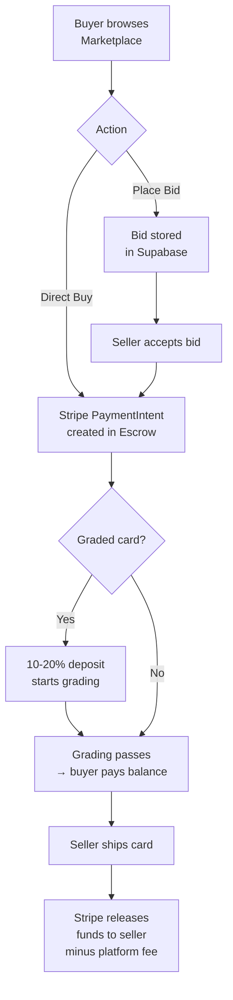

# HKCardVault — 寶可夢卡牌專業交易平台

A premium Japanese Pokémon card trading platform built for collectors and professional investors. It combines stock-market-style bid/ask trading with Stripe Connect escrow, real-time price feeds from Mercari JP, and a gamified collector experience — all delivered as a PWA.

---

## 📁 Directory Structure

```
Pokemon-Card-Trading-Platform/
├── app/                    # Next.js App Router — all pages and components
│   ├── admin/              # Admin panel (approvals, users, database, settings)
│   ├── auth/               # Login / sign-up flows
│   ├── components/         # Shared UI components (cards, nav, marketplace, PWA)
│   ├── profile/            # User profile, merchant dashboard, public profiles
│   ├── search/             # Marketplace / search page
│   ├── settings/           # Platform-level user settings
│   └── ~offline/           # PWA offline fallback page
├── docs/                   # Product requirements, task plans, RBAC spec
├── public/                 # Static assets (icons, splash screens)
├── .github/                # Copilot instructions, prompt files
├── .stitch/                # Stitch design system assets
├── next.config.ts          # Next.js + Serwist PWA configuration
└── tailwind.config         # (via PostCSS) Tailwind CSS v4
```

---

## 🛠 Tech Stack

- **Next.js 16.2** — App Router, Server Components, static + dynamic rendering
- **React 19.2** — UI framework with Server Actions and modern hooks
- **TypeScript 5** — Strict typing across all components and server code
- **Tailwind CSS v4** — Utility-first styling with custom Dark Gold design tokens
- **Framer Motion 12** — Spring physics animations for marketplace card hovers
- **Serwist (Workbox)** — PWA service worker, offline support, "Add to Home Screen"
- **Geist** — Headline/mono font stack (GeistSans + GeistMono)
- **Supabase** *(planned)* — Auth, database, real-time listings and order data
- **Stripe Connect** *(planned)* — Escrow payments, platform commission split, refunds

---

## ✨ Features

- Stock-market style trading: direct buy and live bid/ask matching
- Stripe Connect escrow with deposit-first flow for high-value graded cards
- Real-time price ticker and transaction wall on the homepage
- Mercari JP sold-data integration for historical price chart per card
- Dark Gold premium marketplace UI with Framer Motion hover effects
- PWA — installable on iOS/Android, offline fallback, push-ready
- Gamified collector profile: daily check-in streaks, points, and rank titles
- Admin panel: KYC approvals, user management, card database, platform settings

---

## 🔄 Workflow



---

## ⚖️ Pros & Cons / Known Issues

**Pros**
- ✅ Mobile-first PWA — works offline, installable without App Store
- ✅ Escrow architecture protects both buyers and sellers for high-value trades
- ✅ Premium Dark Gold design system; no generic blue SaaS aesthetic
- ✅ Server Components by default — fast TTFB, SEO-friendly card pages

**Cons / Known Issues**
- ⚠️ Supabase and Stripe are not yet integrated — all data is mock/demo only (`// TODO [MOCK DATA]`, `// TODO [BACKEND]` markers throughout)
- ⚠️ Search and filter chips have no live query handlers yet
- ⚠️ Mercari JP price scraper and TCGdex API are stubbed — no real pricing data
- ⚠️ `PwaInstallPrompt.tsx` and `PwaNetworkBanner.tsx` have known ESLint `setState-in-effect` warnings (pre-existing)

---

## 🚀 Local Setup

### Prerequisites

- [Node.js 20+](https://nodejs.org/)
- npm (bundled with Node.js)

### Installation

```bash
# 1. Clone the repository
git clone https://github.com/VxxxxC/Pokemon-Card-Trading-Platform.git
cd Pokemon-Card-Trading-Platform

# 2. Install dependencies
npm install
```

### Environment Variables

Supabase and Stripe keys are required for backend features. Create a `.env.local` file:

```bash
# Supabase
NEXT_PUBLIC_SUPABASE_URL=your_supabase_project_url
NEXT_PUBLIC_SUPABASE_ANON_KEY=your_supabase_anon_key

# Stripe
STRIPE_SECRET_KEY=sk_test_...
NEXT_PUBLIC_STRIPE_PUBLISHABLE_KEY=pk_test_...
```

> Without these, the app runs in full demo/mock mode — all pages are still browsable.

### Run Locally

```bash
npm run dev
```

Open [http://localhost:3000](http://localhost:3000) in your browser.

### Build for Production

```bash
npm run build
npm run start
```

### Lint

```bash
npm run lint
```

### Expose via Local Tunnel (optional)

```bash
npm run localtunnel
# Exposes localhost:3000 at https://pokemon-trading-platform.loca.lt
```
