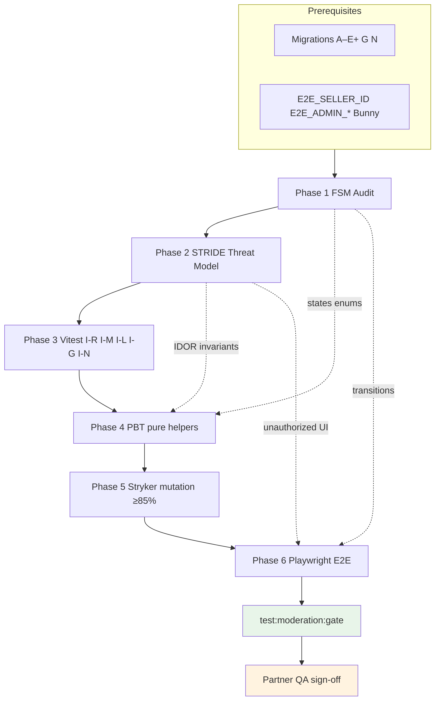

# Admin Moderation — 6-Phase Test Closure Plan

> **Status:** ✅ Implemented (26 integration + unit/PBT + mutation + E2E gate)  
> **Feature:** 舉報機制 / admin moderation & disputes (Phase A–E+ + Phase G + reporter notifications)  
> **Skills SSOT:** `.cursor/skills/phase{1..6}-*/SKILL.md`  
> **Artifacts:** [fsm-audit.md](./fsm-audit.md) · [threat-model-moderation.md](./threat-model-moderation.md)  
> **Backend contract:** [backend.md](./backend.md) · **Phase G UX:** [subject-history-plan.md](./subject-history-plan.md)  
> **Automation:** `tests/integration/moderation/moderation-matrix.integration.test.ts` (31) · `e2e/user-report.spec.ts` · `e2e/admin-moderation.spec.ts` · `e2e/report-outcome-notification.spec.ts`

---

## 1. Scope & prerequisites

### 1.1 In scope

| Area | Coverage target |
|------|-----------------|
| User report submit (`submitUserReport` / `rpc_submit_user_report_v2`) | Category validation, attachments, case merge, **context dedup** |
| Admin queue & detail | Search, bundle, chat thread + audit, score adjust, resolve + sanctions |
| Phase G subject history | `admin_get_subject_moderation_history` + detail panel |
| Reporter in-app notifications | `outcome_acknowledged_at` backfill, unacknowledged fetch, acknowledge, **resolution from `moderation_cases.resolution`** |
| Pure helpers | Contribution math, resolution mapping, outcome copy |
| E2E journeys | Buyer report, admin resolve, subject history, reporter toast |

### 1.2 Out of scope (v1 closure)

| Item | Notes |
|------|-------|
| Phase F auto-escalation cron | **v2** — [v2-plan.md](./v2-plan.md) |
| Email / push（含被罰用戶裁定通知） | **Pre-v1 全站 batch** — 唔屬 moderation v2；in-app reporter notify ✅ |
| Escrow refund saga on resolve | ✅ **Phase H** — `20260910180000`；I-H1–I-H12 + **I-H2/I-H3** auth paths in `phase-h-refund.integration.test.ts`；**I-H14** real Stripe E2E（env-gated，見下） |
| Listing 頁直接舉報 | **v2** |
| Appeal portal | **v2** |
| ML / NLP on chat | Not planned MVP |

完整 v2／pre-launch 決策：[v2-plan.md](./v2-plan.md)

### 1.3 Prerequisites

**Migrations must be applied** on the target Supabase project before integration/E2E runs:

| Migration | Purpose |
|-----------|---------|
| `20260806120000` – `20260812120000` | Phase A–E+ core + **context dedup** |
| `20260910150000` | Phase G subject history RPC |
| `20260910160000` | Reporter outcome notifications + `outcome_acknowledged_at` backfill |
| `20260910180000` | Phase H moderation order refund saga RPCs |
| `20260910190000` – `20260910210000` | Phase H eligibility / e2e seed fixes |
| `20260911120000` | `merchant_direct` sets `payment_capture_status = fully_captured` on paid (I-H14 prerequisite) |
| `20260911130000` | E2E seeds for `merchant_auth` + `member_auth` refund-eligible orders (I-H2 / I-H3) |
| `20260911140000` | Member order trigger bypass for moderation refund **prepare** only (`rpc_prepare_moderation_order_refund`); finalize bypass → **PR3** |
| `20260912120000` | Grading fail buyer fault single capture + seller settlement restore in finalize |
| `20260912130000` | Restore admin grading-fail member trigger bypass (regression from `20260911140000`) |

```bash
bunx supabase db push
bun run supabase:types
```

### 1.4 Environment variables

#### Integration / Vitest (`hasModerationIntegrationEnv`)

| Variable | Required | Purpose |
|----------|----------|---------|
| `NEXT_PUBLIC_SUPABASE_URL` | ✅ | Supabase project URL |
| `NEXT_PUBLIC_SUPABASE_ANON_KEY` | ✅ | Anon key for session clients |
| `SUPABASE_SERVICE_ROLE_KEY` | ✅ | DB assert helpers, chat room seed |
| `E2E_BUYER_EMAIL` / `E2E_BUYER_PASSWORD` | ✅ | Reporter persona (`runAsBuyer`) |
| `E2E_ADMIN_EMAIL` / `E2E_ADMIN_PASSWORD` | ✅ | Admin persona (`runAsAdmin`) |
| `E2E_SELLER_ID` | ✅ | Subject `profiles.id` (accused user) |

#### E2E-only (additional)

| Variable | Required | Purpose |
|----------|----------|---------|
| `E2E_SELLER_USERNAME` | Recommended | Public profile navigation |
| `E2E_LISTING_ID` | Optional | Marketplace fixtures (not all moderation tests) |
| `BUNNY_STORAGE_ZONE_NAME` | Attachment tests only | Report evidence upload |
| `BUNNY_STORAGE_ACCESS_KEY` | Attachment tests only | |
| `BUNNY_CDN_HOSTNAME` | Attachment tests only | |

#### I-H14 Stripe refund smoke (pre-release E2E — **not** in `test:moderation:gate:full`)

| Variable | Required | Purpose |
|----------|----------|---------|
| `STRIPE_SECRET_KEY` | ✅ | Stripe test mode refund assert |
| `E2E_SELLER_EMAIL` / `E2E_SELLER_PASSWORD` | ✅ | Fulfillment RPC (aligned with `E2E_SELLER_ID`) |
| `PLAYWRIGHT_BASE_URL` | Optional | Default `http://localhost:3000`; set staging URL for remote smoke |

```bash
bun run stripe:webhook:listen   # terminal 1 — PI → payment_held
bun run test:e2e:moderation-stripe-smoke   # terminal 2
```

| ID | Scenario | Layer |
|----|----------|-------|
| **I-H14** | Real `merchant_direct` checkout → in-window buyer confirm → admin `upheld_warn_only` + seller-fault refund → DB `refunded` + Stripe `refunds.retrieve` succeeded | `e2e/moderation-stripe-refund-smoke.spec.ts` |

Requires migration `20260911120000` (`payment_capture_status = fully_captured` on direct paid).

#### I-H2 / I-H3 auth refund confidence (integration — in `test:integration:moderation`)

| ID | Scenario | Layer |
|----|----------|-------|
| **I-H2** | `merchant_auth` seed → eligible → resolve + `orderRefund` → `refund_status = processing` (fake PI) | `phase-h-refund.integration.test.ts` |
| **I-H3** | `member_auth` seed → eligible → resolve + `orderRefund` → `refund_status = processing` (fake PI) | `phase-h-refund.integration.test.ts` |

Requires migration `20260911130000`. Real Stripe path remains **I-H14** (`merchant_direct` only). Member refund prepare also requires `20260911140000` (trigger bypass).

Tests **skip gracefully** when env is missing (`describe.skipIf`, `test.skip`) — gate script should treat skip-as-pass only when documented; prefer full env on staging.

### 1.5 Partner QA accounts

| Role | Account |
|------|---------|
| Reporter (buyer) | `E2E_BUYER_*` |
| Subject (seller) | `E2E_SELLER_ID` |
| Admin | `E2E_ADMIN_*` |

Use **staging / dev** only. Wipe pair via `wipeModerationMatrixPair` / `deletePendingReports` between matrix runs.

### 1.6 退款政策 case 對照

> **SSOT**：[refund-policy.md](../../refund-policy.md) · **Admin 速查**：[REFUND_ADMIN_PLAYBOOK.md](./REFUND_ADMIN_PLAYBOOK.md)

| Policy case | Doc ref | Automated / QA |
|-------------|---------|----------------|
| S3 seller fault `merchant_direct` | refund-policy §8.3 | **I-H14** (Stripe E2E) |
| S3 `merchant_auth` / `member_auth` prepare | §8.2 | **I-H2**, **I-H3** (integration) |
| S1 seller fault fail single | §7.2 | Partner smoke / [admin-grading verify #4](../admin-grading/backend.md#verify-backend) — **無 grading IT** |
| S1 buyer fault fail single | §7.2 | **G-BF1–G-BF4** (`test:integration:grading`) · **G-BF-S1/S2** real Stripe (`test:integration:grading:stripe-smoke`) |
| S3 member_auth finalize (real Stripe) | §12 | **PR3**（prepare only today） |
| carrier / inconclusive on resolve | §11 | **PR3**（UI 未接） |

---

## 2. Per-phase objectives

### Phase 1 — FSM audit (`.cursor/skills/phase1-fsm/SKILL.md`)

**Objective:** Map and verify all moderation state machines; document illegal transitions, locking, idempotency, and stale-state handling.

#### Artifacts to audit

| Artifact | FSM focus |
|----------|-----------|
| `reports.status` | `pending` → `resolved` \| `dismissed` |
| `reports.outcome_acknowledged_at` | `NULL` (pending notify) → set on ack or `notifyReporter: false` |
| `moderation_cases.status` | `open` \| `reviewing` → `resolved` \| `dismissed` |
| `rpc_submit_user_report_v2` | Case merge; context dedup guards |
| `rpc_resolve_moderation_case` | `FOR UPDATE` on case; rejects already-closed |
| `account_sanctions` | Insert on upheld; `revoked_at` lift path |

#### Discovered states (baseline)

```text
reports:           pending → resolved | dismissed
moderation_cases:  open | reviewing → resolved | dismissed
outcome_ack:       unacknowledged (NULL) → acknowledged (timestamptz)
sanctions:         active → expired | revoked
```

#### Audit checklist (4 criteria)

1. **Illegal transitions** — e.g. resolve on `dismissed` case → `案件已結案`; upheld without chat when required → blocked unless override.
2. **Concurrency** — `rpc_resolve_moderation_case` uses `FOR UPDATE`; concurrent resolve should fail one caller.
3. **Idempotency** — `acknowledge_report_outcomes` safe on already-acked IDs; duplicate profile/chat dedup rejects second submit.
4. **Stale/TTL** — `ends_at` on suspend; expired sanctions no longer enforce (E+ manual QA); legacy reports backfilled on migration deploy.

#### Commands

```bash
# Read-only code discovery (agent / human)
rg "moderation_case_status|report_state|outcome_acknowledged" supabase/migrations lib/moderation app/actions

# Existing green baseline
bun run test:integration:moderation
```

#### Phase 1 deliverable

`docs/dev/follow-up/admin-moderation/fsm-audit-report.md` (optional) or inline section in PR: **Feature | States | Gaps | Proposed test IDs**.

---

### Phase 2 — STRIDE threat model (`.cursor/skills/phase2-threat-model/SKILL.md`)

**Objective:** STRIDE table for moderation boundaries; drive negative integration cases and E2E IDOR scenarios.

#### Artifacts to audit

| Location | Threat focus |
|----------|--------------|
| `reports` RLS | Reporter read own; accused cannot read |
| `report_attachments` RLS | Reporter insert/select; admin select; accused denied |
| `rpc_submit_user_report_v2` | `auth.uid()` reporter; party validation on chat room |
| `admin_*` / `rpc_resolve_*` | `_grading_require_admin()` |
| `get_unacknowledged_report_outcomes_for_me` | Reporter-scoped only |
| `acknowledge_report_outcomes` | Cannot ack another user's reports |
| Server actions `app/actions/admin-moderation.ts`, `reports.ts` | `isCurrentUserAdmin()` / session guards |

#### STRIDE matrix (seed — expand during audit)

| Threat ID | Vector | Location | Risk | Mitigation / test |
|-----------|--------|----------|------|-------------------|
| T-M1 | Spoofing | Non-admin calls `searchAdminModerationCases` | High | `I-M5` ✅ |
| T-M2 | Tampering | Buyer updates `reports.status` via PostgREST | High | RLS deny + optional `I-N7` |
| T-M3 | IDOR | User A fetches user B unacknowledged outcomes | High | `I-N6` |
| T-M4 | IDOR | User acks another reporter's `report_id` | High | `I-N6` |
| T-M5 | Privilege escalation | Authenticated calls `admin_get_subject_moderation_history` | High | `I-G6` |
| T-M6 | Info disclosure | Accused reads `report_attachments` | Med | RLS + manual SQL check |
| T-M7 | Repudiation | Admin chat view without audit | Med | `I-M3` ✅ (`view_chat`) |

#### Commands

```bash
rg "CREATE POLICY|REVOKE ALL|GRANT EXECUTE|SECURITY DEFINER" supabase/migrations/*moderation*
bun run test:integration:moderation -t "I-M5"
```

#### Phase 2 deliverable

STRIDE table appended to this doc or `threat-model-moderation.md`; each **High** row maps to ≥1 test ID below.

---

### Phase 3 — Vitest integration & unit (`.cursor/skills/phase3-vitest/SKILL.md`)

**Objective:** Close gaps in `moderation-matrix.integration.test.ts` and add focused unit tests for server-action guards and copy helpers.

#### Existing file

`tests/integration/moderation/moderation-matrix.integration.test.ts` — **13 cases** (I-R*, I-M*, I-L*).

#### Artifacts to create / extend

| File | Action |
|------|--------|
| `tests/integration/moderation/moderation-matrix.integration.test.ts` | Add **I-R6**, **I-G1–I-G5**, **I-N1–I-N5** |
| `tests/unit/moderation/report-outcome-copy.test.ts` | **New** — `reportOutcomeMessage` per resolution |
| `tests/unit/moderation/resolution-config.test.ts` | **New** — `mapResolutionOptionToInput` exhaustiveness |
| `tests/integration/moderation/helpers/db-assert.ts` | Add helpers: `getOutcomeAckState`, `countUnacknowledgedOutcomes`, `getSubjectHistory` |

#### Commands

```bash
# Full moderation integration matrix
bun run test:integration:moderation

# Single case while developing
bunx vitest run --config vitest.config.mts tests/integration/moderation/moderation-matrix.integration.test.ts -t "I-N1"

# Unit helpers
bunx vitest run --config vitest.config.mts tests/unit/moderation
```

#### Phase 3 exit criteria

- All IDs in §3 matrix marked ✅ or explicitly deferred with reason.
- No weakened assertions to force green.
- `bunx tsc --noEmit` · `bun run lint` clean.

---

### Phase 4 — Property-based tests (`.cursor/skills/phase4-pbt/SKILL.md`)

**Objective:** PBT for pure moderation math and classifiers; encode Phase 1 FSM enums and Phase 2 invariants.

#### Target modules

| Module | Properties |
|--------|------------|
| `lib/moderation/compute-report-contribution.ts` | `contribution >= 0`; chat multiplier ∈ `{1, 1.1}`; rounding stable |
| `lib/moderation/report-outcome-copy.ts` | Total function; resolution → distinct copy; `default` branch |
| `lib/moderation/resolution-config.ts` | `requiresUpheld` ⟺ upheld sanctions; evidence-insufficient flags |
| `lib/moderation/category-config.ts` | `chat: required` ⟹ slug ∈ `{offline_trade, harassment}` |

#### Artifacts to create

| File | Notes |
|------|-------|
| `lib/moderation/compute-report-contribution.pbt.test.ts` | Pure; preferred path per skill |
| `tests/integration/moderation/moderation-pbt.integration.test.ts` | Optional cross-check with DB weights |

Reuse `COUPON_PBT_NUM_RUNS` pattern → `MODERATION_PBT_NUM_RUNS` (default 1000).

#### Commands

```bash
MODERATION_PBT_NUM_RUNS=1000 bunx vitest run --config vitest.config.mts lib/moderation/compute-report-contribution.pbt.test.ts
# After package.json script added:
bun run test:integration:moderation:pbt
```

#### Phase 4 exit criteria

- No unhandled throws on boundary arbitraries (`0`, `MAX_INT`, empty string, null resolution).
- Shrink failures produce a matching exact unit test killer.

---

### Phase 5 — Mutation testing (`.cursor/skills/phase5-mutation/SKILL.md`)

**Objective:** Stryker on moderation pure helpers; mutation score ≥ 85%.

#### Mutate targets (extend `stryker.config.json` or add `stryker.moderation.config.json`)

```json
"mutate": [
  "lib/moderation/compute-report-contribution.ts",
  "lib/moderation/report-outcome-copy.ts",
  "lib/moderation/resolution-config.ts"
]
```

#### Artifacts

| File | Purpose |
|------|---------|
| `vitest.mutation.config.mts` | Include new `tests/unit/moderation/*` + PBT exact killers |
| `package.json` | `"test:moderation:mutation": "stryker run --config stryker.moderation.config.json"` |

#### Commands

```bash
bun run test:moderation:mutation
# Report: reports/mutation/moderation-mutation.html
```

#### Phase 5 exit criteria

- Mutation score ≥ 85% on listed files.
- Each survived mutant gets an exact boundary assertion (no production edits to game score).

---

### Phase 6 — Playwright E2E (`.cursor/skills/phase6-e2e/SKILL.md`)

**Objective:** Browser verification for reporter submit, admin resolve, subject history panel, reporter outcome toast.

#### Existing specs

| Spec | Coverage |
|------|----------|
| `e2e/user-report.spec.ts` | Chat/profile submit, offline_trade block, evidence upload, same-case merge, profile dedup |
| `e2e/admin-moderation.spec.ts` | Access control, admin list/detail, chat thread, score adjust, suspend redirect |

#### Artifacts to create / extend

| Spec / case | Action |
|-------------|--------|
| `e2e/user-report.spec.ts` | Add **E2E-R6** — duplicate chat-room report blocked (mirrors I-R6) |
| `e2e/admin-moderation.spec.ts` | Add **E2E-G5** — prior case visible in subject history panel |
| `e2e/report-outcome-notification.spec.ts` | **New** — **E2E-N1** reporter sees toast after admin resolve; dismiss ack |

#### Commands

```bash
# Seed chat case then admin flows (documented order)
bun run test:e2e e2e/user-report.spec.ts --project=buyer -g "buyer submits report from chat console"
bun run test:e2e e2e/admin-moderation.spec.ts --project=guest

# New scenarios
bun run test:e2e e2e/report-outcome-notification.spec.ts --project=buyer
bun run test:e2e e2e/admin-moderation.spec.ts --project=guest -g "E2E-G5"

# Proposed gate bundle (see §4)
bun run test:e2e:moderation-gate
```

#### Phase 6 exit criteria

- Phase 1 happy paths and Phase 2 IDOR scenarios assert **server rejection in UI** (toast / redirect), not only disabled buttons.
- `ReportOutcomeNotificationHost` shows copy from `moderation_cases.resolution`, not `reports.status`.

---

## 3. Test ID matrix

Legend: ✅ exists · 📋 proposed · 🚧 in progress (other agent) · ⏭ optional

### 3.1 Reporter submit (I-R*)

| ID | Phase | Description | Status | File |
|----|-------|-------------|--------|------|
| I-R1 | 3, 6 | Chat report succeeds; contribution with chat bonus | ✅ | matrix · `user-report` |
| I-R1b | 3 | Chat room counterparty mismatch rejected | ✅ | matrix |
| I-R2 | 3, 6 | Profile report succeeds | ✅ | matrix · `user-report` |
| I-R3 | 3, 6 | Profile + `offline_trade` rejected | ✅ | matrix · `user-report` |
| I-R4 | 3, 6 | Chat + profile reports merge same case | ✅ | matrix · `user-report` |
| I-R5 | 3, 6 | Duplicate profile same category blocked | ✅ | matrix · `user-report` |
| **I-R6** | **1, 3, 6** | **Duplicate chat same room blocked; different room allowed** | ✅ | matrix · `user-report` E2E-R6 |
| I-R7 | 3 | Max 3 attachments enforced | ⏭ | matrix |
| I-R8 | 3, 6 | Evidence upload binds to report | ✅ E2E | `user-report` (Bunny) |

### 3.2 Admin read & adjust (I-M*)

| ID | Phase | Description | Status | File |
|----|-------|-------------|--------|------|
| I-M1 | 3 | Admin search pending cases | ✅ | matrix |
| I-M2 | 3 | Case bundle includes report | ✅ | matrix |
| I-M3 | 3, 6 | Chat thread + `view_chat` audit | ✅ | matrix · `admin-moderation` |
| I-M4 | 3, 6 | Score adjustment | ✅ | matrix · `admin-moderation` |
| I-M5 | 2, 3 | Buyer cannot call admin actions | ✅ | matrix · `admin-moderation` |

### 3.3 Resolve & lifecycle (I-L*)

| ID | Phase | Description | Status | File |
|----|-------|-------------|--------|------|
| I-L1a | 3 | Dismiss — no sanctions | ✅ | matrix |
| I-L1b | 3, 6 | Uphold + suspend creates sanction | ✅ | matrix |
| I-L2 | 3 | Insufficient evidence path | ✅ | I-E4 |
| I-L3 | 3 | Double resolve rejected (FSM) | ✅ | matrix |

### 3.3b Enforcement side effects (I-E*)

| ID | Phase | Description | Status | File |
|----|-------|-------------|--------|------|
| **I-E1** | 3, 6 | `restrict_member_listing` inactivates matrix member listing | ✅ | matrix |
| **I-E2** | 3, 6 | `freeze_payout` sets `seller_payout_status` frozen | ✅ | matrix |
| **I-E3** | 3, 6 | Suspend blocks `sendMessage` | ✅ | matrix |
| **I-E4** | 3, 6 | Evidence override required when chat evidence insufficient | ✅ | matrix |
| **I-E5** | 3, 6 | Expired suspend clears `moderation_get_account_access_restriction` | ✅ | matrix |

### 3.4 Subject history Phase G (I-G*)

| ID | Phase | Description | Status | File |
|----|-------|-------------|--------|------|
| **I-G1** | **3** | RPC returns stats; prior cases exclude current | ✅ | matrix |
| **I-G2** | **3** | Expired suspend in `sanctionHistory` as `expired` | ✅ | matrix |
| **I-G3** | **3** | Non-admin denied (covers原 I-G5) | ✅ | matrix |
| **I-G4** | **3** | `upheldCount` + list `subjectPriorUpheldCount` | ✅ | matrix |
| **E2E-G5** | **6** | Admin detail shows prior case in history panel | ✅ | `admin-moderation` |

### 3.5 Reporter notifications (I-N*)

| ID | Phase | Description | Status | File |
|----|-------|-------------|--------|------|
| **I-N1** | **1, 3** | Resolve with notify → unacknowledged queue | ✅ | matrix |
| **I-N2** | **3** | insufficient_evidence lifecycle + ack clears queue | ✅ | matrix |
| **I-N3** | **3** | `notifyReporter: false` suppresses queue + sets ack | ✅ | matrix |
| **I-N4** | **3** | Outcome uses `moderation_cases.resolution` for copy | ✅ | matrix |
| **I-N5** | **3** | Ack idempotent (`updated: 0` on second call) | ✅ | matrix |
| **I-N6** | **2, 3** | Non-reporter cannot fetch/ack others' outcomes | ✅ | matrix (`hasFullModerationIntegrationEnv`) |
| **I-N7** | **2** | Legacy backfilled reports not in unack queue | ✅ | matrix |
| **E2E-N1** | **6** | Buyer sees outcome toast after resolve; ack dismisses | ✅ | `report-outcome-notification` |

### 3.6 PBT & mutation (P-M*)

| ID | Phase | Description | Status | File |
|----|-------|-------------|--------|------|
| P-M1 | 4 | `computeReportContribution` ≥ 0, rounding | 📋 | `*.pbt.test.ts` |
| P-M2 | 4 | Resolution copy total function | 📋 | PBT + unit |
| P-M3 | 5 | Mutation killers for contribution boundaries | 📋 | unit exact tests |
| P-M4 | 5 | Mutation killers for `mapResolutionOptionToInput` | 📋 | unit |

### 3.7 E2E access control (existing)

| ID | Phase | Description | Status | File |
|----|-------|-------------|--------|------|
| E2E-AC1 | 6 | Guest `/admin/disputes` → auth | ✅ | `admin-moderation` |
| E2E-AC2 | 6 | Buyer/seller cannot access admin | ✅ | `admin-moderation` |
| E2E-ENF1 | 6 | Suspended user redirect | ✅ | `admin-moderation` |
| **E2E-AB5a** | **6** | Suspended buyer redirected from `/marketplace` | ✅ | `admin-moderation` |
| **E2E-AB5b** | **6** | Admin exempt from self suspend on `/admin/disputes` | ✅ | `admin-moderation` |
| **E2E-AB6** | **6** | Expired suspend unblocks profile access | ✅ | `admin-moderation` |
| **E2E-AB7** | **6** | Permanent ban blocks seller login (with unban cleanup) | ✅ | `admin-moderation` |
| **E2E-AB8** | **6** | Related order card link + escrow timeline | ✅ | `admin-moderation` |

---

## 4. `test:moderation:gate` scripts (implemented)

**Split gate** (production sign-off):

| Script | Command |
|--------|---------|
| Fast | `bun run test:moderation:gate` → `scripts/moderation-release-gate.sh` |
| Full | `bun run test:moderation:gate:full` → fast + PBT + Stryker + E2E |

`package.json` scripts:

```json
{
  "test:integration:moderation:pbt": "vitest run --config vitest.config.mts tests/unit/moderation/compute-report-contribution.pbt.test.ts tests/unit/moderation/moderation-pbt.test.ts",
  "test:moderation:mutation": "stryker run stryker.moderation.config.json",
  "test:e2e:moderation-gate": "playwright test e2e/user-report.spec.ts e2e/admin-moderation.spec.ts e2e/report-outcome-notification.spec.ts --project=setup --project=guest --project=buyer",
  "test:moderation:gate": "bash scripts/moderation-release-gate.sh",
  "test:moderation:gate:full": "bash scripts/moderation-release-gate-full.sh"
}
```

Pre-release sign-off: `bun run test:moderation:gate:full && bun run build:ci`

---

## 5. CI recommendation

Moderation integration CI: [`.github/workflows/moderation-integration.yml`](../../../.github/workflows/moderation-integration.yml) — trigger via PR label `moderation`, nightly schedule, or `workflow_dispatch`. Requires full `E2E_*` secrets including `E2E_SELLER_EMAIL` / `E2E_SELLER_PASSWORD`.

Main CI (`.github/workflows/ci.yml`) runs tsc + lint + `build` only.

| Tier | When | Job | Notes |
|------|------|-----|-------|
| **PR optional** | Phase 3 complete | `bun run test:integration:moderation` | Requires GitHub secrets: Supabase + `E2E_*` fixtures |
| **Nightly** | Full gate | `bun run test:moderation:gate` | Same secrets + Bunny for I-R8/E2E attachment |
| **Pre-release** | Partner sign-off | Gate + `bun run build:ci` | Manual workflow_dispatch |

**Secrets checklist for CI:** mirror `.env` integration block in `docs/dev/e2e.md` § env table.

**Do not** block default PR CI on E2E until staging secrets are stable — follow rewards pattern (`test:rewards:gate` is local/nightly, not in default `ci.yml`).

---

## 6. Execution order & Partner QA sign-off

### 6.1 Recommended execution order

```text
1. Apply migrations (§1.3) + regenerate types
2. Phase 1 FSM audit → document gaps
3. Phase 2 STRIDE → map High threats to test IDs
4. Phase 3 Vitest — implement I-R6, I-G*, I-N* (blocked on Phase G / notify ship)
5. Phase 4 PBT — pure helpers
6. Phase 5 Mutation — extend Stryker config
7. Phase 6 E2E — E2E-R6, E2E-G5, E2E-N1
8. Run test:moderation:gate on staging
9. Partner sign-off → [PARTNER_QA_SIGNOFF.md](./PARTNER_QA_SIGNOFF.md)（staging 煙霧 + 可選 UX）
```

### 6.2 Partner QA sign-off

> **Partner 人手：** [PARTNER_QA_SIGNOFF.md](./PARTNER_QA_SIGNOFF.md) — **P1 staging 煙霧**（必做）、**P2 UX**（可選）。  
> **Logic：** stable gate（§Stable gate in signoff doc）— dev 負責，partner 唔重跑。  
> **Test gaps：** [Automation backlog](./PARTNER_QA_SIGNOFF.md#automation-backlog) — dev backlog，唔入 partner 清單。  
> **全專案待簽：** [PARTNER_QA_PENDING.md](../../PARTNER_QA_PENDING.md)

| # | Check | Covered by |
|---|-------|------------|
| 1–9 | 舉報／admin／outcome／權限／history 等業務規則 | Integration I-* · E2E · unit/PBT/mutation |
| 10 | Gate 全綠 on target branch | Dev stable gate |
| **P1** | Staging URL 煙霧主線 | **Partner 人手** ⬜ |
| **P2** | UX / 文案觀感 | Partner 可選 ⬜ |

**Partner sign-off line:** _______________ Date: ___________

---

## 7. Phase flow (Mermaid)



---

## 8. Dependencies on in-flight work

| Work item | Owner | Unblocks |
|-----------|-------|----------|
| Migration `20260910150000` + `getAdminSubjectModerationHistory` | Backend agent | I-G*, E2E-G5 |
| Migration `20260910160000` + `ReportOutcomeNotificationHost` | Frontend agent | I-N*, E2E-N1 |
| `ModerationSubjectHistoryPanel.tsx` | Frontend agent | E2E-G5 UI assertions |
| **I-R6** integration case | Test closure | Context dedup regression guard |

**Resolution message rule (regression guard):** UI and `getUnacknowledgedReportOutcomes` must use `moderation_cases.resolution` (via RPC join), **not** `reports.status` — `insufficient_evidence` vs `dismissed` diverge at case level.

---

## 9. References

- [backend.md](./backend.md) — action contracts, Partner manual QA Phase E/E+
- [frontend.md](./frontend.md) — UI touchpoints
- [subject-history-plan.md](./subject-history-plan.md) — Phase G acceptance
- [docs/dev/e2e.md](../../e2e.md) — env vars and Playwright projects
- [INTEGRATION_QUEUE.md](../../INTEGRATION_QUEUE.md) — queue row update when gate is green
