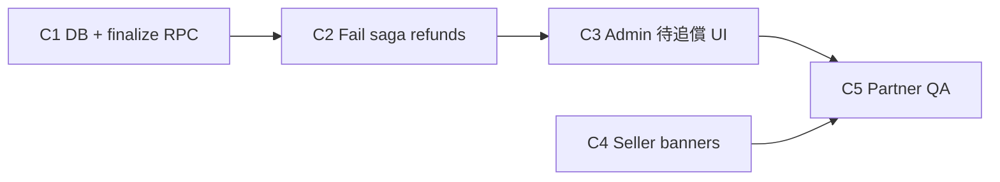

# Auth Escrow v2 — Phase C implementation plan

> **Status:** 📋 Planned (next slice after v2.1 single capture merge)  
> **Depends on:** `aaron-backend-wired` @ `53e7d83` (single capture pass/fail QA ✅)  
> **SSOT:** [plan.md](./plan.md) §6–7 · [backend.md](./backend.md) § Fail & settlement

---

## Goal

When admin marks **鑑定失敗** with `fault_party = seller`:

1. Buyer is fully released (single: PI cancel ✅ already; legacy: refund + void remainder).
2. Platform records **seller liability** (Member → `seller_receivables`; Merchant → `merchant_ledgers` `grading_fail_recovery`).
3. `seller_settlement_status` gates **寄回賣家** outbound tracking until Admin marks **cleared**.

MVP: **`fault_party = seller` only**. Other fault parties keep current behavior until P2.

---

## Current state (v2.1)

| Step | Single capture | Legacy multicapture |
|------|----------------|---------------------|
| Fail prepare | `refund_status=processing`, `fault_party` stored | Same |
| Stripe | `paymentIntents.cancel` | `capture(0, final_capture: true)` |
| Fail finalize | `cancelled` / `voided`, listing `active` | Same pattern + `auth_fee_captured` guard |
| Seller recovery | **Not wired** | **Not wired** |
| `seller_settlement_status` | Stays `none` | Stays `none` |

Schema from Phase A already exists: `seller_receivables`, `seller_settlement_status`, `grading_fail_recovery` enum value.

---

## Amount policy (seller fault MVP)

Use `fn_compute_auth_escrow_amounts` / order snapshots:

| Line item | Single (authorized only) | Legacy (partial captured) |
|-----------|--------------------------|---------------------------|
| Buyer outcome | Authorization released (no charge) | Refund captured `auth_fee + inbound` (+ refunds if any goods leg captured) |
| Seller receivable base | `auth_fee + inbound_shipping_fee` (+ configurable platform SF legs if policy adds) | Captured refund total owed to buyer + Stripe fee (from balance transaction when available) |
| Stripe fee | Optional `stripe_fee_hkd` on receivable row; MVP can estimate 0 or read from PI after cancel |

**Single-capture note:** Buyer was never charged; seller still owes platform for auth + inbound logistics per policy §6.2.

Confirm exact formula with product once before migration (document in `escrow-payment-policy.md` v0.2).

---

## Implementation slices

### C1 — DB & finalize RPC

**Migration** `20260902xxxxxx_auth_escrow_phase_c_settlement.sql`:

1. **`fn_compute_seller_grading_fail_liability(p_order_kind, p_order_id)`**  
   Returns `{ amount_hkd, stripe_fee_hkd, breakdown_json }` for `fault_party = seller`.

2. **Extend `rpc_finalize_auth_grading_fail`** (when `fault_party = seller`):
   - `INSERT INTO seller_receivables` (member) or `merchant_ledgers` (`grading_fail_recovery`, negative amount).
   - `UPDATE` orders: `seller_settlement_status = 'pending'`.
   - Idempotent: skip if receivable/ledger row already exists for order.

3. **Legacy branch:** After Stripe refunds (new saga step), then finalize as today + receivable.

4. **Single branch:** After cancel (existing), finalize + receivable (no Stripe refund).

5. **`rpc_admin_clear_seller_settlement`** — Admin marks FPS received / ledger cleared → `seller_settlement_status = 'cleared'`, receivable `status = paid`.

6. **Gate `rpc_admin_submit_grading_outbound`** (or member equivalent): for failed orders returning card to seller, require `seller_settlement_status = 'cleared'` when `auth_result = failed` AND `fault_party = seller`.

### C2 — Fail saga (Stripe)

**File:** `lib/payments/auth-grading-fail-void-saga.ts`

| Model | Today | Phase C |
|-------|-------|---------|
| `single` | `cancel` | Keep cancel |
| `legacy` | `capture(0)` only | **Add** `stripe.refunds.create` for captured `auth_fee + inbound` before or after void |

Prepare RPC may return `refund_cents` / `void_mode` hints for saga.

Webhook: ensure `payment_intent.canceled` + refund events remain idempotent with finalize.

### C3 — Admin UI

**`/admin/grading`** (or new tab **待追償**):

| Action | RPC |
|--------|-----|
| List `seller_settlement_status = pending` | `search_admin_grading_orders` tab or new `search_seller_receivables` |
| Mark seller paid (FPS ref) | `rpc_admin_clear_seller_settlement` |
| Submit return-to-seller tracking | Existing outbound RPC (gated) |

**Server actions:** `app/actions/admin-grading.ts` — `adminClearSellerSettlement`, extend queue row with `seller_settlement_status`, receivable amount.

### C4 — Seller visibility (minimal)

- Member seller order detail: banner「待結清平台款項」when `seller_settlement_status = pending`.
- Merchant: finance / order detail shows ledger recovery line (read-only).

Frontend handoff: [frontend.md](./frontend.md) Phase C section.

### C5 — Verify

```bash
bunx supabase db push && bun run supabase:types
bunx tsc --noEmit && bun run build:ci
```

**Partner QA (member single):**

1. New auth order → intake → fail (`fault_party=seller`).
2. DB: `seller_receivables` row `pending`, `seller_settlement_status=pending`.
3. Admin clear settlement → `cleared` / receivable `paid`.
4. Admin can submit **寄回賣家** tracking (if product enables return flow on failed orders).

**Legacy smoke:** one `escrow_capture_model IS NULL` order — fail refunds captured auth+inbound.

---

## Out of scope (Phase C)

- `fault_party` ≠ `seller` amount matrix (P2).
- Connect automatic debit for merchant debt.
- Auth checkout coupons (Phase D → unlocks Rewards 2b).
- Moderation / listing ban for unpaid receivables (governance follow-up).

---

## Suggested order of work



1. **C1** — unblock data model (can test with SQL only).
2. **C2** — legacy refund path (single path already works).
3. **C3** — Admin can clear and unblock return.
4. **C4** — optional polish.
5. **C5** — E2E sign-off before merge to `Dev`.

---

## Changelog

| Date | Change |
|------|--------|
| 2026-08-08 | Phase C plan drafted post v2.1 Partner QA |
