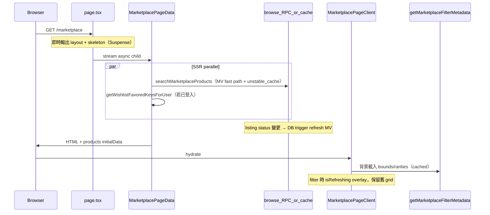
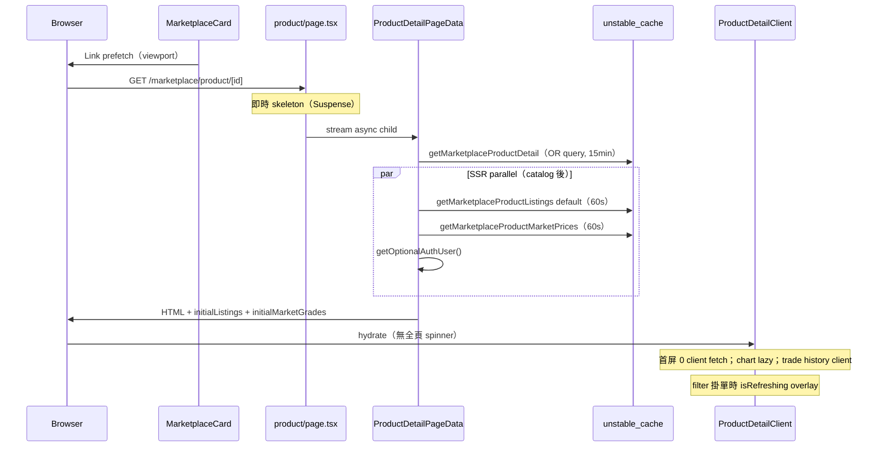

# Marketplace 效能診斷報告

**最後更新：** 2026-07-07（Phase 3 + Product Detail P0–P2）  
**環境：** local dev (`bun run dev`)，Supabase linked remote 已同步  
**量度方式：** `[marketplace:perf]` server log + curl TTFB + browser console + anon RPC smoke test

**涵蓋範圍：** `/marketplace` grid · `/marketplace/product/[id]` product detail

---

## 實作總覽

### Phase 1 — 診斷 instrumentation ✅

| 項目 | 狀態 |
|------|------|
| Server timing（bootstrap / RPC） | ✅ |
| Client search counter | ✅ |
| TTFB / TTI / LCP observer | ✅ |

### Phase 2 — 首屏架構 ✅

| 項目 | 狀態 | 關鍵檔案 |
|------|------|----------|
| 統一 `pageSize`（12） | ✅ | [`lib/marketplace/constants.ts`](../../../lib/marketplace/constants.ts) |
| Streaming + Suspense | ✅ | [`MarketplacePageData.tsx`](../../marketplace/MarketplacePageData.tsx), [`MarketplacePageSkeleton.tsx`](../../marketplace/MarketplacePageSkeleton.tsx) |
| SSR 只等 search；metadata 延後 | ✅ | [`MarketplacePageData.tsx`](../../marketplace/MarketplacePageData.tsx) |
| Filter metadata `unstable_cache`（15min） | ✅ | `getMarketplaceFilterMetadata` in [`marketplace.ts`](../../../app/actions/marketplace.ts) |

### Phase 3 — 體感 + backend 快路徑 ✅

| 項目 | 狀態 | 關鍵檔案 |
|------|------|----------|
| SWR grid（`isRefreshing`） | ✅ | [`useMarketplaceSearch.ts`](../../../app/lib/hooks/useMarketplaceSearch.ts) |
| 圖片 optimization | ✅ | [`MarketplaceCard.tsx`](../../components/marketplace/MarketplaceCard.tsx), [`next.config.ts`](../../../next.config.ts) |
| Wishlist SSR | ✅ | `getWishlistFavoredKeysForUser` + [`MarketplacePageData.tsx`](../../marketplace/MarketplacePageData.tsx) |
| Rarities DISTINCT RPC | ✅ | `20260707120000_marketplace_performance_extend.sql` |
| Browse MV + `search_marketplace_products_browse` | ✅ | 同上 |
| Browse RPC `SECURITY DEFINER` + MV grants | ✅ | `20260707140000_marketplace_browse_security_definer.sql` |
| MV 隨 listing 變動自動 refresh | ✅ | `20260707150000_marketplace_mv_refresh_on_listing_change.sql` |
| 首頁 browse `unstable_cache`（60s） | ✅ | [`search-default.ts`](../../../lib/marketplace/search-default.ts), [`marketplace.ts`](../../../app/actions/marketplace.ts) |
| `createPublicClient`（cache-safe，無 `cookies()`） | ✅ | [`lib/supabase/public.ts`](../../../lib/supabase/public.ts) |
| MarketplaceCard grading badge | ✅ | [`MarketplaceCard.tsx`](../../components/marketplace/MarketplaceCard.tsx) |

### Phase 4 — Product detail `/marketplace/product/[id]` ✅

| 項目 | 狀態 | 關鍵檔案 |
|------|------|----------|
| 移除全頁 `isMounted` hydration spinner | ✅ | [`ProductDetailClient.tsx`](../../marketplace/product/[id]/ProductDetailClient.tsx) |
| Streaming + Suspense + skeleton | ✅ | [`page.tsx`](../../marketplace/product/[id]/page.tsx), [`ProductDetailPageData.tsx`](../../marketplace/product/[id]/ProductDetailPageData.tsx), [`ProductDetailSkeleton.tsx`](../../marketplace/product/[id]/ProductDetailSkeleton.tsx) |
| SSR parallel：catalog + listings + market prices + auth | ✅ | [`ProductDetailPageData.tsx`](../../marketplace/product/[id]/ProductDetailPageData.tsx) |
| Hook `initialData`（skip 首屏 client fetch） | ✅ | [`useMarketplaceProductListings.ts`](../../../app/lib/hooks/useMarketplaceProductListings.ts), [`useMarketplaceProductMarketPrice.ts`](../../../app/lib/hooks/useMarketplaceProductMarketPrice.ts) |
| 掛單簿 SWR `isRefreshing` overlay | ✅ | [`ProductDetailClient.tsx`](../../marketplace/product/[id]/ProductDetailClient.tsx) |
| Recharts lazy load（`ssr: false`） | ✅ | [`ProductPriceChart.tsx`](../../marketplace/product/[id]/ProductPriceChart.tsx) |
| Hero image optimization（移除 `unoptimized`） | ✅ | [`ProductDetailClient.tsx`](../../marketplace/product/[id]/ProductDetailClient.tsx) |
| Catalog 單 query `.or(id, display_id)` | ✅ | `runLoadProductCatalogDetail` in [`marketplace.ts`](../../../app/actions/marketplace.ts) |
| `unstable_cache`：catalog（15min）· market prices（60s）· default listings（60s） | ✅ | [`constants.ts`](../../../lib/marketplace/constants.ts), [`product-detail-default.ts`](../../../lib/marketplace/product-detail-default.ts), [`marketplace.ts`](../../../app/actions/marketplace.ts) |
| Public reads → `createPublicClient`（catalog / prices / listings RPC） | ✅ | [`marketplace.ts`](../../../app/actions/marketplace.ts) |
| Grid → detail `<Link prefetch>` | ✅ | [`MarketplaceCard.tsx`](../../components/marketplace/MarketplaceCard.tsx) |

---

## 現況架構（優化後）



### Product detail（Phase 4）



---

## 量度對照

### 診斷前（Phase 1 baseline）

| 指標 | Mobile | Desktop |
|------|--------|---------|
| TTFB（curl cold） | ~2000ms | ~2000ms |
| bootstrap wall | ~900ms（三 query parallel） | ~1568ms |
| Client search（首 2s） | 0 | **1**（pageSize 9→11 hydration） |
| 首屏體感 | 全頁白屏等 bootstrap | 同左 |

### 優化後（Phase 2+3，local dev）

| 指標 | 預期 / 觀察 |
|------|-------------|
| TTFB（curl warm） | **~160ms**（shell streaming） |
| `GET /marketplace` 總時間 | **~400–1100ms**（stream 完成，視 search RPC） |
| Client search（首 2s，有 initialData） | **0**（pageSize 統一 = 12） |
| Filter / 分頁 | 舊 grid 保留 + overlay（`isRefreshing`） |
| Browse 首頁（migration 後） | `searchMarketplaceProductsBrowse` ~**400ms**（anon RPC）；60s cache hit 更快 |
| `inactive` listing 可見性 | status 變更後即時消失（MV trigger）；Next cache 最多 lag **60s** |

### Product detail — 優化前 vs 後（架構層）

| 指標 | 優化前 | 優化後（預期） |
|------|--------|----------------|
| SSR 輸出 | 全頁 spinner（`isMounted=false`） | Catalog + 掛單 + 市價 HTML 即時可見 |
| 首屏 client server actions | **3**（listings + market prices + trade history） | **0**（預設 filter）；trade history 仍 client（below fold + auth） |
| TTFB 體感 | 白屏等 catalog + auth | Suspense skeleton → stream |
| Catalog DB round-trip | 最多 **2**（id → display_id） | **1**（`.or`） |
| Repeat visit（同 product） | 每次 hit DB | catalog **15min** · prices/listings default **60s** cache |
| Grid → detail navigation | `router.push`（無 prefetch） | `<Link prefetch>` |
| 首屏 JS | Recharts 同步 bundle | `ProductPriceChart` dynamic import |

> **Remote DB：** `bunx supabase db push --linked` → `Remote database is up to date`（截至 2026-07-07）。Product detail 優化 **唔需要新 migration**。

---

## 部署與維護

### 必須 — migration 順序

```bash
bunx supabase db push --linked
```

| Version | 檔案 | 內容 |
|---------|------|------|
| `20260707120000` | `marketplace_performance_extend.sql` | rarities RPC、MV、`search_marketplace_products_browse`、`refresh_marketplace_product_summaries` |
| `20260707130000` | `complete_member_order_buyer_only.sql` | P2P complete 買家限定（**唔係** MV grants） |
| `20260707140000` | `marketplace_browse_security_definer.sql` | `GRANT SELECT` on MV + browse RPC 改 `SECURITY DEFINER` |
| `20260707150000` | `marketplace_mv_refresh_on_listing_change.sql` | listing 變動後自動 `REFRESH MATERIALIZED VIEW` |

### Cache TTL

| Key | TTL | 用途 |
|-----|-----|------|
| `MARKETPLACE_SEARCH_CACHE_SECONDS` | **60s** | 首頁 default browse |
| `MARKETPLACE_FILTER_CACHE_SECONDS` | **15min** | Price bounds + rarities |
| `MARKETPLACE_PRODUCT_CATALOG_CACHE_SECONDS` | **15min** | Product detail catalog |
| `MARKETPLACE_PRODUCT_MARKET_PRICES_CACHE_SECONDS` | **60s** | Product detail market prices（cron 更新） |
| `MARKETPLACE_PRODUCT_DEFAULT_LISTINGS_CACHE_SECONDS` | **60s** | Product detail order book（page 1 · price asc · 無 filter） |

定義於 [`lib/marketplace/constants.ts`](../../../lib/marketplace/constants.ts)；product detail default listings 判斷見 [`lib/marketplace/product-detail-default.ts`](../../../lib/marketplace/product-detail-default.ts)。

### 可選 — 大量 bulk 更新後

Trigger 用 non-concurrent `REFRESH`（同一 transaction 內唔可以用 `CONCURRENTLY`）。若批量 import 後想減 lock，可用 service role 手動：

```sql
SELECT refresh_marketplace_product_summaries();  -- CONCURRENTLY
```

---

## 已知問題與修正

### `unstable_cache` + `cookies()` 衝突（已修正）

**症狀：**  
`Route /marketplace used cookies() inside a function cached with unstable_cache()`

**原因：** `unstable_cache` 內呼叫 `createClient()` → `cookies()`，Next.js 16 不允許。

**修正：** 公開唯讀 RPC（browse、price bounds、rarities）改用 [`createPublicClient()`](../../../lib/supabase/public.ts)（anon key，無 session cookie）。需 user session 嘅 action 仍用 `createClient()`。

### MV `permission denied`（已修正）

**症狀：** `permission denied for materialized view marketplace_product_summaries`

**原因：** `search_marketplace_products_browse` 為 `SECURITY INVOKER`；`anon` / `authenticated` 無 MV 嘅 `SELECT` grant。

**修正：** migration `20260707140000_marketplace_browse_security_definer.sql` — `GRANT SELECT` on MV **and** `search_marketplace_products_browse` 改為 `SECURITY DEFINER`。

**驗證：** `prosecdef = true`；anon RPC browse ~400ms、0 permission error。

### Migration version 衝突（已處理）

**症狀：**

```
Applying migration 20260707130000_marketplace_product_summaries_grants.sql...
ERROR: duplicate key value violates unique constraint "schema_migrations_pkey"
Key (version)=(20260707130000) already exists.
```

**原因：** 曾計劃用 `20260707130000_marketplace_product_summaries_grants.sql`，但 version `20260707130000` 已被 `complete_member_order_buyer_only` 佔用。兩個檔案唔可以共存。

**修正：**
- 刪除 `20260707130000_marketplace_product_summaries_grants.sql`（grants 內容已併入 `07140000`）
- 只保留 `bunx supabase db push --linked`；唔好手動 apply grants migration

### `inactive` listing 仍顯示於大盤（已修正）

**症狀：** `listings.status = inactive` 嘅商品仍出現喺 `/marketplace` grid。

**原因：** `marketplace_product_summaries` 係 materialized view，定義上有 `WHERE l.status = 'active'`，但只喺 **REFRESH** 時先重新計算。Listing 變 inactive 後若 MV 未 refresh，舊 row 會一直留低。

**修正：** `20260707150000_marketplace_mv_refresh_on_listing_change.sql` — `listings` INSERT / DELETE / `status`（等）UPDATE 後 statement-level trigger 自動 `REFRESH MATERIALIZED VIEW`。

**殘餘 lag：** Next.js `unstable_cache` browse 最多 **60s**；DB 層面 status 變更後應即時正確。

**驗證：** anon browse RPC 返回嘅 `lowest_listing_id` 全部 `status = active`。

---

## 如何重現量度

1. `NODE_ENV=development`（預設開 perf log）或 `MARKETPLACE_PERF_LOG=1` / `NEXT_PUBLIC_MARKETPLACE_PERF_LOG=1`
2. 開 `/marketplace`，檢查 **terminal** + **browser console**（prefix `[marketplace:perf]`）

### Server log 範例（優化後）

```
[marketplace:perf] searchMarketplaceProductsBrowse page=1 size=12 sort=latest=45ms
[marketplace:perf] getMarketplacePriceBounds=12ms
[marketplace:perf] getMarketplaceRarities=8ms
GET /marketplace 200 in 530ms
```

### Client log 範例（優化後）

```
[marketplace:perf] ttfb=162ms domContentLoaded=... load=...
[marketplace:perf] skipSearch searchKey=... reason=initialData
[marketplace:perf] clientSearchSummary count=0 within=2000ms
[marketplace:perf] timeToInteractive=... viewport=desktop pageSize=12 hasInitialData=true
```

---

## 剩餘可優化項（未做）

### Grid `/marketplace`

| 優先 | 項目 | 說明 |
|------|------|------|
| P3 | `framer-motion` → CSS hover | 每張 card 減少 JS 開銷 |
| P3 | Filtered search RPC 深度優化 | 有 keyword/filter 時仍走重型 CTE；可考慮 partial index / 預聚合 |
| P3 | `loading.tsx` route-level | client navigation 體感 |
| P3 | Browse cache tag invalidation | listing 變更後 `revalidateTag` 縮短 60s lag（可選；DB trigger 已處理正確性） |

### Product detail `/marketplace/product/[id]`

| 優先 | 項目 | 說明 |
|------|------|------|
| P3 | Trade history SSR（已登入） | `getMarketplaceProductTradeHistory` 可 parallel 於 `ProductDetailPageData`；guest 仍 blur |
| P3 | Product detail perf instrumentation | 沿用 `[marketplace:perf]` 或加 product-detail prefix |
| P3 | Cache tag invalidation | listing / cron 更新後 `revalidateTag` 縮短 60s lag |
| P3 | `loading.tsx` route-level | client navigation 體感（Suspense fallback 已覆蓋 cold load） |
| P3 | 404 copy / link back | [`frontend.md`](../marketplace-product-detail/frontend.md) polish TODO |

---

## 相關檔案索引

### Grid `/marketplace`

| 檔案 | 用途 |
|------|------|
| [`lib/marketplace/constants.ts`](../../../lib/marketplace/constants.ts) | `MARKETPLACE_GRID_PAGE_SIZE`, cache TTL |
| [`lib/marketplace/search-default.ts`](../../../lib/marketplace/search-default.ts) | 預設 browse 判斷（無 filter 首頁） |
| [`lib/marketplace/perf-log.ts`](../../../lib/marketplace/perf-log.ts) | Server timing |
| [`lib/supabase/public.ts`](../../../lib/supabase/public.ts) | Cache-safe anon client |
| [`app/lib/marketplace/perf-log-client.ts`](../../../app/lib/marketplace/perf-log-client.ts) | Client search counter |
| [`app/actions/marketplace.ts`](../../../app/actions/marketplace.ts) | Search / browse / metadata actions |
| [`app/lib/hooks/useMarketplaceSearch.ts`](../../../app/lib/hooks/useMarketplaceSearch.ts) | `isLoading` / `isRefreshing` |
| [`app/marketplace/MarketplacePageData.tsx`](../../marketplace/MarketplacePageData.tsx) | SSR data + wishlist |
| [`app/marketplace/MarketplacePageClient.tsx`](../../marketplace/MarketplacePageClient.tsx) | Grid UI + perf markers |
| [`supabase/migrations/20260707120000_marketplace_performance_extend.sql`](../../../supabase/migrations/20260707120000_marketplace_performance_extend.sql) | MV + browse RPC + rarities |
| [`supabase/migrations/20260707140000_marketplace_browse_security_definer.sql`](../../../supabase/migrations/20260707140000_marketplace_browse_security_definer.sql) | SECURITY DEFINER + grants |
| [`supabase/migrations/20260707150000_marketplace_mv_refresh_on_listing_change.sql`](../../../supabase/migrations/20260707150000_marketplace_mv_refresh_on_listing_change.sql) | MV auto-refresh trigger |

### Product detail `/marketplace/product/[id]`

| 檔案 | 用途 |
|------|------|
| [`lib/marketplace/product-detail-default.ts`](../../../lib/marketplace/product-detail-default.ts) | Default order-book filter 判斷（cache 快路徑） |
| [`app/marketplace/product/[id]/page.tsx`](../../marketplace/product/[id]/page.tsx) | Suspense shell |
| [`app/marketplace/product/[id]/ProductDetailPageData.tsx`](../../marketplace/product/[id]/ProductDetailPageData.tsx) | SSR parallel fetch + initialData |
| [`app/marketplace/product/[id]/ProductDetailSkeleton.tsx`](../../marketplace/product/[id]/ProductDetailSkeleton.tsx) | Streaming fallback |
| [`app/marketplace/product/[id]/ProductDetailClient.tsx`](../../marketplace/product/[id]/ProductDetailClient.tsx) | Client layout · `isRefreshing` · lazy chart |
| [`app/marketplace/product/[id]/ProductPriceChart.tsx`](../../marketplace/product/[id]/ProductPriceChart.tsx) | Recharts（dynamic import） |
| [`app/lib/hooks/useMarketplaceProductListings.ts`](../../../app/lib/hooks/useMarketplaceProductListings.ts) | Order book + `initialData` |
| [`app/lib/hooks/useMarketplaceProductMarketPrice.ts`](../../../app/lib/hooks/useMarketplaceProductMarketPrice.ts) | Market banner/chart + `initialData` |
| [`app/components/marketplace/MarketplaceCard.tsx`](../../components/marketplace/MarketplaceCard.tsx) | `<Link prefetch>` → detail |
| [`app/actions/marketplace.ts`](../../../app/actions/marketplace.ts) | `getMarketplaceProductDetail` · listings · market prices（cached） |

---

## 驗收 checklist

### Grid `/marketplace`

- [x] `bunx supabase db push --linked` 已套用（remote up to date）
- [ ] `/marketplace` 無 `cookies()` inside `unstable_cache` console error
- [ ] Terminal 見到 `searchMarketplaceProductsBrowse`（首頁無 filter）
- [ ] 無 `permission denied for materialized view marketplace_product_summaries`
- [ ] `inactive` listing 唔會長期留喺 grid（status 變更後）
- [ ] Desktop `clientSearchSummary count=0`（首 2s）
- [ ] curl warm TTFB < 500ms
- [ ] Filter 時 grid 唔會成個消失（只有 overlay）

### Product detail `/marketplace/product/[id]`

- [ ] Cold load：Suspense skeleton → catalog + 掛單 + 市價（唔係全頁 spinner）
- [ ] 首屏 Network：無 `getMarketplaceProductListings` / `getMarketplaceProductMarketPrices` server action（預設 filter）
- [ ] 改掛單 filter：舊 rows 保留 + `isRefreshing` overlay
- [ ] 走勢圖：首屏後 lazy load `ProductPriceChart` chunk
- [ ] Grid card：`<Link prefetch>` — viewport 內 card 會 prefetch detail route
- [ ] Repeat load 同一 product：第二次明顯快（catalog 15min · prices/listings 60s cache）
- [ ] `display_id` URL：單次 OR query 可 resolve（唔使兩次 round-trip）
- [ ] `bun run build:ci` pass（Supabase env unset）
