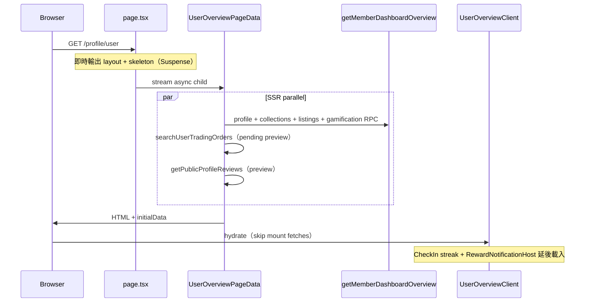

# Member Dashboard 效能優化報告

**最後更新：** 2026-07-07  
**範圍：** `/profile/user` 總覽頁

---

## 問題摘要

`layout.tsx` 本身無 data fetch；慢因全頁 CSR + mount 後 6+ server actions waterfall，最重為 `getMemberDashboardOverview()`（collection rows + pricing context）。

---

## 已實作

| 項目 | 狀態 | 檔案 |
|------|------|------|
| SSR Streaming + Suspense skeleton | ✅ | `page.tsx`, `UserOverviewPageData.tsx`, `UserOverviewSkeleton.tsx` |
| Server 並行 bootstrap（overview + orders + reviews） | ✅ | `UserOverviewPageData.tsx` |
| `initialData` 跳過首屏 client fetch | ✅ | `useMemberDashboard.ts`, `UserOverviewClient.tsx` |
| 單一 supabase client + 收窄 collection select | ✅ | `member-dashboard.ts` |
| 重用 `activeListings`（免重複 seller listings query） | ✅ | `build-entries.ts` `userListingRows` option |
| PTS 經 RPC 讀取（唔直接查 `gamification_stats`） | ✅ | `member-dashboard.ts` → `get_gamification_stats_for_me` |
| `[dashboard:perf]` server / client timing | ✅ | `lib/dashboard/perf-log.ts`, `app/lib/dashboard/perf-log-client.ts` |
| 延遲 RewardNotificationHost | ✅ | `UserProfileDashboardShell.tsx` |
| CheckInCard 用 overview points + defer streak | ✅ | `CheckInCard.tsx` |
| Tab Link prefetch | ✅ | `ProfileTabNav.tsx` |

---

## Bug 修正

### `permission denied for table gamification_stats`

| | |
|---|---|
| **症狀** | Console：`[fetchGamificationPointsBalance] permission denied for table gamification_stats`；Hero PTS 顯示 `0` |
| **原因** | 優化後 `getMemberDashboardOverview` 直接 `SELECT` `gamification_stats`；該表無 authenticated 直接讀取權（RLS） |
| **修正** | 改用既有 `SECURITY DEFINER` RPC `get_gamification_stats_for_me()`（同 `getGamificationStats` / `CheckInCard`） |
| **檔案** | `app/actions/member-dashboard.ts` |

---

## 現況架構（優化後）



---

## 驗證

```bash
# Dev — server timing
bun run dev
# → 開 /profile/user，terminal 應見 [dashboard:perf] overview.totalMs=...
# → 唔應再見 gamification_stats permission denied

# CI-safe build
bun run build:ci
```

| 檢查項 | 預期 |
|--------|------|
| 首屏 Hero + 3 張 stats 卡 | SSR HTML 內可見（唔係 spinner） |
| Hero PTS | 顯示真實 `points_balance`（唔係 0） |
| Client mount server actions | ~6 → 0（CheckIn streak + rewards 延後） |
| `getMemberDashboardOverview` | 少 1 次 listings query + 較少 collection 欄位傳輸 |
| CI | `bun run build:ci` 通過 |

---

## 預期改善

- 首屏 Hero + stats 隨 HTML 輸出（唔等 hydrate）
- Client mount server actions：~6 → 0（CheckIn streak + rewards 延後）
- `getMemberDashboardOverview`：少 1 次 listings query + 較少 collection 欄位傳輸
- 積分讀取走 RPC，符合 DB 權限模型

---

## 後續（未做）

- `unstable_cache` per-user stats TTL 60s
- DB RPC `get_member_portfolio_stats` for 100+ card collections
- 其他 tab（collection / inventory / trading）套用同一 `*PageData` 模式
