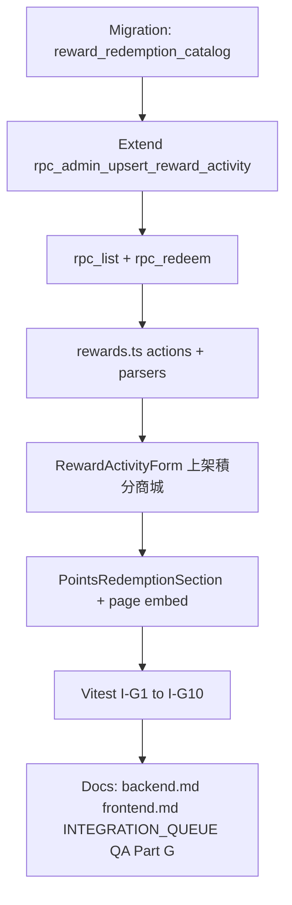

# Platform Rewards v2 — Phase 4（積分商城 · Points Redemption Catalog）

> **Status:** 📋 Planned — doc only; no migrations or app code yet  
> **Depends on:** Platform Rewards Phase 1–3 ✅ · `fn_redeem_member_points` (`20260706170000`) · `fn_issue_reward_from_template` · member persona guards  
> **Unlocks:** Member persona spends PTS to redeem `discount_coupon` / `free_shipping` coupons from an admin-configured catalog  
> **Master plan:** [plan.md](./plan.md) §7.5 · §Phase 4  
> **Integration queue:** No dedicated Phase 4 row yet — add to [INTEGRATION_QUEUE.md](../../INTEGRATION_QUEUE.md) when backend work starts (see §Implementation phases)

## 目標

讓 **會員 persona** 在既有 **`/profile/user/rewards`** 頁面，用積分兌換平台券（`discount_coupon` / `free_shipping`），無需新路由或獨立「積分商城」頁。

**一句話：** Admin 在獎勵活動表單勾選「上架積分商城」並設定 `points_cost` / `stock`；會員在獎勵頁 `FlashCampaignSection` 下方看到 `PointsRedemptionSection`；兌換 RPC 原子扣積分 + 發券 + 扣庫存。

---

## Goal & scope

### In scope (MVP)

| 區域 | 內容 |
|------|------|
| **Placement** | 積分兌換區塊嵌入既有 [`/profile/user/rewards`](../../../app/profile/user/rewards/page.tsx) — **無新 route** |
| **Catalog items** | 僅 `discount_coupon`、`free_shipping`（FK → `reward_templates`） |
| **Persona** | 僅 **member persona** 可賺/花積分；merchant persona 須切換至 member 身份 |
| **Admin** | 在 [`RewardActivityForm`](../../../app/admin/campaigns/RewardActivityForm.tsx) / [`rpc_admin_upsert_reward_activity`](../../../supabase/migrations/20260820120000_reward_trigger_events_expansion.sql) 流程新增「**上架積分商城**」toggle + `points_cost` / `stock` / `is_active` |
| **DB** | `reward_redemption_catalog` + `rpc_list_points_redemption_catalog` + `rpc_redeem_points_catalog_item` |
| **Backend actions** | [`app/actions/rewards.ts`](../../../app/actions/rewards.ts) 新增 list + redeem helpers |
| **Member UI** | 新元件 `PointsRedemptionSection` — 置於 `FlashCampaignSection` **下方**、折價券中心 tabs **上方** |
| **Tests** | Vitest integration + 可選 E2E；Partner QA Part G（草案） |

### Out of scope

| 項目 | 原因 / 歸屬 |
|------|-------------|
| 獨立 `/profile/user/rewards/points-shop` 或新 tab | 產品定案：同一頁區塊即可 |
| 實體禮品 / SKU 物流 | **v2 goods** — deferred |
| `points` 類型 catalog 項目 | MVP 只發券，不「用積分換積分」 |
| `lucky_draw_ticket` | 香港牌照 — 維持封存 |
| Merchant 專屬積分帳戶 | 商戶 **無** 積分；見 §Persona rules |
| Checkout 用券變更 | Phase 2/2b/5 已覆蓋；Phase 4 只 **發券到 wallet** |
| SQL-seed-only catalog | Admin UI 為 SSOT；seed 僅供 local/E2E fixture |

---

## Persona rules（商戶 vs 會員積分）

| 規則 | 定案 |
|------|------|
| 積分餘額 SSOT | `gamification_stats.points_balance` + `point_ledger`（僅經 `fn_apply_point_transaction`） |
| 誰能賺積分 | 簽到、任務、template 發放 — **member persona only**（既有行為） |
| 誰能花積分 | `rpc_redeem_points_catalog_item` — **member persona only** |
| Merchant 帳號 | **沒有**獨立商戶積分；商戶 persona 看獎勵頁時積分區塊應隱藏或顯示切換提示 |
| Server guard | 所有 member-facing actions 在 RPC 前呼叫 [`guardMemberPersonaPersonalFeatures`](../../../lib/auth/guard-member-persona-server.ts)（同 `getGamificationStats`、`executeDailyCheckIn`、`getUserRewardCoupons`） |
| SQL guard | **MVP：action + UI only**（`guardMemberPersonaPersonalFeatures` + `useIsMemberPersonaActive`）。直接呼叫 RPC 的 merchant session 仍可 bypass — 與 flash claim 相同風險；Phase 4b 可選加 SQL persona check |
| 商戶要兌換 | 須切換至 **會員身份**（listing persona = member）後再操作 |

**UI 文案建議（merchant blocked）：** 沿用 `MEMBER_PERSONA_FEATURES_BLOCKED_ERROR` 或「請切換至會員身份以使用積分功能」。

---

## DB schema — `reward_redemption_catalog`

對齊 master plan [§7.5](./plan.md#75-phase-4--reward_redemption_catalog)。

**建議 migration 檔名：** `supabase/migrations/YYYYMMDDHHMMSS_points_redemption_catalog.sql`

### Table: `reward_redemption_catalog`

| Column | Type | Notes |
|--------|------|-------|
| `id` | `UUID` PK | `gen_random_uuid()` |
| `template_id` | `UUID` NOT NULL | FK → `reward_templates(id)` ON DELETE RESTRICT |
| `points_cost` | `INTEGER` NOT NULL | `CHECK (points_cost > 0)` |
| `stock` | `INTEGER` NOT NULL | 剩餘可兌換份數；`CHECK (stock >= 0)` |
| `initial_stock` | `INTEGER` | 可選稽核；預設 = 建立時 `stock` |
| `is_active` | `BOOLEAN` NOT NULL | default `false`；Admin「上架積分商城」 |
| `display_order` | `INTEGER` | 可選排序；default `0` |
| `created_at` | `TIMESTAMPTZ` | default `now()` |
| `updated_at` | `TIMESTAMPTZ` | trigger 維護 |

**Constraints & indexes:**

```sql
-- 一個 template 最多一筆 catalog row（MVP）
UNIQUE (template_id)

-- 列表查詢
CREATE INDEX idx_redemption_catalog_active
  ON reward_redemption_catalog (is_active, display_order)
  WHERE is_active = true;
```

**Template eligibility（RPC 強制）：**

- `reward_templates.type IN ('discount_coupon', 'free_shipping')`
- `reward_templates.status = 'active'` 且 `is_active = true`
- **禁止** `points`、`lucky_draw_ticket`
- Member list：**回傳所有 `catalog.is_active = true` 項目**（含 `stock = 0`），以 `can_redeem = false` + UI「已兌完」標示售罄；**唔** server-side filter `stock > 0`

### Access / RLS

- `reward_redemption_catalog`：**無** authenticated `SELECT` policy（對齊 `reward_templates` — master plan §Design principles）
- Member 只經 `rpc_list_points_redemption_catalog` / `rpc_redeem_points_catalog_item` 存取
- Admin 經 `rpc_admin_upsert_reward_activity`（service role / admin session）寫入
- Migration：`REVOKE ALL` on table from `PUBLIC` / `authenticated`；僅 `service_role` + SECURITY DEFINER RPC

### Template inventory vs catalog stock（⚠️ blocker — 開工前必讀）

`fn_issue_reward_from_template`（[`20260705183000_reward_template_claim_limits.sql`](../../../supabase/migrations/20260705183000_reward_template_claim_limits.sql)）會檢查 template **`max_claims` / `claimed_count`**，庫存用盡時可 `RETURN NULL` 或自動 `is_active = false`。

**定案（catalog 為唯一發券上限）：**

| 規則 | 行為 |
|------|------|
| Catalog 上架時 | Admin upsert **強制** `reward_templates.is_infinite = true`（或等效 bypass template stock） |
| 發券份數 cap | **僅** `reward_redemption_catalog.stock`；template `claimed_count` 仍會遞增但唔阻擋 catalog redeem |
| 驗證 | Integration `I-G10`：finite `max_claims` + catalog enabled **未**設 `is_infinite` → redeem 應被 admin 層擋或測試 fail |

### Optional audit table（建議，非 MVP 阻擋）

`reward_redemption_claims` — `catalog_id`, `user_id`, `user_reward_id`, `points_spent`, `created_at` — 方便客服與防爭議；若省略，以 `point_ledger`（`source = redemption`, `source_ref = catalog_id`）+ `user_rewards` 追溯。

---

## Admin workflow —「上架積分商城」

**觸點：** [`RewardActivityForm.tsx`](../../../app/admin/campaigns/RewardActivityForm.tsx) · [`upsertAdminRewardActivity`](../../../app/actions/admin-reward-activities.ts) · [`rpc_admin_upsert_reward_activity`](../../../supabase/migrations/20260820120000_reward_trigger_events_expansion.sql)（live RPC；含多條 early `RETURN` 路徑）

### UX（繁中標籤）

在活動表單新增區塊（建議置於發放方式 / 檔期之下）：

| 欄位 | 標籤 | 行為 |
|------|------|------|
| Toggle | **上架積分商城** | `is_active` on catalog row |
| Number | **兌換積分** | `points_cost`（> 0） |
| Number | **商城庫存** | `stock`（≥ 0）；新建時可設 `initial_stock` |
| Hint | — | 僅 `discount_coupon` / `free_shipping` 顯示此區；`points` 類型隱藏 |

### Payload 擴展（`p_payload` JSONB）

```json
{
  "redemption_catalog": {
    "enabled": true,
    "points_cost": 500,
    "stock": 100,
    "is_active": true,
    "display_order": 0
  }
}
```

`enabled: false` → upsert catalog row 設 `is_active = false`（保留 `points_cost` / `stock` 供下次上架）。

### `rpc_admin_upsert_reward_activity` 變更（概念）

1. 現有 flow：upsert `reward_templates` (+ campaign if `flash_only` / schedule)。
2. **新增（須在所有 `RETURN` 之前執行）：** `20260820120000` 有 auto_grant / flash_only / schedule 等多條 early return — catalog upsert 必須在 **shared block** 內、**每條 return 路徑之前**完成，不可只掛在單一分支尾。
3. 若 `redemption_catalog.enabled` 且 template type ∈ coupon types：
   - `INSERT ... ON CONFLICT (template_id) DO UPDATE` on `reward_redemption_catalog`
   - Validate `points_cost > 0`；`stock >= 0`
   - **強制** `reward_templates.is_infinite = true`（見 §Template inventory）
   - Reject `is_active = true` if `template.status != 'active'`
   - Reject `stock` decrease below redeemed count：`stock >= initial_stock - sold`（或追蹤 `sold_count`）
4. 若 type 非 coupon 但 `enabled` → `RAISE EXCEPTION '僅折扣券與免運券可上架積分商城'`
5. **`distribution_mode = flash_only` + catalog enabled：** MVP **禁止**同一 template 同時搶券 + 積分商城（admin validation error）
6. **`rpc_admin_set_reward_activity_status` → `archived`：** 同步 `catalog.is_active = false`
7. Return row JSON 加入 `redemption_catalog` 子物件（供 admin 編輯頁回填）

### Admin list / get

- `rpc_admin_get_reward_activity` / `_reward_activity_row_to_json`  JOIN catalog 欄位
- [`AdminRewardActivityRow`](../../../lib/admin-rewards/types.ts) 擴展 `redemption_catalog?: { ... }`

**非 SQL-seed-only：** 營運透過 `/admin/campaigns` 配置；integration/E2E 可用 migration fixture 種一筆 active catalog。

---

## RPC contracts

### 1. `rpc_list_points_redemption_catalog`

**Role:** `authenticated`（member session）

**Signature:**

```sql
rpc_list_points_redemption_catalog()
RETURNS JSONB  -- or SETOF JSON; prefer JSONB array for parity with flash list
```

**Return shape（每項）：**

```json
{
  "catalog_id": "uuid",
  "points_cost": 500,
  "stock": 42,
  "can_redeem": true,
  "user_points_balance": 1200,
  "template": {
    "id": "uuid",
    "title": "HK$10 折扣券",
    "description": "...",
    "type": "discount_coupon",
    "reward_value": { "amount_hkd": 10, "min_spend_hkd": 100 },
    "restrictions": { "order_kinds": ["merchant"], "..." : "..." }
  }
}
```

**Filter rules:**

- `catalog.is_active = true`
- `template.status = 'active'` AND `template.is_active = true`
- `template.type IN ('discount_coupon', 'free_shipping')`
- Order by `display_order`, `points_cost`

**`can_redeem`:** `stock > 0` AND `user_points_balance >= points_cost`（`stock = 0` 仍列出，`can_redeem = false`）

**Errors:** 未登入 → exception `請先登入`（或空陣列 + action layer 擋 — 與 flash list 對齊）

---

### 2. `rpc_redeem_points_catalog_item`

**Role:** `authenticated`

**Signature:**

```sql
rpc_redeem_points_catalog_item(p_catalog_id UUID)
RETURNS JSONB
```

**Atomic steps（單 transaction，`FOR UPDATE` catalog row）：**

1. `auth.uid()` 非空
2. Lock `reward_redemption_catalog` WHERE `id = p_catalog_id`
3. Validate catalog active, stock > 0, template eligible (coupon types, active)
4. Read user `points_balance`（`gamification_stats` 或 `get_gamification_stats_for_me` SSOT）
5. If balance < `points_cost` → rollback
6. **`fn_redeem_member_points(points_cost, description, catalog_id)`** — ledger `redemption`, negative amount via `fn_apply_point_transaction`
7. **`fn_issue_reward_from_template(user_id, template_id, dedup_key)`** — template 須已 `is_infinite = true`（§Template inventory）。dedup_key：`'catalog:' || catalog_id::text || ':' || gen_random_uuid()::text`（MVP：**每次兌換獨立券**；dedup 含 uuid 避免 `fn_issue` 靜默 NULL）
8. **`UPDATE reward_redemption_catalog SET stock = stock - 1`** WHERE `id = ... AND stock > 0`（二次檢查防超賣）
9. Optional: insert `reward_redemption_claims`
10. Return success payload

**Success return:**

```json
{
  "success": true,
  "catalog_id": "uuid",
  "points_redeemed": 500,
  "points_balance": 700,
  "user_reward_id": "uuid",
  "template_id": "uuid"
}
```

**Error cases（`RAISE EXCEPTION` 訊息建議）：**

| Condition | Message（繁中） |
|-----------|------------------|
| 未登入 | `請先登入` |
| `p_catalog_id` 無效 | `商品編號無效` |
| Catalog 不存在 / 未上架 | `積分商城商品不存在或已下架` |
| `stock <= 0` | `商品已兌完` |
| 積分不足 | `積分不足` |
| Template 非 coupon / 未 active | `獎勵模板不可用` |
| `fn_issue_reward_from_template` 失敗 | `發券失敗，請稍後再試`（transaction 整體 rollback，積分不扣） |
| 併發超賣 | `商品已兌完`（stock UPDATE 0 rows） |

**Grants:** `REVOKE PUBLIC`; `GRANT EXECUTE TO authenticated, service_role`

**Reference — points spend SSOT:** [`fn_redeem_member_points`](../../../supabase/migrations/20260706170000_points_mission_redemption_rpcs.sql)（`p_source_ref` = `catalog_id`）

**Reference — issue coupon:** [`fn_issue_reward_from_template`](../../../supabase/migrations/20260705183000_reward_template_claim_limits.sql)（canonical；含 `max_claims` / `claimed_count`）

**Per-user redemption（MVP）：** 無 `max_redemptions_per_user`；用戶積分足夠可重複兌換同一 SKU（每次獨立 `user_rewards`）。Phase 4b 可再加每人限次。

---

## Server actions — `app/actions/rewards.ts`

新增（命名可調，保持與 `reward-flash.ts` 分離或合併 — 建議放 `rewards.ts` 與其他 member rewards 一致）：

### `listPointsRedemptionCatalog()`

```ts
type PointsRedemptionCatalogResult =
  | { success: true; data: PointsRedemptionCatalogView[] }
  | { success: false; error: string };
```

- `isSupabaseConfigured()` guard
- `guardMemberPersonaPersonalFeatures()` — **required**
- `supabase.rpc('rpc_list_points_redemption_catalog')`
- Parse to view type in `lib/rewards/mapPointsRedemptionCatalog.ts`（新建）

### `redeemPointsCatalogItem(catalogId: string)`

```ts
type RedeemPointsCatalogResult =
  | {
      success: true;
      data: {
        pointsRedeemed: number;
        pointsBalance: number;
        userRewardId: string;
      };
    }
  | { success: false; error: string };
```

- Same guards as list
- `supabase.rpc('rpc_redeem_points_catalog_item', { p_catalog_id: catalogId })`
- On success: caller refreshes coupon wallet + points balance

**Pattern reference:** [`app/actions/reward-flash.ts`](../../../app/actions/reward-flash.ts) (`listActiveFlashCampaigns`, `claimFlashReward`)

---

## Member UI — `PointsRedemptionSection`

### Placement（產品定案）

在 [`app/profile/user/rewards/page.tsx`](../../../app/profile/user/rewards/page.tsx)：

```tsx
<CheckInCard />
<FlashCampaignSection onClaimed={reloadCoupons} />
<PointsRedemptionSection onRedeemed={reloadCoupons} />  {/* NEW */}
<section id="redeem-list">  {/* 折價券中心 tabs */}
```

**不是** 新 route、**不是** 新 tab — 為頁內 section（標題建議：**積分商城** / `POINTS REDEMPTION STORE`）。

### Component: `app/components/rewards/PointsRedemptionSection.tsx`

| 行為 | 說明 |
|------|------|
| Mount | 呼叫 `listPointsRedemptionCatalog()` |
| 顯示 | 券面額/免運 cap（可複用 `FlashCampaignSection` 的 `rewardLabel` 邏輯或抽 shared helper） |
| 每項 | `points_cost` PTS、剩餘庫存、`can_redeem` |
| CTA | 「兌換」— disabled 當 `!can_redeem`；confirm toast |
| Success | `onRedeemed()` → parent `reloadCoupons()`；**section 自行**呼叫 `getGamificationStats()` 更新頂部 PTS（`CheckInCard` 無 `onStatsChange` prop，唔依賴 parent） |
| Merchant persona | Section 不渲染或顯示 guard error（與 `CheckInCard` 一致；**唔**順手改 `FlashCampaignSection` — flash 無 persona guard 係已知 asymmetry） |
| Loading / error | 對齊 `FlashCampaignSection` 模式 |

**Addition-only 守則：** 不刪改 `FlashCampaignSection` 與折價券中心既有結構；新 section 為插入區塊。

### Types

- `PointsRedemptionCatalogView` in `lib/rewards/` — **不**手寫 DB table interface；parser 對齊 RPC JSON

---

## Integration test checklist

**檔案建議：** `tests/integration/rewards/points-redemption-catalog.integration.test.ts`

**Fixture：** Admin upsert activity with `redemption_catalog` 或 SQL seed template + catalog row；member test user 有足夠 `points_balance`。

| ID | 情境 | 預期 |
|----|------|------|
| `I-G1` | `rpc_list_points_redemption_catalog` — active coupon catalog | 回傳項目含 `points_cost`, `can_redeem` |
| `I-G2` | List 排除 `points` / inactive template | 空或不含非法 type |
| `I-G3` | `rpc_redeem_points_catalog_item` happy path | `points_balance` 減少；`user_rewards` 新增；`stock` 減 1 |
| `I-G4` | 積分不足 | Exception `積分不足`；stock 不變 |
| `I-G5` | `stock = 0` | `can_redeem = false`；redeem reject |
| `I-G6` | 併發雙 redeem（同一 catalog 最後 1 stock） | 僅一筆成功（兩 session / service-role fixture） |
| `I-G10` | Catalog enabled 但 template `is_infinite = false` + finite `max_claims` | Admin upsert reject 或 redeem fail；防 B1 regression |
| `I-G7` | `fn_redeem_member_points` ledger | `point_ledger` 有 `redemption` 負向列；`source_ref = catalog_id` |
| `I-G8` | Admin upsert `redemption_catalog` via activity RPC | catalog row 與 template 同步 |
| `I-G9` | Server action + `guardMemberPersonaPersonalFeatures` mock deny | `{ success: false }` |

**Gate 命令：**

```bash
bun run test:integration:rewards
bunx tsc --noEmit && bun run lint && bun run build:ci
```

**E2E（可選）：** `e2e/platform-rewards-phase4.spec.ts` — member 兌換後折價券中心「可領取 / 可使用」tab 出現新券。

---

## Implementation phases & acceptance criteria



### Phase 4a — DB + RPC（Backend）

- [ ] Migration `reward_redemption_catalog` (+ optional claims)
- [ ] Patch `rpc_admin_upsert_reward_activity` / get activity JSON
- [ ] `rpc_list_points_redemption_catalog`
- [ ] `rpc_redeem_points_catalog_item`（atomic 三步）
- [ ] `bun run supabase:types` → `types/supabase.ts`

**Acceptance:** SQL 手動 redeem 後 `point_ledger` + `user_rewards` + `stock` 一致。

### Phase 4b — Admin UI

- [ ] `RewardActivityForm` — 上架積分商城區塊
- [ ] `AdminRewardActivityUpsertInput` + `buildActivityPayload` 擴展
- [ ] 僅 coupon types 顯示欄位

**Acceptance:** Admin 建立 HK$10 券 template + 500 PTS / 100 stock → member list 可見。

### Phase 4c — Member UI + actions

- [ ] `listPointsRedemptionCatalog` / `redeemPointsCatalogItem`
- [ ] `PointsRedemptionSection` below Flash, above coupon tabs
- [ ] `guardMemberPersonaPersonalFeatures` on all paths

**Acceptance:** Member 兌換後券出現在折價券中心；商戶 persona 無法兌換。

### Phase 4d — QA & docs

- [ ] Vitest `I-G*`
- [ ] Update [backend.md](./backend.md), [frontend.md](./frontend.md)
- [ ] Add **Platform rewards v2 — Phase 4** row to [INTEGRATION_QUEUE.md](../../INTEGRATION_QUEUE.md)
- [ ] [QA_CHECKLIST.md](./QA_CHECKLIST.md) Part G（可從本檔測試表複製）

**Release gate:** extend `bun run test:rewards:gate` when E2E added.

---

## Relationship to Phase 5 & v2 goods

### Phase 5（Member Auth 免運券）— **獨立**

| 維度 | Phase 4 | Phase 5 |
|------|---------|---------|
| 目的 | 積分 **換券** 到 wallet | Checkout **用** 免運券 |
| 觸點 | `/profile/user/rewards` | `/checkout/[id]` `member_auth` |
| 依賴 | 不依賴 Phase 5 | 不依賴 Phase 4（可並行） |
| 共用 | 兌換出的 `free_shipping` template 若 `order_kinds` 含 `member`，Phase 5 checkout 可用 | [`phase-5-plan.md`](./phase-5-plan.md) |

Phase 4 兌換的免運券能否用於 member 鑑定 checkout，取決於 template `restrictions.order_kinds` — Admin 配置責任，非 Phase 4 RPC 強制。

### v2 physical goods — **deferred**

- 新 `reward_type` 或 catalog `kind = physical_sku`
- 收貨地址、庫存 WMS、出貨狀態
- 可能需獨立 fulfillment 表 — **不在 MVP**

---

## Reference files

| Asset | Path |
|-------|------|
| Master plan §7.5 | [plan.md](./plan.md#75-phase-4--reward_redemption_catalog) |
| Rewards page layout | [`app/profile/user/rewards/page.tsx`](../../../app/profile/user/rewards/page.tsx) |
| Flash section（上方鄰居） | [`app/components/rewards/FlashCampaignSection.tsx`](../../../app/components/rewards/FlashCampaignSection.tsx) |
| Admin activity form | [`app/admin/campaigns/RewardActivityForm.tsx`](../../../app/admin/campaigns/RewardActivityForm.tsx) |
| Admin activity actions | [`app/actions/admin-reward-activities.ts`](../../../app/actions/admin-reward-activities.ts) |
| Member rewards actions | [`app/actions/rewards.ts`](../../../app/actions/rewards.ts) |
| Persona guard | [`lib/auth/guard-member-persona-server.ts`](../../../lib/auth/guard-member-persona-server.ts) |
| Points spend RPC | [`supabase/migrations/20260706170000_points_mission_redemption_rpcs.sql`](../../../supabase/migrations/20260706170000_points_mission_redemption_rpcs.sql) |
| Issue from template | [`supabase/migrations/20260705183000_reward_template_claim_limits.sql`](../../../supabase/migrations/20260705183000_reward_template_claim_limits.sql) |
| Admin activity RPC (live) | [`supabase/migrations/20260820120000_reward_trigger_events_expansion.sql`](../../../supabase/migrations/20260820120000_reward_trigger_events_expansion.sql) |
| Flash claim（原子庫存參考） | [`supabase/migrations/20260817120000_reward_flash_campaigns.sql`](../../../supabase/migrations/20260817120000_reward_flash_campaigns.sql) |
| Phase 5（獨立） | [phase-5-plan.md](./phase-5-plan.md) |
| Points SSOT 文檔 | [member-rewards-gamification/backend.md](../member-rewards-gamification/backend.md) |

---

## Changelog

| Date | Change |
|------|--------|
| 2026-08-09 | 初稿：無新頁、MVP coupon catalog、member-only points、admin 上架積分商城、RPC/actions/UI 合約、測試與 Phase 5 關係 |
| 2026-08-09 | Review pass：template `is_infinite` vs catalog stock、RLS、admin early-return、售罄 list 行為、persona MVP、I-G10 |
