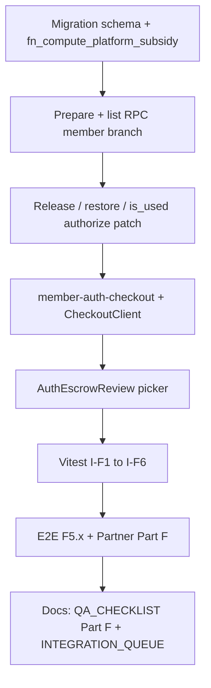

# Platform Rewards v2 — Phase 5（Member Auth 免運券）

> **Status:** 🟡 In progress — migration + app wiring landed; apply `20260910110000_member_auth_checkout_coupon.sql` then run integration/E2E gates  
> **Depends on:** Auth Escrow v2 Phase D ✅ · Platform Rewards Phase 2b/3 ✅ Partner QA  
> **Unlocks:** C2C 鑑定託管 checkout 使用平台免運券；`order_kinds` 含 `member` 的通用模板  
> **Partner QA:** 本檔驗收後更新 [QA_CHECKLIST.md](./QA_CHECKLIST.md) **Part F** · [INTEGRATION_QUEUE.md](../../INTEGRATION_QUEUE.md)

## 目標

在 **`member_auth`** unified checkout（`/checkout/[id]`）支援 **`free_shipping` 免運券**，補貼規則與 merchant 鑑定 Phase D 對齊（只減 **outbound leg**），且 **不影響賣家 FPS 卡價**。

**一句話：** Member 鑑定單只得用免運券；買家少付 outbound 補貼；賣家仍收 `final_price`；平台承擔補貼差額。

---

## MVP 範圍（In scope）

| 區域 | 內容 |
|------|------|
| DB | `member_orders` 券 snapshot 欄位；`user_rewards.reserved_member_order_id` |
| SQL | 泛化 `fn_compute_platform_subsidy` / list / prepare / release / restore |
| Webhook | `member_auth` authorize 時 `is_used=true`；cancel / void 還券 |
| Cron | 未付款過期釋放 member 預留券（parity merchant） |
| Backend | `member-auth-checkout.ts` 傳 `userRewardId`；`checkout-coupons.ts` 支援 member 訂單 |
| Frontend | `AuthEscrowReview` 對 `member_auth` 顯示 picker；summary 平台優惠行 |
| QA | Vitest + E2E + Partner Part F |

## 明確 Out of scope

| 項目 | 原因 |
|------|------|
| P2P **無鑑定** / 面交 offline 用券 | 無 unified checkout / Stripe PI |
| Member **`discount_coupon`** | 產品定案：鑑定單折扣券違反人性 |
| `percent_off`、積分商城（Phase 4） | 另 phase |
| 平台補貼 admin 報表、`manual_claim`、爭議人工改券 | Phase 5b（[plan.md](./plan.md) § Phase 5 原列表） |
| Polymorphic `reserved_order_id` 重構 | 風險大；沿用雙欄位 |

---

## 產品定案（會計）

### 買家 / 賣家 / 平台

```text
total_amount      = item_subtotal + auth_fee + inbound_shipping_fee + outbound_shipping_fee
platform_subsidy  = LEAST(outbound_shipping_fee, max_subsidy_hkd)   -- 僅 free_shipping
buyer_total       = total_amount − platform_subsidy
Stripe PI         = buyer_total_amount（single manual capture，與現有 member auth 一致）

seller_fps_amount = final_price    -- 原卡價；不因券減少
```

| 角色 | 規則 |
|------|------|
| **買家** | 只少付 outbound 補貼；auth_fee、inbound **不**補貼 |
| **賣家（Member）** | FPS 出款 = `final_price`（v1 pipeline）；**唔扣 commission**（commission 僅 merchant） |
| **平台** | 承擔 `platform_subsidy_amount`；PI 以 `buyer_total` 為準 |

> **與 merchant 差異：** Merchant payout 含 `item − commission + inbound`；Member **無 commission**，FPS 仍為卡價 snapshot，券只動買家邊。

### 券種與 Admin `restrictions`

| 規則 | 定案 |
|------|------|
| Member checkout 可用券種 | **僅 `free_shipping`**（SQL + list RPC 硬拒 `discount_coupon`） |
| `order_kinds` | 允許 `["merchant","member"]` 通用模板；member 路徑檢查 `? 'member'` |
| `requires_authentication` | **沿用三態**，唔新增 admin 欄位；`member_auth` 永遠 `p_use_auth := true` |
| `requires_authentication: false` | member_auth **不符合**（同 merchant auth `I-D4`） |
| `requires_authentication: true` / `any` | 可符合（再加 order_kinds、券種、min_spend 等） |
| `shipping_methods` | 鑑定路徑仍要求 `sf`（outbound leg） |

### 現有模板營運

- 舊模板若僅 `order_kinds: ["merchant"]` → member checkout **不會列出**（預期）
- 要支援 member 免運 → Admin 將 `order_kinds` 改為含 `"member"` 或新建通用免運活動

---

## 現況 Gap（實作前）

| 資產 | 現況 | Phase 5 目標 |
|------|------|----------------|
| `member_orders` | 有 `buyer_total_amount`；**無** `coupon_*` / `platform_subsidy_amount` | 補齊 snapshot 欄位 |
| `user_rewards` | 僅 `reserved_merchant_order_id` | 加 `reserved_member_order_id` |
| `rpc_list_checkout_eligible_coupons` | 只查 `merchant_orders` | 支援 member |
| `rpc_prepare_member_auth_order_payment` | 無 `p_user_reward_id` | 泛化 prepare + 預留券 |
| `fn_compute_platform_subsidy` | `order_kinds` 預設 merchant only | 加 `p_order_kind` |
| `AuthEscrowReview` | Picker **僅** `merchant_auth` | `member_auth` 亦顯示 |
| `compute-pricing` member 路徑 | `platformSubsidy: 0` | 跟 RPC preview |
| Fail void 還券 | 僅 `fn_restore_merchant_order_coupon_on_void` | member 對等 |
| `is_used` on auth authorize | merchant_auth **未**設 true（已知 gap） | authorize 時設 true（merchant + member） |

---

## Schema（Migration 草案）

**建議檔名：** `supabase/migrations/YYYYMMDDHHMMSS_member_auth_checkout_coupon.sql`（實作日 push）

### `member_orders`

| Column | Type | Notes |
|--------|------|-------|
| `coupon_user_reward_id` | UUID FK → `user_rewards` | nullable |
| `coupon_type` | `reward_type` | snapshot |
| `platform_subsidy_amount` | NUMERIC | default 0 |

`buyer_total_amount` 已存在；prepare 寫入 `total_amount − platform_subsidy_amount`。

### `user_rewards`

| Column | Type | Notes |
|--------|------|-------|
| `reserved_member_order_id` | UUID FK → `member_orders` | nullable |

**Constraint（概念）：**

```sql
CHECK (
  reserved_merchant_order_id IS NULL
  OR reserved_member_order_id IS NULL
)
```

預留檢查：`fn_compute_platform_subsidy` 與 list RPC 需同時考慮兩個 reserved 欄位。

---

## SQL / RPC 設計

### 1. `fn_compute_platform_subsidy`

新增參數（或內部由 order 類型推斷）：

- `p_order_kind TEXT` — `'merchant' | 'member'`
- 既有 `p_use_auth` — member_auth 固定 `true`

**Member 硬規則：**

```sql
IF p_order_kind = 'member' AND v_template.type <> 'free_shipping' THEN
  RAISE EXCEPTION '會員鑑定訂單僅可使用免運券';
END IF;
```

**`order_kinds`：**

```sql
IF p_order_kind = 'member' AND NOT (v_order_kinds ? 'member') THEN ...
IF p_order_kind = 'merchant' AND NOT (v_order_kinds ? 'merchant') THEN ...
```

免運 auth 路徑：基數 = `fn_platform_auth_sf_leg_fee()`（同 Phase D），**唔補貼** inbound / auth_fee。

### 2. `rpc_list_checkout_eligible_coupons`

- 先判斷 `p_order_id` 屬 `merchant_orders` 或 `member_orders`
- Member 分支：`p_use_auth := true`；只回傳 `free_shipping` 且 eligible 的列
- `preview_subsidy` 仍呼叫 `fn_compute_platform_subsidy`

### 3. `rpc_prepare_member_auth_order_payment`

簽名擴展（對齊 merchant）：

```sql
rpc_prepare_member_auth_order_payment(
  p_order_id UUID,
  p_user_reward_id UUID DEFAULT NULL
)
```

行為：

1. 若有券：release 舊預留 → compute subsidy → 寫 snapshot → `reserved_member_order_id`
2. v2 四行金額：`shipping_fee = 0`；inbound/outbound 來自 `fn_compute_auth_escrow_amounts`
3. `escrow_capture_model = 'single'`（有冇券皆然，同 Phase D P0）
4. `buyer_total_amount = total_amount − platform_subsidy_amount`
5. **唔修改** `final_price`（FPS 基礎）

### 4. 券 FSM（泛化 helper）

| Function | 行為 |
|----------|------|
| `fn_release_order_coupon(p_order_id, p_order_kind)` | 清訂單券欄位 + 清對應 reserved |
| `fn_restore_order_coupon_on_void(p_order_id, p_order_kind)` | fail void 還券 |
| `fn_finalize_stale_coupon_reserve`（或擴展現有 cron） | 支援 member 未付款過期 |

Merchant 現有函式可 thin wrapper 呼叫泛化版，減 regression 風險。

### 5. `is_used` 修復（順便，4.4）

| 路徑 | 時機 |
|------|------|
| `merchant_direct` | 維持 `rpc_mark_merchant_order_paid` |
| `merchant_auth` | **`rpc_mark_merchant_order_authorized`** 成功時 `is_used=true`、清 reserved |
| `member_auth` | **`rpc_mark_member_auth_order_authorized`** 同上 |

鑑定 fail void：呼叫 `fn_restore_order_coupon_on_void`（member + merchant）。

---

## Frontend

| 檔案 | 變更 |
|------|------|
| [`AuthEscrowReview.tsx`](../../../app/checkout/[id]/components/steps/AuthEscrowReview.tsx) | `member_auth` 顯示 `CheckoutCouponPicker`（`useAuth`） |
| [`CheckoutClient.tsx`](../../../app/checkout/[id]/CheckoutClient.tsx) | member 路徑：`selectedCouponId`、preview、`createMemberAuthPaymentIntent` 傳券 id |
| [`compute-pricing.ts`](../../../lib/checkout/compute-pricing.ts) | `member_auth` preview 接受 `platformSubsidy` |
| [`CheckoutOrderSummary.tsx`](../../../app/checkout/[id]/components/CheckoutOrderSummary.tsx) | member auth 顯示「平台優惠」行（若已有 merchant 模式可複用） |
| [`member-auth-checkout.ts`](../../../app/actions/member-auth-checkout.ts) | prepare RPC 傳 `p_user_reward_id` |
| [`MemberOrderDetailView.tsx`](../../../app/components/user/MemberOrderDetailView.tsx) | 買家實付顯示 `buyer_total_amount ?? total_amount` |

**Addition-only：** 遵守 backend-driven UI 守則；唔刪 frontend 結構。

---

## 測試與 Gate

### Vitest（建議 ID）

| ID | 情境 |
|----|------|
| `I-F1` | member prepare + free_shipping → `platform_subsidy` = min(outbound, cap) |
| `I-F2` | member prepare + `discount_coupon` → reject |
| `I-F3` | member list：template `requires_authentication: false` → ineligible |
| `I-F4` | member authorize → `is_used=true`；`final_price` 不變 |
| `I-F5` | member fail void → coupon restored |
| `I-F6` | stale reserve / PI canceled → release member coupon |

檔案：新建 `tests/integration/rewards/member-auth-coupon.integration.test.ts` 或擴展 `auth-escrow-phase-d`。

### E2E

| ID | 情境 |
|----|------|
| `F5.1` | member auth checkout 選免運 → summary 平台優惠 → PI = buyer_total |
| `F5.2` | 付款後錢包券 `is_used`；訂單詳情實付正確 |
| `F5.3` | FPS 候選金額仍 = `final_price`（有券前後一致） |

可擴展 `e2e/member-auth-escrow.spec.ts` 或 `platform-rewards-phase2` 新 describe。

### Gate 命令

```bash
bun run test:integration:rewards    # 含 I-F*
bun run test:e2e:member-auth-escrow   # 或合併入 test:rewards:gate
bunx tsc --noEmit && bun run lint && bun run build:ci
```

---

## Partner QA — Part F（草案）

### F1 — Member auth 免運主流程

| # | 步驟 | 預期 |
|---|------|------|
| F1.1 | C2C 鑑定單 checkout 見 picker | 僅免運券；折扣券不出現或 ineligible |
| F1.2 | 選免運券 | 摘要平台優惠；outbound 補貼 |
| F1.3 | Stripe authorize 成功 | PI = `buyer_total_amount` |
| F1.4 | 錢包 | 券 `is_used=true`（authorize 後） |

### F2 — 賣家 FPS 不受券影響

| # | 步驟 | 預期 |
|---|------|------|
| F2.1 | 訂單完成 + T+3 | `payout_requests.amount` = `final_price`（與無券單相同） |

### F3 — 還券

| # | 步驟 | 預期 |
|---|------|------|
| F3.1 | 鑑定 fail void | 券還原；訂單 coupon 欄位清空 |
| F3.2 | 付款前取消 / 過期 | 預留釋放；券可重用 |

---

## 驗證 SQL

```sql
-- Member auth + 免運券
SELECT final_price,
       item_subtotal,
       auth_fee,
       inbound_shipping_fee,
       outbound_shipping_fee,
       total_amount,
       platform_subsidy_amount,
       buyer_total_amount,
       total_amount - platform_subsidy_amount AS buyer_check,
       coupon_user_reward_id,
       coupon_type,
       escrow_capture_model
FROM member_orders
WHERE id = '<order_id>';
```

預期：

- `buyer_check = buyer_total_amount`
- `platform_subsidy_amount <= outbound_shipping_fee`
- `final_price` **不變**（與用券前卡價一致）
- `escrow_capture_model = 'single'`

```sql
-- 賣家 FPS（完成後）
SELECT mo.final_price, pr.amount
FROM member_orders mo
LEFT JOIN payout_requests pr ON pr.order_id = mo.id
WHERE mo.id = '<order_id>';
```

預期：`pr.amount = mo.final_price`（無 commission 扣減）。

---

## 實作順序（建議）



1. Migration + `bun run supabase:types`
2. Server actions / prepare wiring
3. Frontend picker + summary
4. Tests + Partner QA
5. 更新 [plan.md](./plan.md) § Phase 5、[backend.md](./backend.md)、[frontend.md](./frontend.md)、[phase-d-plan.md](../auth-escrow-v2/phase-d-plan.md) §風險「member_auth defer」→ ✅

---

## 風險

| 風險 | 緩解 |
|------|------|
| Merchant 券 FSM regression | 泛化 helper + 現有 `coupon-fsm` / `auth-escrow-phase-d` 全綠 |
| FPS amount 誤扣 subsidy | 測試 F5.3；prepare **禁止**改 `final_price` |
| Member 無 48h cron | 擴展 stale-reserve 或 webhook cancel 釋放 |
| `is_used` 改動影響 merchant 錢包 | 只 patch authorize RPC；direct paid 路徑不變 |
| Auth escrow plan §4.3 FPS 含 inbound 與 v1 `final_price` 文檔差 | Phase 5 **不改** FPS 公式；僅券補貼買家邊 |

---

## Related docs

| Doc | Link |
|-----|------|
| Rewards master plan | [plan.md](./plan.md) |
| Phase D（merchant auth 券） | [auth-escrow-v2/phase-d-plan.md](../auth-escrow-v2/phase-d-plan.md) |
| Member FPS pipeline | [member-fps-payout/backend.md](../member-fps-payout/backend.md) |
| QA | [QA_CHECKLIST.md](./QA_CHECKLIST.md) |
| API | [api.md](../../api.md) |

---

## Changelog

| Date | Change |
|------|--------|
| 2026-07-29 | 初稿：Member auth **僅 free_shipping**；FPS = `final_price` 無 commission；泛化 RPC；`reserved_member_order_id`；authorize `is_used` 修復 |
