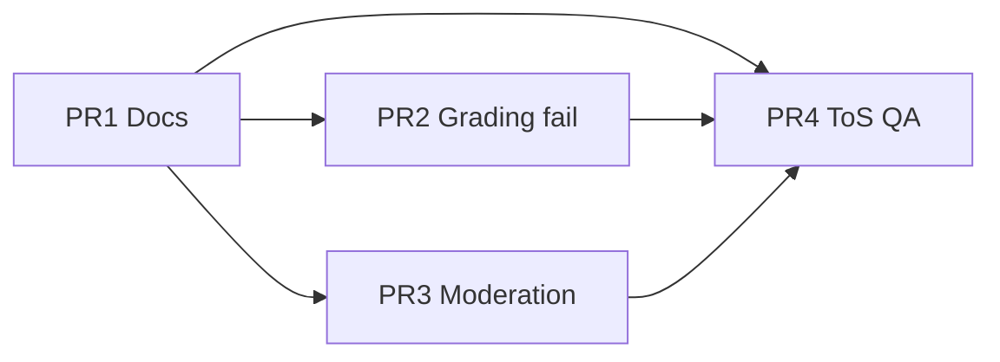

# 退款政策全面修正 — 四 PR 落地計劃

> **政策 SSOT**：[../refund-policy.md](../refund-policy.md)  
> **決策日期**：2026-08-10  
> **原則**：Member 售後窗口 **維持 3 日**；鑑定費入庫後已服務；Seller fault 假卡退 D 並追賣家；Buyer fault fail 留 D。

---

## 總覽

| PR | 標題 | 範圍 | 依賴 |
|----|------|------|------|
| **PR1** | 政策 SSOT + 文檔對齊 | Docs only | — |
| **PR2** | 鑑定 fail — Buyer fault 留鑑定費 | DB + saga + tests | PR1 |
| **PR3** | 售後 saga 補齊 + fault 擴充 | Migration + UI + tests | PR1 |
| **PR4** | 對外條款 + Partner QA | 條款／Help／簽收清單 | PR1–PR3（可並行 PR4 文案 with PR1） |



---

## PR1 — 政策 SSOT + 文檔對齊

**目標**：全 repo 只引用一份退款規則；消除 escrow §2.1 / §6 矛盾。

### 變更清單

| 文件 | 動作 |
|------|------|
| `docs/dev/refund-policy.md` | ✅ 已建立（本輪） |
| `docs/dev/escrow-payment-policy.md` | 頂部加「退款細則 → refund-policy.md」；§6/§7/§9 改為摘要 + 連結 |
| `docs/dev/follow-up/admin-moderation/v2-plan.md` | Phase H 退款表指向 refund-policy |
| `docs/dev/follow-up/admin-moderation/backend.md` | Phase H verify 連結 refund-policy §8 |
| `docs/dev/follow-up/admin-grading/backend.md` | Grading fail 連結 refund-policy §7 |
| `docs/dev/follow-up/admin-moderation/6phase-test-plan.md` | 新增「政策 case」對照表（可選） |

### Admin 內部

- 新增 `docs/dev/follow-up/admin-moderation/REFUND_ADMIN_PLAYBOOK.md`（可選，或併入 refund-policy §11）：
  - 假卡 → seller fault
  - Breakdown 欄位解讀

### 驗收

- [x] 搜尋 repo 無獨立矛盾表述（「鑑定費永不退」無上下文）
- [x] `refund-policy.md` §12 缺口表與實作一致
- [x] 無 code 變更（或僅 markdown）
- [x] `REFUND_ADMIN_PLAYBOOK.md` + 6phase policy case 對照表
- [x] `PARTNER_QA_SIGNOFF` migration range 至 `20260911140000`
- [x] escrow §2.2 step 4 / §7 inconclusive 分 S1 vs S3

### 風險

- 低；純文檔。

---

## PR2 — 鑑定 fail：Single capture + Buyer fault 留鑑定費

**目標**：落實 [refund-policy.md §7.2](../refund-policy.md#72-single-captureescrow_capture_model--single目標行為) Buyer fault 行。

### 現況 vs 目標

| | 現況 | 目標 |
|--|------|------|
| Single + any fault | `PI.cancel` 全釋 | Seller fault：**cancel 全釋**（不變） |
| Single + buyer fault | 同上（買家連 D 都收回） | **Capture `auth_fee`**，釋放 A+B+C 畀買家 |

### 技術任務

1. **Migration** `20260912xxxx_grading_fail_buyer_fault_auth_fee.sql`
   - `rpc_prepare_auth_grading_fail`：依 `fault_party` 設 `void_mode` / `capture_auth_fee_only` / `refund_cents`
   - Buyer fault + single：`void_mode := 'partial_release'`（或明確新 enum）
   - 更新 `fn_compute_seller_grading_fail_liability`：buyer fault → `settlement_required = false`（已有）

2. **`lib/payments/auth-grading-fail-void-saga.ts`**
   - Buyer fault single 分支：
     - `stripe.paymentIntents.capture({ amount_to_capture: auth_fee_cents })`
     - `cancel` 或 release 剩餘 authorized amount（按 Stripe PI 狀態）
   - Seller / platform：維持 full cancel

3. **`rpc_finalize_auth_grading_fail`**
   - 寫入 `payment_capture_status`、refund 快照、breakdown 欄位（若表有）

4. **Tests**
   - Integration：member + merchant auth，buyer fault single → 買家收 A+B+C，D 留平台
   - Regression：seller fault 仍全退 + receivable

5. **Docs**
   - `refund-policy.md` §12 更新 buyer fault 列為 ✅

### 驗收

- [x] Vitest grading fail unit + integration (`test:integration:grading`) 全綠
- [x] Stripe smoke：`test:integration:grading:stripe-smoke`（G-BF-S1 buyer fault capture D · G-BF-S2 seller cancel）
- [x] Seller fault finalize 恢復 receivable/ledger（G-BF4）

### 風險

- **中**：Stripe partial capture + cancel 組合需與 unified checkout PI 結構一致；legacy staged **唔改**（§7.3 已不同路徑）。

### 估算

- 1 migration + 1 saga + 2–4 integration tests

---

## PR3 — 售後 saga 補齊 + fault 擴充（可拆子 PR）

**目標**：Phase H 真退款端到端安全；可選擴充 carrier / inconclusive。

### 3A — Member auth finalize trigger（必做）

| 任務 | 說明 |
|------|------|
| Migration | `rpc_finalize_moderation_order_refund` / `rpc_mark_*` / `rpc_retry_*` 對 `member_orders` UPDATE 前 `set_config('moderation.order_refund','on')`（extend `20260911140000` 模式） |
| 或 | `runModerationOrderRefundSaga` finalize 改用 `service_role`（需安全審查） |
| Tests | I-H3 延伸：fake finalize member；或 stripe smoke 子集 |

### 3B — Fault 擴充（可選，同一 PR 或 follow-up）

| 任務 | 說明 |
|------|------|
| `DisputeDetailClient` | 加 carrier、inconclusive |
| `fn_compute_moderation_order_refund` | inconclusive：eligible 全退、fee 50/50 記帳（或 platform absorb — 與 policy 一致） |
| Integration | I-H15 / I-H16 煙霧 case |

### 3C — Admin 金額 preview（可選）

- Resolve 前 RPC 或 action 返回 breakdown（§2.1 五欄）
- 只讀，唔改裁定邏輯

### 驗收

- [ ] `test:integration:moderation` 全綠
- [ ] Manual：member_auth resolve → saga → `refund_status = refunded`（staging + Stripe test）
- [ ] `refund-policy.md` §12 member finalize ✅

### 風險

- Trigger bypass 過寬 → 僅在 RPC 內 set_config，同 freeze_payout 模式

### 估算

- 3A：1 migration + tests（~0.5–1d）
- 3B–3C：+1–2d

---

## PR4 — 對外條款 + Partner QA

**目標**：用戶可見條款與 SSOT 一致；Partner 簽收有清單。

### 變更清單

| 產物 | 內容 |
|------|------|
| **Terms / Help**（路徑按產品定） | 簡版：階段表、鑑定費、3 日窗口、P2P 無退 |
| `PARTNER_QA_SIGNOFF.md` | 新增「退款政策 spot check」3–5 條（staging 人手） |
| `PARTNER_QA_PENDING.md` | Migrations 列至 `20260912*`（PR2 後更新） |
| Checkout 披露 | 鑑定費不退條款（buyer fault / pass 後）— 若已有組件則改文案 |

### Partner spot check（建議）

1. Seller fault 鑑定 fail → 買家全額收回（含鑑定費）
2. Buyer fault 鑑定 fail → 買家收卡+運，鑑定費留平台
3. Pass 後 3 日內 seller fault 售後 → 退卡+運，唔退鑑定費
4. P2P 舉報 → 無退款選項

### 驗收

- [ ] 法務／產品 sign-off on 對外文案
- [ ] Partner P1 清單包含退款 spot check
- [ ] 無 code regression（文案 PR 可獨立）

### 依賴

- PR2 完成後 spot check #2 才有意義；#1/#3 現行大致可做

---

## 建議合併順序與發布

| 週次 | 動作 |
|------|------|
| W1 | Merge **PR1** → 全隊對齊 SSOT |
| W1–W2 | **PR2** staging 驗證 → merge |
| W2 | **PR3A** merge（member finalize） |
| W2–W3 | **PR3B/C** 視資源；**PR4** 文案可與 PR1 並行起草 |
| 發布前 | `bun run test:moderation:gate:full` + staging spot check |

### DB push 順序（累積）

```text
… 20260911140000  (existing moderation prepare bypass)
→ 20260912xxxx    (PR2 grading fail buyer fault)
→ 20260912yyyy    (PR3 member finalize bypass)
```

---

## 不在本四 PR 範圍（記錄備忘）

- Member 售後窗口改 7 日（已決定 **不做**）
- Appeal portal（v2）
- P2P 平台退款
- Legacy staged 單 sunset / 遷移
- Chargeback 與 moderation 對賬自動化

---

## 參考

- [refund-policy.md](../refund-policy.md)
- [escrow-payment-policy.md](../escrow-payment-policy.md)
- [admin-moderation/6phase-test-plan.md](./admin-moderation/6phase-test-plan.md)
