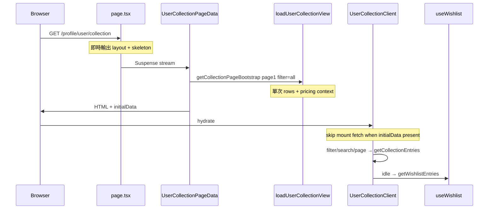

# User Collection 效能優化報告

**最後更新：** 2026-07-07  
**範圍：** `/profile/user/collection` 卡牌庫頁

---

## 問題摘要

卡牌庫頁原本係 **100% CSR**，首屏被 `isMounted` spinner 擋住；hydrate 後 `useCollection` 兩個 `useEffect` 並行觸發：

1. `getCollectionPortfolioSummary()` — 全表 `user_collections` + `loadCollectionPricingContext`
2. `getCollectionEntries()` — **再掃一次**全表 + pricing context（page subset 時可能第三次 context）
3. `getWishlistEntries()` — 願望清單全量 fetch（區塊在 fold 下方）

最重瓶頸係 **同一請求內重複全表讀取**，而唔係 pagination 本身。

---

## 優化前 vs 優化後

| 指標 | 優化前 | 優化後 |
|------|--------|--------|
| 首屏渲染 | 全頁 spinner → hydrate → fetch | SSR HTML 已有 portfolio + table |
| Mount server actions | 3（summary + entries + wishlist） | 1 bootstrap；wishlist idle 延後 |
| `user_collections` 全表讀取 / 首屏 | 2 次 | 1 次 |
| `loadCollectionPricingContext` / 首屏 | 2–3 次 | 1 次 |
| Filter / 搜尋 / 分頁 | `getCollectionEntries` | 不變（仍用 `getCollectionEntries`） |
| 收錄 / 移除 / 改 grade 後 refresh | 分別 refresh summary + page | `getCollectionPageBootstrap` 一次更新兩者 |

---

## 已實作

### Phase 1 — Backend 單次 bootstrap

| 項目 | 狀態 | 檔案 |
|------|------|------|
| `getCollectionPageBootstrap` | ✅ | [`app/actions/collection.ts`](../../../app/actions/collection.ts) |
| Shared `loadUserCollectionView` | ✅ | [`lib/collection/load-user-collection.ts`](../../../lib/collection/load-user-collection.ts) |
| 消除 page subset 第二次 pricing context | ✅ | 全程 reuse full `CollectionPricingContext` |
| `getCollectionPortfolioSummary` / `getCollectionEntries` thin wrapper | ✅ | 同上 helper，保持既有 API 契約 |

**Bootstrap 內部流程（單次）：**

```
fetchAllCollectionRows
  → loadCollectionPricingContext (all productIds)
  → computePortfolioTotals → summary
  → applyCollectionFilters + slice → mapCollectionRowToEntry → page
```

### Phase 2 — SSR Streaming + initialData

| 項目 | 狀態 | 檔案 |
|------|------|------|
| `Suspense` + skeleton | ✅ | [`page.tsx`](../../../app/profile/user/(dashboard)/collection/page.tsx) |
| Server bootstrap | ✅ | [`UserCollectionPageData.tsx`](../../../app/profile/user/(dashboard)/collection/UserCollectionPageData.tsx) |
| Client UI + `initialData` | ✅ | [`UserCollectionClient.tsx`](../../../app/profile/user/(dashboard)/collection/UserCollectionClient.tsx) |
| `useCollection` `initialData` + `isRefreshing` | ✅ | [`app/lib/hooks/useCollection.ts`](../../../app/lib/hooks/useCollection.ts) |
| 移除 `isMounted` 全頁 spinner | ✅ | `UserCollectionClient.tsx` |

### Phase 3 — Wishlist 延後

| 項目 | 狀態 | 檔案 |
|------|------|------|
| `useWishlist({ deferLoad: true })` | ✅ | [`app/lib/hooks/useWishlist.ts`](../../../app/lib/hooks/useWishlist.ts) |
| `requestIdleCallback` / 1.5s fallback | ✅ | 同上 |

### 診斷 instrumentation

| 項目 | 檔案 |
|------|------|
| Server `[collection:perf]` | [`lib/collection/perf-log.ts`](../../../lib/collection/perf-log.ts) |
| Client mount timing | [`app/lib/collection/perf-log-client.ts`](../../../app/lib/collection/perf-log-client.ts) |

**Server log 範例（dev）：**

```
[collection:perf] bootstrap.rowsMs=42 count=128
[collection:perf] bootstrap.pricingContextMs=186 products=95
[collection:perf] bootstrap.totalMs=241 cards=128 listed=128 filter=all
```

啟用 staging：`COLLECTION_PERF_LOG=1` / `NEXT_PUBLIC_COLLECTION_PERF_LOG=1`

---

## 現況架構（優化後）



### Client 互動路徑

| 觸發 | Server action | 更新範圍 |
|------|---------------|----------|
| 首屏 SSR | `getCollectionPageBootstrap` | summary + page 1 |
| 篩選 / 搜尋 / 分頁 | `getCollectionEntries` | 僅 table page |
| `collection-should-refresh` / `refetch()` | `getCollectionPageBootstrap` | summary + 當前 page |
| 移除 / 改 grade | `getCollectionPageBootstrap` | summary + 當前 page（`isRefreshing` overlay） |
| 願望清單區塊 | `getWishlistEntries`（延後） | wishlist table only |

---

## 驗證

```bash
# Dev — server timing
bun run dev
# → 開 /profile/user/collection
# → terminal 應見 [collection:perf] bootstrap.totalMs=...

# CI-safe build
bun run build:ci
```

| 檢查項 | 預期 |
|--------|------|
| Portfolio header（身家估值 + 4 格統計） | SSR HTML 內可見 |
| 持有卡牌 table 第一頁 | SSR HTML 內可見（唔係全頁 spinner） |
| Network：hydrate 後首屏 | 0 次 collection bootstrap（有 initialData） |
| 切換篩選（全部 / 已鑑定 / …） | 只見 `getCollectionEntries` |
| 收錄新卡後 `collection-should-refresh` | summary + table 同步更新 |
| 願望清單 | 稍後載入（idle），唔阻塞 header/table |
| CI | `bun run build:ci` 通過 |

---

## 預期改善

- 首屏 portfolio + table 隨 HTML 輸出，TTI 體感明顯縮短
- Server 工作量約減半（消除重複全表掃描 + 多餘 pricing context）
- Client mount network waterfall：3 actions → 1（wishlist 非阻塞）
- 大收藏庫用戶仍受全表 in-memory filter 限制 — 見後續 Phase 4

---

## 後續（未做 — Phase 4）

| 項目 | 說明 |
|------|------|
| 收窄 `fetchAllCollectionRows` select | 唔用 `select("*")`，只取 list/summary 所需欄位 |
| `unstable_cache` summary 60s TTL | per-user tag；mutations 已 `revalidatePath` |
| DB RPC `get_member_portfolio_stats` | 500+ 張卡時 DB 層聚合，避免拉全表 |
| Wishlist server pagination | 獨立 backlog（[`backend.md`](./backend.md)） |
| Home `PortfolioRewards` 接 live summary | 可重用 `getCollectionPortfolioSummary` |

---

## 相關文件

- [backend.md](./backend.md) — action 契約、`loadUserCollectionView` 架構
- [frontend.md](./frontend.md) — UI 接線、`initialData` 用法
- [INTEGRATION_QUEUE.md](../../INTEGRATION_QUEUE.md) — integration queue 條目
