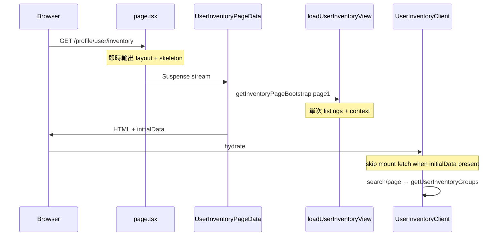

# User Inventory 效能優化報告

**最後更新：** 2026-07-07  
**範圍：** `/profile/user/inventory` 庫存上架頁

---

## 問題摘要

庫存頁原本係 **100% CSR**，hydrate 後 `useInventory` 兩個 `useEffect` 並行觸發：

1. `getUserInventorySummary()` — 全表 `listings` WHERE `seller_id`
2. `getUserInventoryGroups()` — **再掃一次**同一批 listings + catalog + stats

最重瓶頸係 **同一請求內重複 listings 全表讀取**。優化前頁面亦包含「新增商品」accordion（`NewListingForm`），已於 2026-07-07 從 user inventory 頁移除。

---

## 優化前 vs 優化後

| 指標 | 優化前 | 優化後 |
|------|--------|--------|
| 首屏渲染 | hydrate → 雙 fetch | SSR HTML 已有 summary + accordion |
| Mount server actions | 2（summary + groups） | 1 bootstrap |
| `listings` 全表讀取 / 首屏 | 2 次 | 1 次 |
| 搜尋 / 分頁 | `getUserInventoryGroups` | 不變 |
| `inventory-should-refresh` | 雙 fetch | `getInventoryPageBootstrap` 一次更新 |
| 「新增商品」表單 | 頁內 accordion + `NewListingForm` | **已移除**（user 頁不再提供上架入口） |

---

## 已實作

### Phase 1 — Backend 單次 bootstrap

| 項目 | 狀態 | 檔案 |
|------|------|------|
| `getInventoryPageBootstrap` | ✅ | [`app/actions/inventory.ts`](../../../app/actions/inventory.ts) |
| Shared `loadUserInventoryView` | ✅ | [`lib/listings/load-user-inventory.ts`](../../../lib/listings/load-user-inventory.ts) |
| `getUserInventorySummary` / `getUserInventoryGroups` thin wrapper | ✅ | 同上 helper，保持既有 API 契約 |

**Bootstrap 內部流程（單次）：**

```
fetchSellerListings
  → loadInventoryContext (catalog + listing_stats)
  → summarizeInventoryListings → summary
  → matchesInventorySearch + groupListingsByProduct + slice → page
```

### Phase 2 — SSR Streaming + initialData

| 項目 | 狀態 | 檔案 |
|------|------|------|
| `Suspense` + skeleton | ✅ | [`page.tsx`](../../../app/profile/user/(dashboard)/inventory/page.tsx) |
| Server bootstrap | ✅ | [`UserInventoryPageData.tsx`](../../../app/profile/user/(dashboard)/inventory/UserInventoryPageData.tsx) |
| Client UI + `initialData` | ✅ | [`UserInventoryClient.tsx`](../../../app/profile/user/(dashboard)/inventory/UserInventoryClient.tsx) |
| `useInventory` `initialData` + `isRefreshing` + `isSummaryLoading` | ✅ | [`app/lib/hooks/useInventory.ts`](../../../app/lib/hooks/useInventory.ts) |

### Phase 3 — UI 精簡

| 項目 | 狀態 | 檔案 |
|------|------|------|
| 移除「新增商品」accordion | ✅ | [`UserInventoryClient.tsx`](../../../app/profile/user/(dashboard)/inventory/UserInventoryClient.tsx) |
| Summary cards `isSummaryLoading` | ✅ | 同上 |
| Skeleton 對齊（無表單區塊） | ✅ | [`UserInventorySkeleton.tsx`](../../../app/profile/user/(dashboard)/inventory/UserInventorySkeleton.tsx) |

> `inventory-should-refresh` listener 仍保留於 client，供其他流程（例如 collection 上架後）觸發 refetch；user inventory 頁本身唔再 mount `NewListingForm`。

### 診斷 instrumentation

| 項目 | 檔案 |
|------|------|
| Server `[inventory:perf]` | [`lib/listings/perf-log.ts`](../../../lib/listings/perf-log.ts) |
| Client mount timing | [`app/lib/inventory/perf-log-client.ts`](../../../app/lib/inventory/perf-log-client.ts) |

**Server log 範例（dev）：**

```
[inventory:perf] bootstrap.listingsMs=38 count=24
[inventory:perf] bootstrap.contextMs=52 products=18
[inventory:perf] bootstrap.totalMs=96 listings=24 groups=18 query=(none)
```

啟用 staging：`INVENTORY_PERF_LOG=1` / `NEXT_PUBLIC_INVENTORY_PERF_LOG=1`

---

## 現況架構（優化後）



### Client 互動路徑

| 觸發 | Server action | 更新範圍 |
|------|---------------|----------|
| 首屏 SSR | `getInventoryPageBootstrap` | summary + page 1 |
| 搜尋 / 分頁 | `getUserInventoryGroups` | 僅 accordion page |
| `inventory-should-refresh` / `refetch()` | `getInventoryPageBootstrap` | summary + 當前 page |

---

## 驗證

```bash
# Dev — server timing
bun run dev
# → 開 /profile/user/inventory
# → terminal 應見 [inventory:perf] bootstrap.totalMs=...

# CI-safe build
bun run build:ci
```

| 檢查項 | 預期 |
|--------|------|
| Summary 三格（現貨 / 上架中 / 已售出） | SSR HTML 內可見 |
| Accordion 第一頁 | SSR HTML 內可見 |
| Network：hydrate 後首屏 | 0 次 inventory bootstrap（有 initialData） |
| 搜尋 / 分頁 | 只見 `getUserInventoryGroups` |
| 頁面無「新增商品」區塊 | user inventory 只顯示 summary + search + accordion |
| CI | `bun run build:ci` 通過 |

---

## 預期改善

- 首屏 summary + accordion 隨 HTML 輸出，TTI 體感明顯縮短
- Server 工作量約減半（消除重複 listings 掃描）
- Client mount network waterfall：2 actions → 1
- 移除 `NewListingForm` 後首屏 JS bundle 更輕（無 listing form chunk）

---

## 後續（未做）

| 項目 | 說明 |
|------|------|
| DB RPC `get_seller_inventory_summary` | 大賣家時 DB 層聚合，避免拉全表 |
| `unstable_cache` summary 60s TTL | per-user tag；listing mutations 後 revalidate |
| Merchant inventory 頁接 `useInventory` | 仍用 mock — 見 [PARTNER_REPORT.md](./PARTNER_REPORT.md) |
| User 上架入口 | 若需要可改由 collection / 其他 flow 提供；唔再於本頁放 `NewListingForm` |

---

## 相關文件

- [backend.md](./backend.md) — action 契約、`loadUserInventoryView` 架構
- [frontend.md](./frontend.md) — UI 接線、`initialData` 用法
- [INTEGRATION_QUEUE.md](../../INTEGRATION_QUEUE.md) — integration queue 條目
