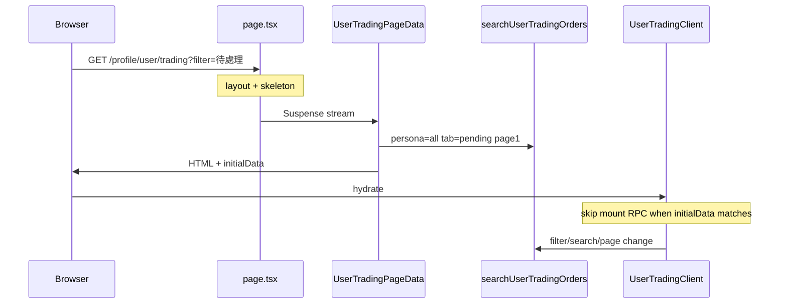

# User Trading 效能優化報告

**最後更新：** 2026-07-07  
**範圍：** `/profile/user/trading` 交易管理頁

---

## 問題摘要

交易頁原本係 **100% CSR**，並有雙層 loading gate：

1. `useSyncExternalStore` isMounted spinner
2. `Suspense` fallback spinner
3. hydrate 後 `useEffect` 才呼叫 `searchUserTradingOrders`

另外 page 內含 ~108 行未使用嘅 `USER_MOCK_ORDERS_DB`，以及與 [`map-sale-order.ts`](../../../app/lib/member-order/map-sale-order.ts) 重複嘅 mapper。

**與 collection/inventory 不同：** 後端早已用單一 RPC `search_user_trading_orders` 一次回傳 list + meta + facet counts，無「雙 fetch 重複掃表」問題。優化重心係 **SSR 首屏** 同 **client 架構整理**。

---

## 優化前 vs 優化後

| 指標 | 優化前 | 優化後 |
|------|--------|--------|
| 首屏渲染 | 雙 spinner → hydrate → RPC | skeleton → streamed HTML |
| hydrate 後 network | 必打 1 RPC | 0 RPC（`initialData` 命中） |
| page bundle | mock + 重複 mapper | 精簡；mapper 單一來源 |
| `ReviewModal` | 首屏 bundle | `next/dynamic`（點評時載入） |
| 後端 RPC / visit | 1 | 1（SSR 提前，體感更快） |

---

## 已實作

### Phase 1 — 常數與清理

| 項目 | 狀態 | 檔案 |
|------|------|------|
| Trading 常數 + tab URL mapping | ✅ | [`lib/member-order/constants.ts`](../../../lib/member-order/constants.ts) |
| Bootstrap 型別 | ✅ | [`app/lib/member-order/types.ts`](../../../app/lib/member-order/types.ts) |
| 移除 `USER_MOCK_ORDERS_DB` | ✅ | 原 `trading/page.tsx` |
| 改用 `mapTradingOrderToSaleOrder` | ✅ | [`app/lib/member-order/map-sale-order.ts`](../../../app/lib/member-order/map-sale-order.ts) |

### Phase 2 — Perf instrumentation

| 項目 | 檔案 |
|------|------|
| Server `[trading:perf]` | [`lib/member-order/perf-log.ts`](../../../lib/member-order/perf-log.ts) |
| Client mount timing | [`app/lib/member-order/perf-log-client.ts`](../../../app/lib/member-order/perf-log-client.ts) |
| RPC timing in action | [`app/actions/orders.ts`](../../../app/actions/orders.ts) `searchUserTradingOrders` |

**Server log 範例（dev）：**

```
[trading:perf] search.rpcMs=42 totalMs=58 orders=8 total=24 needsAction=2 persona=all tab=all
```

啟用 staging：`TRADING_PERF_LOG=1` / `NEXT_PUBLIC_TRADING_PERF_LOG=1`

### Phase 3 — `useUserTrading` hook

| 項目 | 狀態 | 檔案 |
|------|------|------|
| `initialData` skip mount fetch | ✅ | [`app/lib/hooks/useUserTrading.ts`](../../../app/lib/hooks/useUserTrading.ts) |
| 搜尋 debounce 300ms | ✅ | 同上 |
| Responsive `pageSize` 5/8 | ✅ | 同上 |
| `refetch` / `isRefreshing` | ✅ | 同上 |
| Pagination page>1 仍 fetch | ✅ | initial list key guard |

### Phase 4 — SSR Streaming

| 項目 | 狀態 | 檔案 |
|------|------|------|
| `Suspense` + skeleton | ✅ | [`page.tsx`](../../../app/profile/user/(dashboard)/trading/page.tsx) |
| Server bootstrap + `searchParams.filter` | ✅ | [`UserTradingPageData.tsx`](../../../app/profile/user/(dashboard)/trading/UserTradingPageData.tsx) |
| Client UI | ✅ | [`UserTradingClient.tsx`](../../../app/profile/user/(dashboard)/trading/UserTradingClient.tsx) |
| 移除 isMounted gate | ✅ | 原 `page.tsx` |

---

## 現況架構（優化後）



### Client 互動路徑

| 觸發 | Server action | 更新範圍 |
|------|---------------|----------|
| 首屏 SSR | `searchUserTradingOrders` | orders + meta + filters |
| persona / status / 搜尋 / 分頁 | `searchUserTradingOrders` | 同上（單一 RPC） |
| 評價 / 取消 / 完成後 `refetch()` | `searchUserTradingOrders` | 同上 |

---

## 驗證

```bash
bun run dev
# → /profile/user/trading
# → terminal: [trading:perf] search.rpcMs=...

bunx tsc --noEmit
bun run build:ci
```

| 檢查項 | 預期 |
|--------|------|
| needs-action banner + tab counts | SSR HTML 可見 |
| 第一頁 order rows | SSR HTML 可見 |
| hydrate 後首屏 | 0 次重複 RPC |
| `?filter=待處理` | SSR 以 `pending` tab bootstrap |
| 切換 persona/status/搜尋/分頁 | 單次 `searchUserTradingOrders` |
| CI | `build:ci` 通過 |

---

## 後續（未做）

| 項目 | 說明 |
|------|------|
| Merchant trading 頁 | 仍用 mock store |
| RPC 層進一步優化 | 大交易量用戶 facet count 快取 |

---

## 相關文件

- [backend.md](./backend.md)
- [frontend.md](./frontend.md)
- [INTEGRATION_QUEUE.md](../../INTEGRATION_QUEUE.md)
