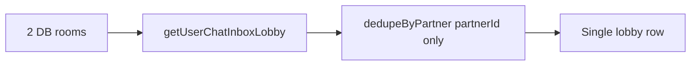

# Persona Orders & Dual-Persona Chat — Implementation Report

**Date:** 2026-07-18  
**Scope:** Merchant listing order/review persona correction + dual-persona chat session split  
**Status:** Code complete — pending `bunx supabase db push` on target environment

---

## Executive summary

Two related dual-persona bugs were fixed:

1. **Orders & reviews:** Accepting an offer on a **merchant** listing incorrectly created `member_orders`, so seller reviews landed on the member profile and merchant trading dashboards stayed empty.
2. **Chat:** Separate DB `chat_rooms` (member vs merchant persona) were **merged in the client** by `partnerId` only, so one inbox row showed both conversation histories.

Both flows now respect persona as the single source of truth end-to-end.

---

## Part A — Merchant listing orders & reviews

### Business rules (SSOT)

| Scenario | Buyer | Seller | Order table | Seller review persona |
|----------|-------|--------|-------------|------------------------|
| Member buys merchant listing | member | merchant | `merchant_orders` | **merchant** (shop) |
| Dual-persona merchant buys others | member | member | `member_orders` | member |
| Member buys member listing | member | member | `member_orders` | member |

Buyers always offer as `buyer_persona = 'member'` (`rpc_make_offer`). The bug was **`rpc_accept_offer` always inserting `member_orders`**.

### Database migrations (apply with `bunx supabase db push`)

| Migration | Purpose |
|-----------|---------|
| `20260718100000_accept_offer_merchant_persona.sql` | `rpc_accept_offer` branches on `listings.seller_persona`; merchant path → `merchant_orders` + `chat_messages.merchant_order_id`; skips P2P AML for B2C |
| `20260718110000_rpc_complete_merchant_order.sql` | Buyer confirms receipt; `escrow_status = completed_and_transferred`; chat `SYSTEM_ORDER_COMPLETED` with `merchant_order_id` |
| `20260718130000_merchant_trading_helpers.sql` | `rpc_get_user_reviewed_merchant_order_ids`, escrow→member status mapper |
| `20260718140000_chat_inbox_merchant_order_id.sql` | Inbox/thread RPCs return `merchant_order_id` on message payloads |

### Application changes

| Layer | Key files |
|-------|-----------|
| Orders | `app/actions/orders.ts` — `completeMerchantOrder`, buyer merge of `merchant_orders` in `searchUserTradingOrders` |
| Offers | `app/actions/offers.ts` — parse `order_kind` from accept RPC |
| Reviews | `app/actions/reviews.ts` — `getUserReviewedOrderIds`, merchant-aware `resolveChatCompletionOrderId` |
| Chat (order msgs) | `mapDbChats.ts`, `realtimeChatMessages.ts`, `useChatRoomRealtime.ts`, `app/actions/chat.ts` |
| Store | `useHkCardVaultStore.ts` — `orderKind` on offer ledger / accept |
| UI | `UserOrderRow.tsx` — buyer complete for `orderKind: 'merchant'` |
| Lib | `lib/merchant-order/merchant-order-rpc.ts`, `load-buyer-merchant-orders.ts` |

### Verification checklist

- [ ] Merchant listing accept → row in `merchant_orders` only (not `member_orders`)
- [ ] Seller sees order on `/profile/merchant/trading` only
- [ ] Buyer sees B2C order on `/profile/user/trading` (buy tab)
- [ ] After complete: buyer review → `reviewee_persona = merchant`; seller review buyer → `member`
- [ ] Dual-persona merchant buying member listing → still `member_orders`

### Out of scope

- Historical bad rows in `member_orders` (optional backfill not implemented)
- Stripe checkout for merchant listings (`merchant_checkout_follow_up.md`)

---

## Part B — Dual-persona chat session split

### Problem

Supabase already enforces unique rooms on `(buyer_id, buyer_persona, seller_id, seller_persona)` (`20260717130000`). The client collapsed rooms in `mergeChatRoomsWithDb` → `dedupeByPartner` when only `partnerId` matched, merging message histories.

### Solution

Composite identity: **`partnerId` + `partnerPersona`** (`member` | `merchant`).

| Change | Files |
|--------|-------|
| Room model | `ChatRoom.partnerPersona` in `useHkCardVaultStore.ts` |
| Helpers | **New** `app/lib/chat/partnerRoomKey.ts` |
| Pending IDs | `buildPendingChatRoomId(partnerId, persona)` |
| Merge/dedupe | `app/lib/chat/mergeChatRooms.ts` — persona-aware `findRoomByPartnerId`, `findRoomsByPartnerId` |
| DB mapping | `mapDbChats.ts` — `partnerPersona` from counterparty persona |
| Open chat | `open-global-chat` detail includes `partnerPersona`; TopNav, MobileHeader, profile headers |
| Storefront | `MerchantStorefrontPageClient.tsx` → `openChatWithPartner(..., 'merchant')` |
| Spawn UI | `GlobalChatConsole.tsx` — 會員/商家 toggle on「新增聊天」 |
| Legacy hash | `generateDeterministicRoomId(buyerId, buyerPersona, sellerId, sellerPersona)` |
| Offer open | `ExecutionSlideOver.tsx` passes `partnerPersona` from `room.seller_persona` |
| Active room | `GlobalChatOverlay.tsx` preserves persona when re-binding after lobby sync |

### Tests

`app/lib/chat/partnerRoomKey.test.ts` (5 cases):

- Same `partnerId`, different persona → **2** rooms after merge
- `findRoomByPartnerId` respects persona
- Pending room IDs differ by persona
- Deterministic room hash differs by seller persona

Run: `bun test app/lib/chat/partnerRoomKey.test.ts`

### Verification checklist

- [ ] Offer on merchant listing → lobby row with shop name + 認證商家 badge
- [ ] Open member profile chat with same user → **separate** row with 會員 chip
- [ ] Switching rows shows different histories (no cross-merge)
- [ ]「新增聊天」persona toggle routes to correct existing or pending room

---

## Ancillary fixes (same branch)

| Item | Files |
|------|-------|
| Order book seller avatar/name by `seller_persona` | `lib/profile/load-profile-snippets.ts`, `app/actions/marketplace.ts` |
| Listing view tracking (瀏覽) on card clicks | `lib/listings/track-listing-view.ts`, `MarketplaceCard.tsx`, home sections |

---

## CI / build

| Command | Result |
|---------|--------|
| `bunx tsc --noEmit` | Pass |
| `bun run build:ci` | Pass |
| `bun test app/lib/chat/partnerRoomKey.test.ts` | 5/5 pass |

---

## Deployment steps

1. `bunx supabase db push` (four new migrations)
2. Smoke-test order accept + complete + review on merchant listing
3. Smoke-test two chat sessions (member profile vs merchant storefront) for same dual-persona account
4. Optional: `bun run supabase:types` if RPC signatures were not already in `types/supabase.ts`

---

## Handoff docs updated

- [`docs/dev/follow-up/merchant-trading/backend.md`](../follow-up/merchant-trading/backend.md)
- [`docs/dev/follow-up/transaction-reviews/backend.md`](../follow-up/transaction-reviews/backend.md)

**Suggested follow-up for frontend:** Confirm lobby UX when the same display name appears twice (member + merchant chips); no further backend work required for chat persona split.
