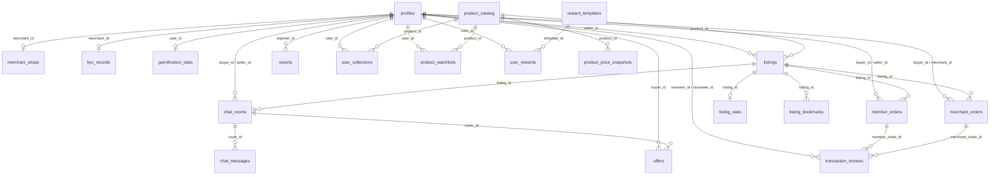

# Supabase Database Types Reference

> **Auto-generated reference** from `types/supabase.ts`  
> **Project:** HKCardVault (`uxqdktkrqtorswgylrln`)  
> **PostgREST version:** 14.5  
> **Schema:** `public`

Regenerate after schema changes:

```bash
bun run supabase:types
```

---

## TypeScript Usage

```typescript
import type { Tables, TablesInsert, TablesUpdate, Enums } from "@/types/supabase";

// Row type (SELECT)
type Profile = Tables<"profiles">;
type Listing = Tables<"listings">;

// Insert / Update payloads
type NewListing = TablesInsert<"listings">;
type ListingPatch = TablesUpdate<"listings">;

// Enum union
type UserRole = Enums<"user_role">;
type EscrowState = Enums<"escrow_state">;
```

---

## Enums

| Enum | Values |
|------|--------|
| `catalog_type` | `single_card`, `booster_pack`, `booster_box`, `gift_set`, `starter_deck` |
| `escrow_state` | `payment_held`, `authenticating`, `authenticated`, `completed_and_transferred`, `refunded` |
| `kyc_state` | `pending`, `verified`, `rejected` |
| `listing_status` | `active`, `sold`, `inactive` |
| `member_order_state` | `pending`, `meetup_arranged`, `completed`, `cancelled` |
| `offer_status` | `pending`, `accepted`, `rejected`, `cancelled` |
| `report_state` | `pending`, `reviewing`, `resolved`, `dismissed` |
| `review_persona` | `member`, `merchant` |
| `reward_type` | `discount_coupon`, `free_shipping`, `lucky_draw_ticket` |
| `sync_state` | `synced`, `partial`, `needs_review` |
| `transaction_type` | `escrow_payment`, `commission_deduction`, `shipping_subsidy`, `refund`, `payout` |
| `user_role` | `admin`, `merchant`, `member` |

---

## Entity Relationship Overview



---

## Tables

### `profiles`

Core user profile linked to Supabase Auth (`id` = auth user UUID).

| Column | Type | Nullable | Notes |
|--------|------|----------|-------|
| `id` | `string` (UUID) | No | PK, matches `auth.users.id` |
| `display_name` | `string` | No | |
| `avatar_path` | `string` | Yes | Storage path |
| `role` | `user_role` | No | Default: `member` |
| `rating_score` | `number` | Yes | |
| `reputation_tag` | `string` | Yes | |
| `total_trades` | `number` | Yes | |
| `created_at` | `string` (timestamptz) | No | |
| `updated_at` | `string` (timestamptz) | No | |

**Referenced by:** `listings`, `member_orders`, `merchant_orders`, `chat_rooms`, `offers`, `reports`, `user_collections`, `product_watchlists`, `user_rewards`, `transaction_reviews`, `merchant_shops`, `kyc_records`, `gamification_stats`, `merchant_ledgers`

---

### `product_catalog`

Master catalog of Pokémon cards and sealed products (synced from external API).

| Column | Type | Nullable | Notes |
|--------|------|----------|-------|
| `id` | `string` | No | PK |
| `type` | `catalog_type` | No | |
| `name_ja` | `string` | No | Japanese name |
| `name_en` | `string` | Yes | |
| `name_zh` | `string` | Yes | |
| `set_code` | `string` | No | |
| `card_number` | `string` | Yes | |
| `display_id` | `string` | Yes | |
| `rarity` | `string` | Yes | |
| `element_type` | `string` | Yes | |
| `pokemon_stage` | `string` | Yes | |
| `sub_type_ja` | `string` | Yes | |
| `hp` | `number` | Yes | |
| `pack_count` | `number` | Yes | |
| `jan_code` | `string` | Yes | |
| `snkr_rank` | `number` | Yes | |
| `image_url` | `string` | No | |
| `last_synced_at` | `string` (timestamptz) | Yes | |
| `created_at` | `string` (timestamptz) | No | |
| `updated_at` | `string` (timestamptz) | No | |

**Referenced by:** `listings`, `product_price_snapshots`, `user_collections`, `product_watchlists`

---

### `product_price_snapshots`

Historical JPY price data per product and condition.

| Column | Type | Nullable | Notes |
|--------|------|----------|-------|
| `id` | `string` (UUID) | No | PK |
| `product_id` | `string` | No | FK → `product_catalog.id` |
| `condition_type` | `string` | No | |
| `condition_name_ja` | `string` | Yes | |
| `price_jpy` | `number` | No | |
| `snapshot_date` | `string` (date) | No | |
| `created_at` | `string` (timestamptz) | No | |

---

### `listings`

User-posted items for sale.

| Column | Type | Nullable | Notes |
|--------|------|----------|-------|
| `id` | `string` (UUID) | No | PK |
| `seller_id` | `string` (UUID) | No | FK → `profiles.id` |
| `product_id` | `string` | No | FK → `product_catalog.id` |
| `price` | `number` | No | HKD |
| `status` | `listing_status` | No | `active` \| `sold` \| `inactive` |
| `grading_company` | `string` | No | e.g. `PSA`, `CGC`, `RAW` |
| `grading_score` | `string` | Yes | e.g. `10`, `9.5` |
| `seller_persona` | `seller_persona_type` | No | `member` \| `merchant` |
| `images` | `Json` | No | Array of image objects |
| `use_authentication` | `boolean` | No | P2P escrow flag |
| `created_at` | `string` (timestamptz) | No | |
| `updated_at` | `string` (timestamptz) | No | |

**Referenced by:** `listing_bookmarks`, `listing_stats`, `chat_rooms`, `member_orders`, `merchant_orders`

---

### `listing_stats`

Aggregated engagement metrics per listing (1:1 with listing).

| Column | Type | Nullable | Notes |
|--------|------|----------|-------|
| `listing_id` | `string` (UUID) | No | PK / FK → `listings.id` |
| `views` | `number` | Yes | |
| `likes` | `number` | Yes | |
| `trade_records_count` | `number` | Yes | |
| `updated_at` | `string` (timestamptz) | Yes | |

---

### `listing_bookmarks`

User bookmarks on listings (composite PK).

| Column | Type | Nullable | Notes |
|--------|------|----------|-------|
| `user_id` | `string` (UUID) | No | PK, FK → `profiles.id` |
| `listing_id` | `string` (UUID) | No | PK, FK → `listings.id` |
| `created_at` | `string` (timestamptz) | Yes | |

---

### `product_watchlists`

User watchlist on catalog products (composite PK).

| Column | Type | Nullable | Notes |
|--------|------|----------|-------|
| `user_id` | `string` (UUID) | No | PK, FK → `profiles.id` |
| `product_id` | `string` | No | PK, FK → `product_catalog.id` |

---

### `user_collections`

User-owned cards/products in portfolio (composite PK).

| Column | Type | Nullable | Notes |
|--------|------|----------|-------|
| `user_id` | `string` (UUID) | No | PK, FK → `profiles.id` |
| `product_id` | `string` | No | PK, FK → `product_catalog.id` |
| `quantity` | `number` | No | |
| `created_at` | `string` (timestamptz) | No | |
| `updated_at` | `string` (timestamptz) | No | |

---

### `member_orders`

Peer-to-peer (member) trade orders with meetup flow.

| Column | Type | Nullable | Notes |
|--------|------|----------|-------|
| `id` | `string` (UUID) | No | PK |
| `listing_id` | `string` (UUID) | No | FK → `listings.id` |
| `buyer_id` | `string` (UUID) | No | FK → `profiles.id` |
| `seller_id` | `string` (UUID) | No | FK → `profiles.id` |
| `final_price` | `number` | No | |
| `status` | `member_order_state` | Yes | |
| `meetup_details` | `Json` | Yes | Location, time, etc. |
| `created_at` | `string` (timestamptz) | Yes | |
| `updated_at` | `string` (timestamptz) | Yes | |

**Referenced by:** `transaction_reviews`

---

### `merchant_orders`

Merchant escrow orders with Stripe payment flow.

| Column | Type | Nullable | Notes |
|--------|------|----------|-------|
| `id` | `string` (UUID) | No | PK |
| `listing_id` | `string` (UUID) | No | FK → `listings.id` |
| `buyer_id` | `string` (UUID) | No | FK → `profiles.id` |
| `merchant_id` | `string` (UUID) | No | FK → `profiles.id` |
| `final_price` | `number` | No | |
| `escrow_status` | `escrow_state` | Yes | |
| `requires_authentication` | `boolean` | Yes | |
| `stripe_payment_intent_id` | `string` | Yes | |
| `logistics_proof_path` | `string` | Yes | Storage path |
| `created_at` | `string` (timestamptz) | Yes | |
| `updated_at` | `string` (timestamptz) | Yes | |

**Referenced by:** `transaction_reviews`

---

### `merchant_shops`

Merchant storefront profile (1:1 with merchant profile).

| Column | Type | Nullable | Notes |
|--------|------|----------|-------|
| `merchant_id` | `string` (UUID) | No | PK, FK → `profiles.id` |
| `shop_description` | `string` | Yes | |
| `top_banner_path` | `string` | Yes | Storage path |
| `business_details` | `Json` | Yes | |
| `rating_score` | `number` | Yes | |
| `shop_rating_score` | `number` | Yes | |
| `shipping_speed_score` | `number` | Yes | |
| `created_at` | `string` (timestamptz) | Yes | |
| `updated_at` | `string` (timestamptz) | Yes | |

---

### `merchant_ledgers`

Financial ledger entries for merchant payouts and fees.

| Column | Type | Nullable | Notes |
|--------|------|----------|-------|
| `id` | `string` (UUID) | No | PK |
| `merchant_id` | `string` (UUID) | No | FK → `profiles.id` |
| `order_id` | `string` (UUID) | Yes | Related order |
| `amount` | `number` | No | |
| `transaction_type` | `transaction_type` | No | |
| `stripe_transfer_id` | `string` | Yes | |
| `created_at` | `string` (timestamptz) | Yes | |

---

### `kyc_records`

Merchant KYC / Stripe Connect onboarding status (1:1 with merchant).

| Column | Type | Nullable | Notes |
|--------|------|----------|-------|
| `merchant_id` | `string` (UUID) | No | PK, FK → `profiles.id` |
| `kyc_status` | `kyc_state` | Yes | |
| `stripe_account_id` | `string` | Yes | |
| `verified_at` | `string` (timestamptz) | Yes | |
| `created_at` | `string` (timestamptz) | Yes | |
| `updated_at` | `string` (timestamptz) | Yes | |

---

### `chat_rooms`

Negotiation room between buyer and seller for a listing.

| Column | Type | Nullable | Notes |
|--------|------|----------|-------|
| `id` | `string` (UUID) | No | PK |
| `listing_id` | `string` (UUID) | No | FK → `listings.id` |
| `buyer_id` | `string` (UUID) | No | FK → `profiles.id` |
| `seller_id` | `string` (UUID) | No | FK → `profiles.id` |
| `created_at` | `string` (timestamptz) | Yes | |
| `updated_at` | `string` (timestamptz) | Yes | |

**Referenced by:** `chat_messages`, `offers`

---

### `chat_messages`

Messages within a chat room.

| Column | Type | Nullable | Notes |
|--------|------|----------|-------|
| `id` | `string` (UUID) | No | PK |
| `room_id` | `string` (UUID) | No | FK → `chat_rooms.id` |
| `sender_id` | `string` (UUID) | No | FK → `profiles.id` (via auth) |
| `content` | `string` | No | |
| `is_system_warning` | `boolean` | Yes | |
| `created_at` | `string` (timestamptz) | Yes | |

---

### `offers`

Price offers made in a chat room.

| Column | Type | Nullable | Notes |
|--------|------|----------|-------|
| `id` | `string` (UUID) | No | PK |
| `room_id` | `string` (UUID) | No | FK → `chat_rooms.id` |
| `buyer_id` | `string` (UUID) | No | FK → `profiles.id` |
| `offer_price` | `number` | No | |
| `status` | `offer_status` | Yes | |
| `created_at` | `string` (timestamptz) | Yes | |
| `updated_at` | `string` (timestamptz) | Yes | |

---

### `transaction_reviews`

Post-trade ratings and comments.

| Column | Type | Nullable | Notes |
|--------|------|----------|-------|
| `id` | `string` (UUID) | No | PK |
| `reviewer_id` | `string` (UUID) | No | FK → `profiles.id` |
| `reviewee_id` | `string` (UUID) | No | FK → `profiles.id` |
| `reviewee_persona` | `review_persona` | No | `member` or `merchant` |
| `member_order_id` | `string` (UUID) | Yes | FK → `member_orders.id` |
| `merchant_order_id` | `string` (UUID) | Yes | FK → `merchant_orders.id` |
| `rating` | `number` | No | |
| `comment` | `string` | Yes | |
| `created_at` | `string` (timestamptz) | No | |

---

### `reports`

User-submitted reports on listings, users, etc.

| Column | Type | Nullable | Notes |
|--------|------|----------|-------|
| `id` | `string` (UUID) | No | PK |
| `reporter_id` | `string` (UUID) | No | FK → `profiles.id` |
| `target_type` | `string` | No | e.g. `listing`, `user` |
| `target_id` | `string` | No | Polymorphic target |
| `reason` | `string` | No | |
| `status` | `report_state` | Yes | |
| `created_at` | `string` (timestamptz) | Yes | |
| `updated_at` | `string` (timestamptz) | Yes | |

---

### `gamification_stats`

Daily check-in streaks and gamification (1:1 with user).

| Column | Type | Nullable | Notes |
|--------|------|----------|-------|
| `user_id` | `string` (UUID) | No | PK, FK → `profiles.id` |
| `current_streak` | `number` | Yes | |
| `longest_streak` | `number` | Yes | |
| `last_check_in` | `string` (timestamptz) | Yes | |
| `created_at` | `string` (timestamptz) | Yes | |
| `updated_at` | `string` (timestamptz) | Yes | |

---

### `reward_templates`

Admin-defined reward campaign templates.

| Column | Type | Nullable | Notes |
|--------|------|----------|-------|
| `id` | `string` (UUID) | No | PK |
| `title` | `string` | No | |
| `description` | `string` | Yes | |
| `type` | `reward_type` | No | |
| `reward_value` | `Json` | No | Coupon amount, etc. |
| `trigger_conditions` | `Json` | No | |
| `is_active` | `boolean` | Yes | |
| `is_infinite` | `boolean` | Yes | |
| `valid_duration_days` | `number` | Yes | |
| `fixed_expiry_date` | `string` (timestamptz) | Yes | |
| `created_at` | `string` (timestamptz) | Yes | |
| `updated_at` | `string` (timestamptz) | Yes | |

**Referenced by:** `user_rewards`

---

### `user_rewards`

Rewards granted to users from templates.

| Column | Type | Nullable | Notes |
|--------|------|----------|-------|
| `id` | `string` (UUID) | No | PK |
| `user_id` | `string` (UUID) | No | FK → `profiles.id` |
| `template_id` | `string` (UUID) | No | FK → `reward_templates.id` |
| `is_used` | `boolean` | Yes | |
| `used_at` | `string` (timestamptz) | Yes | |
| `calculated_expiry` | `string` (timestamptz) | Yes | |
| `created_at` | `string` (timestamptz) | Yes | |

---

## Table Index (21 tables)

| Table | Domain |
|-------|--------|
| `profiles` | Users & auth |
| `product_catalog` | Catalog |
| `product_price_snapshots` | Catalog / pricing |
| `product_watchlists` | User watchlist |
| `user_collections` | User portfolio |
| `listings` | Marketplace |
| `listing_stats` | Marketplace analytics |
| `listing_bookmarks` | Marketplace bookmarks |
| `member_orders` | P2P orders |
| `merchant_orders` | Escrow orders |
| `merchant_shops` | Merchant storefront |
| `merchant_ledgers` | Merchant finance |
| `kyc_records` | Merchant KYC |
| `chat_rooms` | Messaging |
| `chat_messages` | Messaging |
| `offers` | Negotiation |
| `transaction_reviews` | Reputation |
| `reports` | Moderation |
| `gamification_stats` | Gamification |
| `reward_templates` | Rewards |
| `user_rewards` | Rewards |

---

## Notes

- **Single source of truth for code:** Always import from `types/supabase.ts`. Do not hand-write duplicate interfaces.
- **This markdown file** is a human-readable companion for quick reference and onboarding. Re-generate or update it when the schema changes.
- **Json columns** (`images`, `meetup_details`, `business_details`, `reward_value`, `trigger_conditions`) have flexible structure — document expected shapes in Server Actions or API layer.
